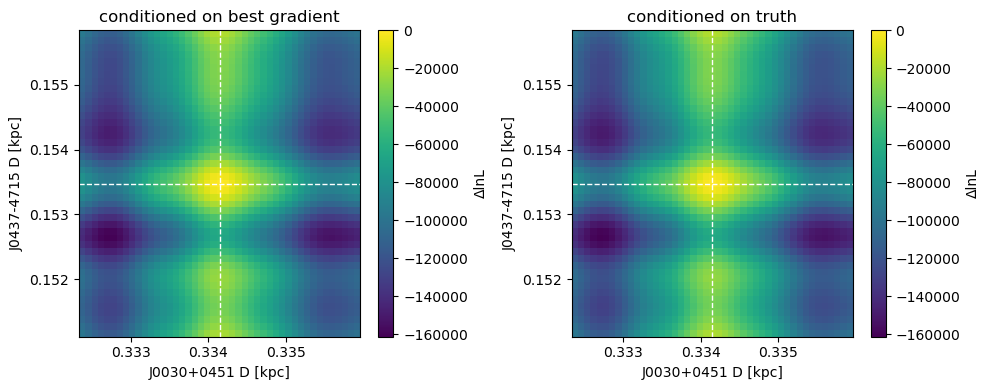
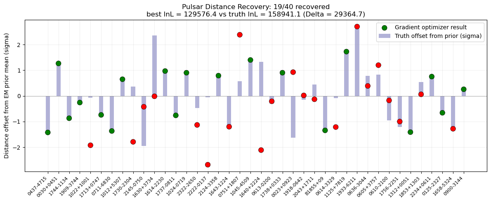
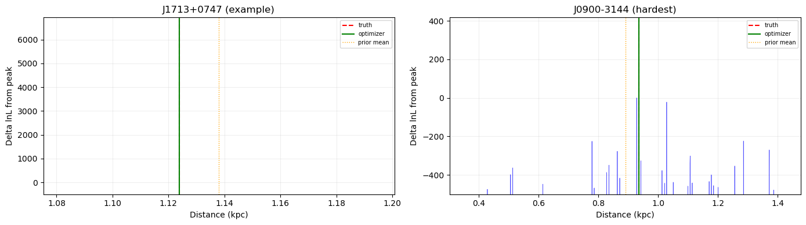
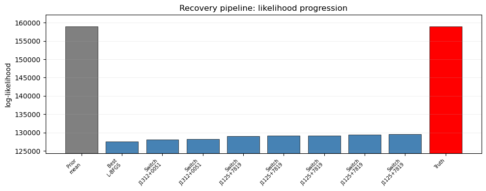
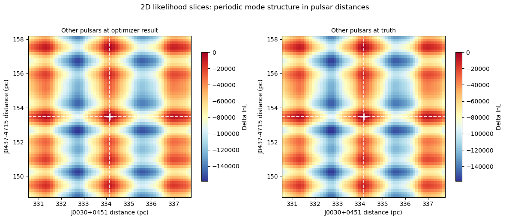

# 05 - Scaling and Stochastic Distance Recovery

Continuation of notebook 04: empirical candidate generation plus gradient/mode-switch optimization, now aimed at stochastic data and scaling tests.


```python
from pathlib import Path
import sys
import time
import copy
import importlib

import jax
import jax.numpy as jnp
from scipy.signal import find_peaks

import numpy as np
import pandas as pd
import matplotlib.pyplot as plt
from IPython.display import clear_output, display

HERE = Path.cwd()
sys.path.insert(0, str((HERE / "../CW_lnL_check").resolve()))

import cw_helpers
importlib.reload(cw_helpers)

from cw_helpers import (
    build_disco_likelihood,
    build_fast_scan_likelihood,
    build_enterprise_pta,
    build_pure_cw_likelihood,
    compute_mode_spacing,
    enumerate_pulsar_modes,
    generate_injection_params,
    inject_noisefree_cw,
    load_pulsars,
    make_distance_optimizer,
    scan_pulsar_distance,
    scan_pulsar_pair_2d,
    simulate,
)

print(HERE)
```

    /home/mattm/projects/HSYMT/lnL_distance_scans


## Control Panel


```python
# Dataset knobs
DATA_MODE = "stochastic"            # "pure" or "stochastic"
N_PSR = 40                    # use <=80 with discovery HD GWB
N_CW = 4
LOG10_H = -12.0
LOG10_MC = None
RNG_SEED = 12345
NOISE_SEED = 24680

# Test matrix controls
TEST_SEEDS = [12345]
TEST_N_CW = [2, 4, 8, 12, 16]
TEST_LOG10_H = [-12.0]
CW_PARAM_PERTURBATION_SIGMA = 0.0

# Truth-vs-prior split
TRUTH_DISTANCE_MODE = "gaussian_prior_draw"  # "prior_mean", "gaussian_prior_draw", "sigma_offset"
TRUTH_SIGMA_OFFSET = 1.0
TRUTH_SIGMA_CLIP = 3.0
TRUTH_SIGMA_MULTIPLIER = 1.0

# Stochastic mode knobs
STOCHASTIC_SCENARIO = "well_separated"
COMPONENTS = 30
INCLUDE_GWB = True
GWB_LOG10_A = -14.5
GWB_GAMMA = 13/3
INCLUDE_RN = True
RN_COMPONENTS = 30

# Pair ordering
PAIR_MODE = "anchor_ladder"   # "anchor", "anchor_ladder", "all"
MAX_PAIRS_PER_SWEEP = 0       # 0 = full chosen schedule

# Robust candidate generation. Increase these only if candidate truth coverage is poor.
MODE_PRIOR_SIGMA_WIDTH = 3.0
MODE_SAMPLES_PER_MODE = 6
MAX_1D_SCAN_POINTS = 5000
TOP_MODE_CANDIDATES = 60
N_CONTEXT_RANDOM = 3          # extra conditioning contexts for 1D candidate scans
CONTEXT_SIGMA_CLIP = 3.0

# Beam optimizer. Fast defaults use two-stage pair scan: candidate centers -> tiny local refinement.
BEAM_WIDTH = 12
ELITE_BEAM_WIDTH = 4             # always keep top lnL states
DIVERSE_BEAM_WIDTH = 8           # also keep mode-diverse states, even if lower lnL
ACTIVE_BEAM_WIDTH_PER_PAIR = 12    # scan only top active states each pair; carry rest forward unchanged
BEAM_RANDOM_STATES = 64          # random combinations of candidate modes
RAW_PRIOR_RANDOM_STATES = 16       # raw Gaussian-prior starts, same distribution family as truth
PAIR_CENTER_K = 6                 # candidate centers per pulsar for coarse pair center scan
PAIR_REFINE_TOP_N = 4             # refine this many center-scan peaks
PAIR_PROPOSALS_PER_STATE = 4        # keep this many pair-update proposals per active state             # local refinement patches around top center-scan peaks
PAIR_LOCAL_HALF_WIDTH_MODES = 0.75
PAIR_LOCAL_POINTS_PER_MODE = 2
PAIR_LOCAL_MIN_POINTS = 5
BEAM_MAX_SWEEPS = 2
FORCE_TRUTH_IN_PAIR_GRIDS_FOR_DEBUG = False # keep False for real optimizer; diagnostics force truth separately
CHUNK_SIZE = None

# Display / progress
PLOT_DURING_RUN = False
PLOT_EVERY_PAIR = 10
PROGRESS_EVERY_PAIR = 1
KEEP_PAIR_RECORDS = 20
# Candidate generation
CANDIDATE_MODE = "empirical"  # "empirical" or "analytic"

# Gradient optimizer controls
MODE_ENUM_SHORT_SCAN_POINTS = 80
GRADIENT_MODE_STARTS = 100
GRADIENT_PRIOR_STARTS = 20
GRADIENT_MAXITER = 200
MODE_SWITCH_MAX_ROUNDS = 3
MODE_SWITCH_GROUPS = True
RUN_MODE_SPACING_VALIDATION = True
RUN_MODE_ENUMERATION = True
RUN_GRADIENT_OPTIMIZER = True
RUN_MODE_SWITCHING = True
RUN_BEAM_FOR_TIMING_COMPARISON = False
MODE_SWITCH_CANDIDATES_PER_PSR = 15
MODE_SWITCH_GROUP_CANDIDATES_PER_PSR = 8
MODE_SWITCH_GROUP_TOP_PULSARS = 5
MODE_SWITCH_MAX_TRIALS = 800
MODE_SWITCH_SECONDS_BUDGET = 1800
MODE_SWITCH_PULSAR_ORDER = "hard_first"  # "hard_first" or "index"
MODE_SWITCH_RESCUE_CANDIDATES_PER_PSR = 120
MODE_SWITCH_RESCUE_EXTRA_HARD_PULSARS = 3

if DATA_MODE == "stochastic":
    GRADIENT_MAXITER = max(GRADIENT_MAXITER, 500)
    print(f"Stochastic mode: increased GRADIENT_MAXITER to {GRADIENT_MAXITER}")

if N_PSR >= 40:
    MODE_SWITCH_MAX_TRIALS = max(MODE_SWITCH_MAX_TRIALS, 1500)
    MODE_SWITCH_SECONDS_BUDGET = max(MODE_SWITCH_SECONDS_BUDGET, 3600)
    print(
        f"Large array: increased mode switch budget to "
        f"{MODE_SWITCH_MAX_TRIALS} trials / {MODE_SWITCH_SECONDS_BUDGET}s"
    )

# Staged tests
RUN_TEST_FULL_TRUTH_START = True

# Expensive notebook-05 experiments
RUN_SCALING_EXPERIMENT = False
RUN_PURE_VS_STOCHASTIC = False
SCALING_N_PSR_VALUES = [10, 20, 40, 60, 80]

```

    Stochastic mode: increased GRADIENT_MAXITER to 500
    Large array: increased mode switch budget to 1500 trials / 3600s


## Helpers


```python
CW_LIBRARY = [
    dict(cos_gwtheta=0.30, gwphi=2.50, cos_inc=-0.20, phase0=1.00, psi=0.70, log10_h=-12.0, log10_mc=9.00, log10_fgw=-8.00),
    dict(cos_gwtheta=-0.50, gwphi=0.80, cos_inc=0.40, phase0=2.10, psi=1.30, log10_h=-12.0, log10_mc=9.00, log10_fgw=-7.80),
    dict(cos_gwtheta=0.05, gwphi=4.20, cos_inc=-0.65, phase0=0.35, psi=2.30, log10_h=-12.0, log10_mc=9.00, log10_fgw=-8.20),
    dict(cos_gwtheta=0.70, gwphi=5.40, cos_inc=0.10, phase0=1.70, psi=0.20, log10_h=-12.0, log10_mc=9.00, log10_fgw=-7.90),
    dict(cos_gwtheta=-0.10, gwphi=3.30, cos_inc=0.80, phase0=2.90, psi=1.80, log10_h=-12.0, log10_mc=9.00, log10_fgw=-8.10),
    dict(cos_gwtheta=0.45, gwphi=1.60, cos_inc=-0.35, phase0=0.80, psi=2.70, log10_h=-12.0, log10_mc=9.00, log10_fgw=-7.70),
    dict(cos_gwtheta=-0.75, gwphi=5.90, cos_inc=0.55, phase0=2.40, psi=0.45, log10_h=-12.0, log10_mc=9.00, log10_fgw=-8.35),
    dict(cos_gwtheta=0.18, gwphi=0.25, cos_inc=-0.85, phase0=1.35, psi=1.05, log10_h=-12.0, log10_mc=9.00, log10_fgw=-7.60),
    dict(cos_gwtheta=-0.32, gwphi=2.05, cos_inc=0.25, phase0=3.05, psi=2.05, log10_h=-12.0, log10_mc=9.00, log10_fgw=-8.45),
    dict(cos_gwtheta=0.88, gwphi=3.75, cos_inc=-0.05, phase0=0.15, psi=0.95, log10_h=-12.0, log10_mc=9.00, log10_fgw=-7.95),
    dict(cos_gwtheta=-0.62, gwphi=4.75, cos_inc=0.72, phase0=1.95, psi=2.85, log10_h=-12.0, log10_mc=9.00, log10_fgw=-8.25),
    dict(cos_gwtheta=0.58, gwphi=0.95, cos_inc=-0.48, phase0=2.75, psi=1.55, log10_h=-12.0, log10_mc=9.00, log10_fgw=-7.75),
    dict(cos_gwtheta=-0.18, gwphi=5.15, cos_inc=0.08, phase0=0.55, psi=0.10, log10_h=-12.0, log10_mc=9.00, log10_fgw=-8.05),
    dict(cos_gwtheta=0.02, gwphi=1.20, cos_inc=-0.70, phase0=2.25, psi=2.45, log10_h=-12.0, log10_mc=9.00, log10_fgw=-7.85),
    dict(cos_gwtheta=-0.88, gwphi=3.95, cos_inc=0.38, phase0=1.15, psi=1.75, log10_h=-12.0, log10_mc=9.00, log10_fgw=-8.30),
    dict(cos_gwtheta=0.36, gwphi=4.55, cos_inc=-0.18, phase0=2.55, psi=0.60, log10_h=-12.0, log10_mc=9.00, log10_fgw=-7.65),
]


def clipped_normal(mean, sigma, rng, clip):
    draw = rng.normal(mean, sigma)
    lo = np.maximum(0.01, mean - clip * sigma)
    hi = mean + clip * sigma
    return np.clip(draw, lo, hi)


def select_pulsars(n_psr):
    ent_all, disco_all = load_pulsars(None)
    pairs = sorted(zip(ent_all, disco_all), key=lambda pair: pair[1].pdist[1])
    selected = pairs[:n_psr]
    return [p[0] for p in selected], [p[1] for p in selected], len(disco_all)


def clone_psrs_with_distances(psrs, distances):
    clones = copy.deepcopy(psrs)
    for psr, dist in zip(clones, distances):
        sigma = float(psr.pdist[1])
        try:
            psr.pdist = (float(dist), sigma)
        except Exception:
            psr._pdist = (float(dist), sigma)
    return clones


def make_truth_distances(prior_mean, prior_sigma, rng):
    if TRUTH_DISTANCE_MODE == "prior_mean":
        return prior_mean.copy()
    if TRUTH_DISTANCE_MODE == "gaussian_prior_draw":
        effective_sigma = prior_sigma * TRUTH_SIGMA_MULTIPLIER
        return clipped_normal(prior_mean, effective_sigma, rng, TRUTH_SIGMA_CLIP)
    if TRUTH_DISTANCE_MODE == "sigma_offset":
        signs = rng.choice([-1.0, 1.0], size=len(prior_mean))
        return np.maximum(0.01, prior_mean + signs * TRUTH_SIGMA_OFFSET * prior_sigma)
    raise ValueError(TRUTH_DISTANCE_MODE)


def cw_params_from_library(n_cw, log10_h=None, log10_mc=None):
    if n_cw > len(CW_LIBRARY):
        raise ValueError(f"N_CW={n_cw} exceeds CW_LIBRARY size={len(CW_LIBRARY)}")
    out = [dict(cw) for cw in CW_LIBRARY[:n_cw]]
    for cw in out:
        if log10_h is not None:
            cw["log10_h"] = log10_h
        if log10_mc is not None:
            cw["log10_mc"] = log10_mc
    return out


def cw_list_from_enterprise_params(enterprise_params, cw_block_names):
    keys = ("cos_gwtheta", "gwphi", "cos_inc", "log10_mc", "log10_fgw", "log10_h", "phase0", "psi")
    return [{key: float(enterprise_params[f"{name}_{key}"]) for key in keys} for name in cw_block_names]


def perturb_cw_params(cw_params_list, sigma_frac, rng):
    """Perturb fixed CW parameters used by the likelihood, leaving injection truth unchanged."""
    if sigma_frac <= 0:
        return [dict(cw) for cw in cw_params_list]

    perturbed = []
    for cw in cw_params_list:
        p = dict(cw)
        p["cos_gwtheta"] = np.clip(p["cos_gwtheta"] + rng.normal(0, sigma_frac), -1, 1)
        p["gwphi"] = (p["gwphi"] + rng.normal(0, sigma_frac * 2 * np.pi)) % (2 * np.pi)
        p["log10_fgw"] = p["log10_fgw"] + rng.normal(0, sigma_frac * 0.1)
        perturbed.append(p)
    return perturbed


def apply_cw_params_to_enterprise_params(enterprise_params, cw_block_names, cw_params_list):
    out = dict(enterprise_params)
    for name, cw in zip(cw_block_names, cw_params_list):
        for key, val in cw.items():
            out[f"{name}_{key}"] = val
    return out


def make_pair_schedule(n_psr, mode):
    if mode == "all":
        pairs = [(i, j) for i in range(n_psr) for j in range(i + 1, n_psr)]
    elif mode == "anchor":
        pairs = [(0, j) for j in range(1, n_psr)]
    elif mode == "anchor_ladder":
        pairs = [(0, j) for j in range(1, n_psr)]
        pairs += [(j, j + 1) for j in range(1, n_psr - 1)]
        pairs = list(dict.fromkeys(pairs))
    else:
        raise ValueError(mode)
    return pairs[:MAX_PAIRS_PER_SWEEP] if MAX_PAIRS_PER_SWEEP else pairs


def distance_key(psr):
    return f"{psr.name}_cw_p_dist"


def set_distances(values, param_keys, disco_psrs, distances):
    out = np.array(values, dtype=float).copy()
    for psr, dist in zip(disco_psrs, distances):
        out[param_keys.index(distance_key(psr))] = dist
    return out


def get_distances(values, param_keys, disco_psrs):
    return np.array([float(values[param_keys.index(distance_key(psr))]) for psr in disco_psrs])


def min_mode_spacings(disco_psrs, cw_params_list):
    out = []
    for psr in disco_psrs:
        vals = [compute_mode_spacing(cw["cos_gwtheta"], cw["gwphi"], cw["log10_fgw"], psr.pos) for cw in cw_params_list]
        out.append(float(np.nanmin(vals)))
    return np.array(out)


def recovery_score(distances):
    err = distances - truth_dist
    em = err / mode_spacings
    es = err / sigmas
    return dict(
        frac_within_half_mode=float(np.mean(np.abs(em) < 0.5)),
        frac_within_one_mode=float(np.mean(np.abs(em) < 1.0)),
        median_abs_modes=float(np.median(np.abs(em))),
        max_abs_modes=float(np.max(np.abs(em))),
        median_abs_sigma=float(np.median(np.abs(es))),
        max_abs_sigma=float(np.max(np.abs(es))),
    )


def top_local_maxima(x, y, k):
    x = np.asarray(x, dtype=float)
    y = np.asarray(y, dtype=float)
    finite = np.isfinite(y)
    x, y = x[finite], y[finite]
    if len(x) == 0:
        return np.array([]), np.array([])
    if len(x) >= 3:
        idx = np.where(np.r_[False, (y[1:-1] >= y[:-2]) & (y[1:-1] >= y[2:]), False])[0]
    else:
        idx = np.array([], dtype=int)
    if len(idx) < k:
        idx = np.unique(np.r_[idx, np.argsort(y)[::-1]])
    idx = idx[np.argsort(y[idx])[::-1]][:k]
    return x[idx], y[idx]


def candidate_grid_bounds(i):
    lo = max(0.01, prior_mean[i] - MODE_PRIOR_SIGMA_WIDTH * sigmas[i])
    hi = prior_mean[i] + MODE_PRIOR_SIGMA_WIDTH * sigmas[i]
    dL = mode_spacings[i]
    if not np.isfinite(dL) or dL <= 0:
        n_points = MAX_1D_SCAN_POINTS
    else:
        n_points = int(np.ceil((hi - lo) / dL * MODE_SAMPLES_PER_MODE)) + 1
        n_points = int(np.clip(n_points, 25, MAX_1D_SCAN_POINTS))
    return lo, hi, n_points


def local_grid_around_centers(centers, i):
    lo, hi, _ = candidate_grid_bounds(i)
    dL = mode_spacings[i]
    centers = np.asarray(centers, dtype=float)
    centers = centers[np.isfinite(centers)]
    if len(centers) == 0:
        return np.linspace(lo, hi, PAIR_LOCAL_MIN_POINTS)
    half = PAIR_LOCAL_HALF_WIDTH_MODES * dL if np.isfinite(dL) and dL > 0 else 0.1 * (hi - lo)
    n = int(max(PAIR_LOCAL_MIN_POINTS, np.ceil(2 * PAIR_LOCAL_HALF_WIDTH_MODES * PAIR_LOCAL_POINTS_PER_MODE + 1)))
    pieces = []
    for c in centers:
        a = max(lo, c - half)
        b = min(hi, c + half)
        pieces.append(np.linspace(a, b, n) if b > a else np.array([np.clip(c, lo, hi)]))
    return np.unique(np.concatenate(pieces))


def dedupe_beam(states, max_states):
    seen = set()
    out = []
    for st in sorted(states, key=lambda s: s["lnL"], reverse=True):
        key = tuple(np.round(st["distances"] / mode_spacings, 2))
        if key in seen:
            continue
        seen.add(key)
        out.append(st)
        if len(out) >= max_states:
            break
    return out


def nearest_grid_value(grid, x):
    grid = np.asarray(grid, dtype=float)
    idx = int(np.nanargmin(np.abs(grid - x)))
    return idx, float(grid[idx])


def draw_truth_crosshair(ax, truth_i, truth_j):
    ax.axvline(truth_j, color="black", lw=3.0, ls="--", alpha=0.9, zorder=8)
    ax.axhline(truth_i, color="black", lw=3.0, ls="--", alpha=0.9, zorder=8)
    ax.axvline(truth_j, color="magenta", lw=1.6, ls="--", alpha=0.95, zorder=9, label="truth")
    ax.axhline(truth_i, color="magenta", lw=1.6, ls="--", alpha=0.95, zorder=9)


def set_pair_plot_limits(ax, grid_i, grid_j, truth_i, truth_j, pad_frac=0.05):
    xvals = np.asarray(list(grid_j) + [truth_j], dtype=float)
    yvals = np.asarray(list(grid_i) + [truth_i], dtype=float)
    xmin, xmax = np.nanmin(xvals), np.nanmax(xvals)
    ymin, ymax = np.nanmin(yvals), np.nanmax(yvals)
    ax.set_xlim(xmin - max((xmax - xmin) * pad_frac, 1e-9), xmax + max((xmax - xmin) * pad_frac, 1e-9))
    ax.set_ylim(ymin - max((ymax - ymin) * pad_frac, 1e-9), ymax + max((ymax - ymin) * pad_frac, 1e-9))


def unique_sorted(vals):
    vals = np.asarray(vals, dtype=float)
    vals = vals[np.isfinite(vals)]
    return np.unique(vals)


def center_values_for_pulsar(state, i):
    vals = [state["distances"][i], prior_mean[i]]
    vals += list(mode_candidates[i]["distances"][:PAIR_CENTER_K])
    if FORCE_TRUTH_IN_PAIR_GRIDS_FOR_DEBUG:
        vals.append(truth_dist[i])
    lo, hi, _ = candidate_grid_bounds(i)
    vals = np.clip(vals, lo, hi)
    return unique_sorted(vals)


def local_grid_single(center, i):
    lo, hi, _ = candidate_grid_bounds(i)
    dL = mode_spacings[i]
    half = PAIR_LOCAL_HALF_WIDTH_MODES * dL if np.isfinite(dL) and dL > 0 else 0.02 * (hi - lo)
    n = int(max(PAIR_LOCAL_MIN_POINTS, np.ceil(2 * PAIR_LOCAL_HALF_WIDTH_MODES * PAIR_LOCAL_POINTS_PER_MODE + 1)))
    a = max(lo, center - half)
    b = min(hi, center + half)
    grid = np.linspace(a, b, n) if b > a else np.array([np.clip(center, lo, hi)])
    if FORCE_TRUTH_IN_PAIR_GRIDS_FOR_DEBUG:
        grid = np.unique(np.r_[grid, truth_dist[i]])
    return grid


def top_surface_indices(surf, n):
    flat = np.asarray(surf).ravel()
    finite = np.where(np.isfinite(flat))[0]
    if len(finite) == 0:
        return []
    order = finite[np.argsort(flat[finite])[::-1]]
    out = []
    seen = set()
    for idx in order:
        ij = np.unravel_index(idx, surf.shape)
        if ij in seen:
            continue
        seen.add(ij)
        out.append(ij)
        if len(out) >= n:
            break
    return out


def mode_vector(distances):
    return np.asarray(distances, dtype=float) / mode_spacings


def select_diverse_beam(states, max_states=None):
    """Keep high-lnL states plus mode-diverse lower-lnL states.

    Pure lnL pruning can kill intermediate states needed to cross between
    multimodal basins. This selection keeps elites, then greedily adds states
    far from already-kept states in mode-index space.
    """
    max_states = BEAM_WIDTH if max_states is None else max_states
    sorted_states = sorted(states, key=lambda s: s["lnL"], reverse=True)
    deduped = []
    seen = set()
    for st in sorted_states:
        key = tuple(np.round(mode_vector(st["distances"]), 2))
        if key in seen:
            continue
        seen.add(key)
        deduped.append(st)

    kept = deduped[:min(ELITE_BEAM_WIDTH, max_states)]
    remaining = deduped[min(ELITE_BEAM_WIDTH, max_states):]
    while remaining and len(kept) < max_states:
        kept_vecs = np.array([mode_vector(st["distances"]) for st in kept])
        best_idx = None
        best_score = -np.inf
        for idx, st in enumerate(remaining):
            v = mode_vector(st["distances"])
            dist = np.min(np.sqrt(np.mean((kept_vecs - v[None, :]) ** 2, axis=1)))
            # mostly diversity, slight lnL tie-breaker after scaling.
            score = dist + 1e-6 * (st["lnL"] - deduped[0]["lnL"])
            if score > best_score:
                best_score = score
                best_idx = idx
        kept.append(remaining.pop(best_idx))
    return kept


def mutate_beam_state(state, n_mutations=2):
    """Randomly replace a few pulsars by candidate modes to seed bridge states."""
    d = state["distances"].copy()
    idxs = rng.choice(np.arange(len(disco_psrs)), size=min(n_mutations, len(d)), replace=False)
    for i in idxs:
        c = mode_candidates[i]
        if len(c["distances"]):
            # use flatter distribution than candidate init
            d[i] = rng.choice(c["distances"])
    vals = set_distances(base_values, param_keys, disco_psrs, d)
    return dict(label=f"mutated_{state.get('label', 'beam')}", distances=d, values=vals, lnL=float(logl_fn(vals)))

```

## Build Injection and Likelihood


```python
rng = np.random.default_rng(RNG_SEED)
np.random.seed(NOISE_SEED)

t0 = time.time()
ent_psrs, disco_psrs, total_loaded = select_pulsars(N_PSR)
prior_mean = np.array([p.pdist[0] for p in disco_psrs], dtype=float)
sigmas = np.array([p.pdist[1] for p in disco_psrs], dtype=float)
truth_dist = make_truth_distances(prior_mean, sigmas, rng)

ent_psrs_inj = clone_psrs_with_distances(ent_psrs, truth_dist)
disco_psrs_inj = clone_psrs_with_distances(disco_psrs, truth_dist)

if DATA_MODE == "pure":
    cw_params_list = cw_params_from_library(N_CW, LOG10_H, LOG10_MC)
    cw_params_for_likelihood = cw_params_list
    residual_map, _ = inject_noisefree_cw(disco_psrs_inj, cw_params_list)
    logl_fn, param_keys, base_values = build_pure_cw_likelihood(disco_psrs, residual_map, cw_params_for_likelihood)
    enterprise_params = None
    enterprise_params_for_likelihood = None
    cw_block_names = None
else:
    pta, cw_block_names, _ = build_enterprise_pta(
        ent_psrs_inj, N_CW, components=COMPONENTS,
        include_rn=INCLUDE_RN, rn_components=RN_COMPONENTS,
    )
    enterprise_params = generate_injection_params(
        pta, ent_psrs_inj, N_CW, cw_block_names,
        log10_h=LOG10_H,
        scenario=STOCHASTIC_SCENARIO,
        rng=rng,
        gwb_log10_A=GWB_LOG10_A,
        gwb_gamma=GWB_GAMMA,
        include_rn=INCLUDE_RN,
    )
    if LOG10_MC is not None:
        for name in cw_block_names:
            enterprise_params[f"{name}_log10_mc"] = LOG10_MC
    cw_params_list = cw_list_from_enterprise_params(enterprise_params, cw_block_names)
    cw_params_for_likelihood = perturb_cw_params(cw_params_list, CW_PARAM_PERTURBATION_SIGMA, rng)
    enterprise_params_for_likelihood = apply_cw_params_to_enterprise_params(
        enterprise_params, cw_block_names, cw_params_for_likelihood
    )
    if CW_PARAM_PERTURBATION_SIGMA > 0:
        print(f"WARNING: CW params perturbed by sigma_frac={CW_PARAM_PERTURBATION_SIGMA}")
    sim_resids = simulate(pta, enterprise_params, sparse_cholesky=True)
    residual_map = {getattr(p, "name", p): y for p, y in zip(pta.pulsars, sim_resids)}
    logl_fn_disco, param_keys_disco, base_values_disco = build_disco_likelihood(
        disco_psrs, residual_map,
        num_cw=N_CW,
        enterprise_params=enterprise_params_for_likelihood,
        cw_block_names=cw_block_names,
        components=COMPONENTS,
        include_gwb=INCLUDE_GWB,
        include_rn=INCLUDE_RN,
        rn_components=RN_COMPONENTS,
    )
    if INCLUDE_GWB:
        try:
            logl_fn_fast, param_keys_fast, base_values_fast = build_fast_scan_likelihood(
                disco_psrs, residual_map,
                num_cw=N_CW,
                enterprise_params=enterprise_params_for_likelihood,
                cw_block_names=cw_block_names,
                components=COMPONENTS,
                include_rn=INCLUDE_RN,
                rn_components=RN_COMPONENTS,
            )
            if param_keys_fast != param_keys_disco:
                print("WARNING: fast/disco param key order differs; falling back to discovery likelihood.")
                logl_fn, param_keys, base_values = logl_fn_disco, param_keys_disco, base_values_disco
            else:
                truth_probe = set_distances(base_values_fast, param_keys_fast, disco_psrs, truth_dist)
                ll_fast = float(logl_fn_fast(jnp.asarray(truth_probe)))
                ll_disco = float(logl_fn_disco(jnp.asarray(truth_probe)))
                grad_probe = jax.grad(logl_fn_fast)(jnp.asarray(truth_probe))
                grad_finite = bool(np.all(np.isfinite(np.asarray(grad_probe))))
                print(f"fast/disco truth lnL Δ={ll_fast-ll_disco:.3e}; fast grad finite={grad_finite}")
                if abs(ll_fast - ll_disco) > 1e-6 or not grad_finite:
                    print("WARNING: fast-scan validation failed; falling back to discovery likelihood.")
                    logl_fn, param_keys, base_values = logl_fn_disco, param_keys_disco, base_values_disco
                else:
                    logl_fn, param_keys, base_values = logl_fn_fast, param_keys_fast, base_values_fast
        except Exception as e:
            print(f"WARNING: fast-scan likelihood failed ({e}); falling back to discovery likelihood.")
            logl_fn, param_keys, base_values = logl_fn_disco, param_keys_disco, base_values_disco
    else:
        print("WARNING: build_fast_scan_likelihood requires GWB globalgp; using discovery likelihood.")
        logl_fn, param_keys, base_values = logl_fn_disco, param_keys_disco, base_values_disco

mode_spacings = min_mode_spacings(disco_psrs, cw_params_list)
pair_schedule = make_pair_schedule(N_PSR, PAIR_MODE)
prior_mean_values = np.array(base_values, dtype=float)
truth_values = set_distances(base_values, param_keys, disco_psrs, truth_dist)
prior_mean_lnL = float(logl_fn(prior_mean_values))
truth_lnL = float(logl_fn(truth_values))

print(f"loaded total pulsars: {total_loaded}")
print(f"selected N_PSR: {N_PSR}")
print(f"N_CW: {N_CW}, DATA_MODE={DATA_MODE}")
print(f"pair schedule: {PAIR_MODE}, pairs/sweep={len(pair_schedule)}")
print(f"truth lnL: {truth_lnL:.3f}")
print(f"prior mean lnL: {prior_mean_lnL:.3f}, Δ={prior_mean_lnL-truth_lnL:.3f}")
print(f"mode spacing min/median/max: {np.nanmin(mode_spacings):.3g} / {np.nanmedian(mode_spacings):.3g} / {np.nanmax(mode_spacings):.3g} kpc")
print(f"build+JIT seconds: {time.time()-t0:.1f}")

display(pd.DataFrame({
    "pulsar": [p.name for p in disco_psrs],
    "prior_mean_kpc": prior_mean,
    "truth_kpc": truth_dist,
    "truth_minus_prior_sigma": (truth_dist - prior_mean) / sigmas,
    "sigma_kpc": sigmas,
    "min_mode_spacing_kpc": mode_spacings,
    "sigma_over_mode": sigmas / mode_spacings,
}))
```

    FeatherPulsar.read_feather: cannot find dmx in feather file /home/mattm/projects/HSYMT/data_products/B1855+09.feather.
    FeatherPulsar.read_feather: cannot find _pdist in feather file /home/mattm/projects/HSYMT/data_products/B1855+09.feather.
    FeatherPulsar.read_feather: cannot find dmx in feather file /home/mattm/projects/HSYMT/data_products/B1937+21.feather.
    FeatherPulsar.read_feather: cannot find _pdist in feather file /home/mattm/projects/HSYMT/data_products/B1937+21.feather.
    FeatherPulsar.read_feather: cannot find dmx in feather file /home/mattm/projects/HSYMT/data_products/B1953+29.feather.
    FeatherPulsar.read_feather: cannot find _pdist in feather file /home/mattm/projects/HSYMT/data_products/B1953+29.feather.
    FeatherPulsar.read_feather: cannot find dmx in feather file /home/mattm/projects/HSYMT/data_products/J0023+0923.feather.
    FeatherPulsar.read_feather: cannot find _pdist in feather file /home/mattm/projects/HSYMT/data_products/J0023+0923.feather.
    FeatherPulsar.read_feather: cannot find dmx in feather file /home/mattm/projects/HSYMT/data_products/J0030+0451.feather.
    FeatherPulsar.read_feather: cannot find _pdist in feather file /home/mattm/projects/HSYMT/data_products/J0030+0451.feather.
    FeatherPulsar.read_feather: cannot find dmx in feather file /home/mattm/projects/HSYMT/data_products/J0125-2327.feather.
    FeatherPulsar.read_feather: cannot find _pdist in feather file /home/mattm/projects/HSYMT/data_products/J0125-2327.feather.
    FeatherPulsar.read_feather: cannot find dmx in feather file /home/mattm/projects/HSYMT/data_products/J0340+4130.feather.
    FeatherPulsar.read_feather: cannot find _pdist in feather file /home/mattm/projects/HSYMT/data_products/J0340+4130.feather.
    FeatherPulsar.read_feather: cannot find dmx in feather file /home/mattm/projects/HSYMT/data_products/J0406+3039.feather.
    FeatherPulsar.read_feather: cannot find _pdist in feather file /home/mattm/projects/HSYMT/data_products/J0406+3039.feather.
    FeatherPulsar.read_feather: cannot find dmx in feather file /home/mattm/projects/HSYMT/data_products/J0437-4715.feather.
    FeatherPulsar.read_feather: cannot find _pdist in feather file /home/mattm/projects/HSYMT/data_products/J0437-4715.feather.
    FeatherPulsar.read_feather: cannot find dmx in feather file /home/mattm/projects/HSYMT/data_products/J0509+0856.feather.
    FeatherPulsar.read_feather: cannot find _pdist in feather file /home/mattm/projects/HSYMT/data_products/J0509+0856.feather.
    FeatherPulsar.read_feather: cannot find dmx in feather file /home/mattm/projects/HSYMT/data_products/J0557+1551.feather.
    FeatherPulsar.read_feather: cannot find _pdist in feather file /home/mattm/projects/HSYMT/data_products/J0557+1551.feather.
    FeatherPulsar.read_feather: cannot find dmx in feather file /home/mattm/projects/HSYMT/data_products/J0605+3757.feather.
    FeatherPulsar.read_feather: cannot find _pdist in feather file /home/mattm/projects/HSYMT/data_products/J0605+3757.feather.
    FeatherPulsar.read_feather: cannot find dmx in feather file /home/mattm/projects/HSYMT/data_products/J0610-2100.feather.
    FeatherPulsar.read_feather: cannot find _pdist in feather file /home/mattm/projects/HSYMT/data_products/J0610-2100.feather.
    FeatherPulsar.read_feather: cannot find dmx in feather file /home/mattm/projects/HSYMT/data_products/J0613-0200.feather.
    FeatherPulsar.read_feather: cannot find _pdist in feather file /home/mattm/projects/HSYMT/data_products/J0613-0200.feather.
    FeatherPulsar.read_feather: cannot find dmx in feather file /home/mattm/projects/HSYMT/data_products/J0614-3329.feather.
    FeatherPulsar.read_feather: cannot find _pdist in feather file /home/mattm/projects/HSYMT/data_products/J0614-3329.feather.
    FeatherPulsar.read_feather: cannot find dmx in feather file /home/mattm/projects/HSYMT/data_products/J0636+5128.feather.
    FeatherPulsar.read_feather: cannot find _pdist in feather file /home/mattm/projects/HSYMT/data_products/J0636+5128.feather.
    FeatherPulsar.read_feather: cannot find dmx in feather file /home/mattm/projects/HSYMT/data_products/J0636-3044.feather.
    FeatherPulsar.read_feather: cannot find _pdist in feather file /home/mattm/projects/HSYMT/data_products/J0636-3044.feather.
    FeatherPulsar.read_feather: cannot find dmx in feather file /home/mattm/projects/HSYMT/data_products/J0645+5158.feather.
    FeatherPulsar.read_feather: cannot find _pdist in feather file /home/mattm/projects/HSYMT/data_products/J0645+5158.feather.
    FeatherPulsar.read_feather: cannot find dmx in feather file /home/mattm/projects/HSYMT/data_products/J0709+0458.feather.
    FeatherPulsar.read_feather: cannot find _pdist in feather file /home/mattm/projects/HSYMT/data_products/J0709+0458.feather.
    FeatherPulsar.read_feather: cannot find dmx in feather file /home/mattm/projects/HSYMT/data_products/J0711-6830.feather.
    FeatherPulsar.read_feather: cannot find _pdist in feather file /home/mattm/projects/HSYMT/data_products/J0711-6830.feather.
    FeatherPulsar.read_feather: cannot find dmx in feather file /home/mattm/projects/HSYMT/data_products/J0740+6620.feather.
    FeatherPulsar.read_feather: cannot find _pdist in feather file /home/mattm/projects/HSYMT/data_products/J0740+6620.feather.
    FeatherPulsar.read_feather: cannot find dmx in feather file /home/mattm/projects/HSYMT/data_products/J0751+1807.feather.
    FeatherPulsar.read_feather: cannot find _pdist in feather file /home/mattm/projects/HSYMT/data_products/J0751+1807.feather.
    FeatherPulsar.read_feather: cannot find dmx in feather file /home/mattm/projects/HSYMT/data_products/J0900-3144.feather.
    FeatherPulsar.read_feather: cannot find _pdist in feather file /home/mattm/projects/HSYMT/data_products/J0900-3144.feather.
    FeatherPulsar.read_feather: cannot find dmx in feather file /home/mattm/projects/HSYMT/data_products/J0931-1902.feather.
    FeatherPulsar.read_feather: cannot find _pdist in feather file /home/mattm/projects/HSYMT/data_products/J0931-1902.feather.
    FeatherPulsar.read_feather: cannot find dmx in feather file /home/mattm/projects/HSYMT/data_products/J0955-6150.feather.
    FeatherPulsar.read_feather: cannot find _pdist in feather file /home/mattm/projects/HSYMT/data_products/J0955-6150.feather.
    FeatherPulsar.read_feather: cannot find dmx in feather file /home/mattm/projects/HSYMT/data_products/J1012+5307.feather.
    FeatherPulsar.read_feather: cannot find _pdist in feather file /home/mattm/projects/HSYMT/data_products/J1012+5307.feather.
    FeatherPulsar.read_feather: cannot find dmx in feather file /home/mattm/projects/HSYMT/data_products/J1012-4235.feather.
    FeatherPulsar.read_feather: cannot find _pdist in feather file /home/mattm/projects/HSYMT/data_products/J1012-4235.feather.
    FeatherPulsar.read_feather: cannot find dmx in feather file /home/mattm/projects/HSYMT/data_products/J1017-7156.feather.
    FeatherPulsar.read_feather: cannot find _pdist in feather file /home/mattm/projects/HSYMT/data_products/J1017-7156.feather.
    FeatherPulsar.read_feather: cannot find dmx in feather file /home/mattm/projects/HSYMT/data_products/J1022+1001.feather.
    FeatherPulsar.read_feather: cannot find _pdist in feather file /home/mattm/projects/HSYMT/data_products/J1022+1001.feather.
    FeatherPulsar.read_feather: cannot find dmx in feather file /home/mattm/projects/HSYMT/data_products/J1024-0719.feather.
    FeatherPulsar.read_feather: cannot find _pdist in feather file /home/mattm/projects/HSYMT/data_products/J1024-0719.feather.
    FeatherPulsar.read_feather: cannot find dmx in feather file /home/mattm/projects/HSYMT/data_products/J1036-8317.feather.
    FeatherPulsar.read_feather: cannot find _pdist in feather file /home/mattm/projects/HSYMT/data_products/J1036-8317.feather.
    FeatherPulsar.read_feather: cannot find dmx in feather file /home/mattm/projects/HSYMT/data_products/J1045-4509.feather.
    FeatherPulsar.read_feather: cannot find _pdist in feather file /home/mattm/projects/HSYMT/data_products/J1045-4509.feather.
    FeatherPulsar.read_feather: cannot find dmx in feather file /home/mattm/projects/HSYMT/data_products/J1101-6424.feather.
    FeatherPulsar.read_feather: cannot find _pdist in feather file /home/mattm/projects/HSYMT/data_products/J1101-6424.feather.
    FeatherPulsar.read_feather: cannot find dmx in feather file /home/mattm/projects/HSYMT/data_products/J1103-5403.feather.
    FeatherPulsar.read_feather: cannot find _pdist in feather file /home/mattm/projects/HSYMT/data_products/J1103-5403.feather.
    FeatherPulsar.read_feather: cannot find dmx in feather file /home/mattm/projects/HSYMT/data_products/J1125+7819.feather.
    FeatherPulsar.read_feather: cannot find _pdist in feather file /home/mattm/projects/HSYMT/data_products/J1125+7819.feather.
    FeatherPulsar.read_feather: cannot find dmx in feather file /home/mattm/projects/HSYMT/data_products/J1125-5825.feather.
    FeatherPulsar.read_feather: cannot find _pdist in feather file /home/mattm/projects/HSYMT/data_products/J1125-5825.feather.
    FeatherPulsar.read_feather: cannot find dmx in feather file /home/mattm/projects/HSYMT/data_products/J1125-6014.feather.
    FeatherPulsar.read_feather: cannot find _pdist in feather file /home/mattm/projects/HSYMT/data_products/J1125-6014.feather.
    FeatherPulsar.read_feather: cannot find dmx in feather file /home/mattm/projects/HSYMT/data_products/J1216-6410.feather.
    FeatherPulsar.read_feather: cannot find _pdist in feather file /home/mattm/projects/HSYMT/data_products/J1216-6410.feather.
    FeatherPulsar.read_feather: cannot find dmx in feather file /home/mattm/projects/HSYMT/data_products/J1312+0051.feather.
    FeatherPulsar.read_feather: cannot find _pdist in feather file /home/mattm/projects/HSYMT/data_products/J1312+0051.feather.
    FeatherPulsar.read_feather: cannot find dmx in feather file /home/mattm/projects/HSYMT/data_products/J1327-0755.feather.
    FeatherPulsar.read_feather: cannot find _pdist in feather file /home/mattm/projects/HSYMT/data_products/J1327-0755.feather.
    FeatherPulsar.read_feather: cannot find dmx in feather file /home/mattm/projects/HSYMT/data_products/J1421-4409.feather.
    FeatherPulsar.read_feather: cannot find _pdist in feather file /home/mattm/projects/HSYMT/data_products/J1421-4409.feather.
    FeatherPulsar.read_feather: cannot find dmx in feather file /home/mattm/projects/HSYMT/data_products/J1431-5740.feather.
    FeatherPulsar.read_feather: cannot find _pdist in feather file /home/mattm/projects/HSYMT/data_products/J1431-5740.feather.
    FeatherPulsar.read_feather: cannot find dmx in feather file /home/mattm/projects/HSYMT/data_products/J1435-6100.feather.
    FeatherPulsar.read_feather: cannot find _pdist in feather file /home/mattm/projects/HSYMT/data_products/J1435-6100.feather.
    FeatherPulsar.read_feather: cannot find dmx in feather file /home/mattm/projects/HSYMT/data_products/J1446-4701.feather.
    FeatherPulsar.read_feather: cannot find _pdist in feather file /home/mattm/projects/HSYMT/data_products/J1446-4701.feather.
    FeatherPulsar.read_feather: cannot find dmx in feather file /home/mattm/projects/HSYMT/data_products/J1453+1902.feather.
    FeatherPulsar.read_feather: cannot find _pdist in feather file /home/mattm/projects/HSYMT/data_products/J1453+1902.feather.
    FeatherPulsar.read_feather: cannot find dmx in feather file /home/mattm/projects/HSYMT/data_products/J1455-3330.feather.
    FeatherPulsar.read_feather: cannot find _pdist in feather file /home/mattm/projects/HSYMT/data_products/J1455-3330.feather.
    FeatherPulsar.read_feather: cannot find dmx in feather file /home/mattm/projects/HSYMT/data_products/J1525-5545.feather.
    FeatherPulsar.read_feather: cannot find _pdist in feather file /home/mattm/projects/HSYMT/data_products/J1525-5545.feather.
    FeatherPulsar.read_feather: cannot find dmx in feather file /home/mattm/projects/HSYMT/data_products/J1543-5149.feather.
    FeatherPulsar.read_feather: cannot find _pdist in feather file /home/mattm/projects/HSYMT/data_products/J1543-5149.feather.
    FeatherPulsar.read_feather: cannot find dmx in feather file /home/mattm/projects/HSYMT/data_products/J1545-4550.feather.
    FeatherPulsar.read_feather: cannot find _pdist in feather file /home/mattm/projects/HSYMT/data_products/J1545-4550.feather.
    FeatherPulsar.read_feather: cannot find dmx in feather file /home/mattm/projects/HSYMT/data_products/J1547-5709.feather.
    FeatherPulsar.read_feather: cannot find _pdist in feather file /home/mattm/projects/HSYMT/data_products/J1547-5709.feather.
    FeatherPulsar.read_feather: cannot find dmx in feather file /home/mattm/projects/HSYMT/data_products/J1600-3053.feather.
    FeatherPulsar.read_feather: cannot find _pdist in feather file /home/mattm/projects/HSYMT/data_products/J1600-3053.feather.
    FeatherPulsar.read_feather: cannot find dmx in feather file /home/mattm/projects/HSYMT/data_products/J1603-7202.feather.
    FeatherPulsar.read_feather: cannot find _pdist in feather file /home/mattm/projects/HSYMT/data_products/J1603-7202.feather.
    FeatherPulsar.read_feather: cannot find dmx in feather file /home/mattm/projects/HSYMT/data_products/J1614-2230.feather.
    FeatherPulsar.read_feather: cannot find _pdist in feather file /home/mattm/projects/HSYMT/data_products/J1614-2230.feather.
    FeatherPulsar.read_feather: cannot find dmx in feather file /home/mattm/projects/HSYMT/data_products/J1629-6902.feather.
    FeatherPulsar.read_feather: cannot find _pdist in feather file /home/mattm/projects/HSYMT/data_products/J1629-6902.feather.
    FeatherPulsar.read_feather: cannot find dmx in feather file /home/mattm/projects/HSYMT/data_products/J1630+3734.feather.
    FeatherPulsar.read_feather: cannot find _pdist in feather file /home/mattm/projects/HSYMT/data_products/J1630+3734.feather.
    FeatherPulsar.read_feather: cannot find dmx in feather file /home/mattm/projects/HSYMT/data_products/J1640+2224.feather.
    FeatherPulsar.read_feather: cannot find _pdist in feather file /home/mattm/projects/HSYMT/data_products/J1640+2224.feather.
    FeatherPulsar.read_feather: cannot find dmx in feather file /home/mattm/projects/HSYMT/data_products/J1643-1224.feather.
    FeatherPulsar.read_feather: cannot find _pdist in feather file /home/mattm/projects/HSYMT/data_products/J1643-1224.feather.
    FeatherPulsar.read_feather: cannot find dmx in feather file /home/mattm/projects/HSYMT/data_products/J1652-4838.feather.
    FeatherPulsar.read_feather: cannot find _pdist in feather file /home/mattm/projects/HSYMT/data_products/J1652-4838.feather.
    FeatherPulsar.read_feather: cannot find dmx in feather file /home/mattm/projects/HSYMT/data_products/J1653-2054.feather.
    FeatherPulsar.read_feather: cannot find _pdist in feather file /home/mattm/projects/HSYMT/data_products/J1653-2054.feather.
    FeatherPulsar.read_feather: cannot find dmx in feather file /home/mattm/projects/HSYMT/data_products/J1658-5324.feather.
    FeatherPulsar.read_feather: cannot find _pdist in feather file /home/mattm/projects/HSYMT/data_products/J1658-5324.feather.
    FeatherPulsar.read_feather: cannot find dmx in feather file /home/mattm/projects/HSYMT/data_products/J1705-1903.feather.
    FeatherPulsar.read_feather: cannot find _pdist in feather file /home/mattm/projects/HSYMT/data_products/J1705-1903.feather.
    FeatherPulsar.read_feather: cannot find dmx in feather file /home/mattm/projects/HSYMT/data_products/J1708-3506.feather.
    FeatherPulsar.read_feather: cannot find _pdist in feather file /home/mattm/projects/HSYMT/data_products/J1708-3506.feather.
    FeatherPulsar.read_feather: cannot find dmx in feather file /home/mattm/projects/HSYMT/data_products/J1713+0747.feather.
    FeatherPulsar.read_feather: cannot find _pdist in feather file /home/mattm/projects/HSYMT/data_products/J1713+0747.feather.
    FeatherPulsar.read_feather: cannot find dmx in feather file /home/mattm/projects/HSYMT/data_products/J1719-1438.feather.
    FeatherPulsar.read_feather: cannot find _pdist in feather file /home/mattm/projects/HSYMT/data_products/J1719-1438.feather.
    FeatherPulsar.read_feather: cannot find dmx in feather file /home/mattm/projects/HSYMT/data_products/J1721-2457.feather.
    FeatherPulsar.read_feather: cannot find _pdist in feather file /home/mattm/projects/HSYMT/data_products/J1721-2457.feather.
    FeatherPulsar.read_feather: cannot find dmx in feather file /home/mattm/projects/HSYMT/data_products/J1730-2304.feather.
    FeatherPulsar.read_feather: cannot find _pdist in feather file /home/mattm/projects/HSYMT/data_products/J1730-2304.feather.
    FeatherPulsar.read_feather: cannot find dmx in feather file /home/mattm/projects/HSYMT/data_products/J1732-5049.feather.
    FeatherPulsar.read_feather: cannot find _pdist in feather file /home/mattm/projects/HSYMT/data_products/J1732-5049.feather.
    FeatherPulsar.read_feather: cannot find dmx in feather file /home/mattm/projects/HSYMT/data_products/J1737-0811.feather.
    FeatherPulsar.read_feather: cannot find _pdist in feather file /home/mattm/projects/HSYMT/data_products/J1737-0811.feather.
    FeatherPulsar.read_feather: cannot find dmx in feather file /home/mattm/projects/HSYMT/data_products/J1738+0333.feather.
    FeatherPulsar.read_feather: cannot find _pdist in feather file /home/mattm/projects/HSYMT/data_products/J1738+0333.feather.
    FeatherPulsar.read_feather: cannot find dmx in feather file /home/mattm/projects/HSYMT/data_products/J1741+1351.feather.
    FeatherPulsar.read_feather: cannot find _pdist in feather file /home/mattm/projects/HSYMT/data_products/J1741+1351.feather.
    FeatherPulsar.read_feather: cannot find dmx in feather file /home/mattm/projects/HSYMT/data_products/J1744-1134.feather.
    FeatherPulsar.read_feather: cannot find _pdist in feather file /home/mattm/projects/HSYMT/data_products/J1744-1134.feather.
    FeatherPulsar.read_feather: cannot find dmx in feather file /home/mattm/projects/HSYMT/data_products/J1745+1017.feather.
    FeatherPulsar.read_feather: cannot find _pdist in feather file /home/mattm/projects/HSYMT/data_products/J1745+1017.feather.
    FeatherPulsar.read_feather: cannot find dmx in feather file /home/mattm/projects/HSYMT/data_products/J1747-4036.feather.
    FeatherPulsar.read_feather: cannot find _pdist in feather file /home/mattm/projects/HSYMT/data_products/J1747-4036.feather.
    FeatherPulsar.read_feather: cannot find dmx in feather file /home/mattm/projects/HSYMT/data_products/J1751-2857.feather.
    FeatherPulsar.read_feather: cannot find _pdist in feather file /home/mattm/projects/HSYMT/data_products/J1751-2857.feather.
    FeatherPulsar.read_feather: cannot find dmx in feather file /home/mattm/projects/HSYMT/data_products/J1756-2251.feather.
    FeatherPulsar.read_feather: cannot find _pdist in feather file /home/mattm/projects/HSYMT/data_products/J1756-2251.feather.
    FeatherPulsar.read_feather: cannot find dmx in feather file /home/mattm/projects/HSYMT/data_products/J1757-5322.feather.
    FeatherPulsar.read_feather: cannot find _pdist in feather file /home/mattm/projects/HSYMT/data_products/J1757-5322.feather.
    FeatherPulsar.read_feather: cannot find dmx in feather file /home/mattm/projects/HSYMT/data_products/J1801-1417.feather.
    FeatherPulsar.read_feather: cannot find _pdist in feather file /home/mattm/projects/HSYMT/data_products/J1801-1417.feather.
    FeatherPulsar.read_feather: cannot find dmx in feather file /home/mattm/projects/HSYMT/data_products/J1802-2124.feather.
    FeatherPulsar.read_feather: cannot find _pdist in feather file /home/mattm/projects/HSYMT/data_products/J1802-2124.feather.
    FeatherPulsar.read_feather: cannot find dmx in feather file /home/mattm/projects/HSYMT/data_products/J1804-2717.feather.
    FeatherPulsar.read_feather: cannot find _pdist in feather file /home/mattm/projects/HSYMT/data_products/J1804-2717.feather.
    FeatherPulsar.read_feather: cannot find dmx in feather file /home/mattm/projects/HSYMT/data_products/J1811-2405.feather.
    FeatherPulsar.read_feather: cannot find _pdist in feather file /home/mattm/projects/HSYMT/data_products/J1811-2405.feather.
    FeatherPulsar.read_feather: cannot find dmx in feather file /home/mattm/projects/HSYMT/data_products/J1824-2452A.feather.
    FeatherPulsar.read_feather: cannot find _pdist in feather file /home/mattm/projects/HSYMT/data_products/J1824-2452A.feather.
    FeatherPulsar.read_feather: cannot find dmx in feather file /home/mattm/projects/HSYMT/data_products/J1825-0319.feather.
    FeatherPulsar.read_feather: cannot find _pdist in feather file /home/mattm/projects/HSYMT/data_products/J1825-0319.feather.
    FeatherPulsar.read_feather: cannot find dmx in feather file /home/mattm/projects/HSYMT/data_products/J1832-0836.feather.
    FeatherPulsar.read_feather: cannot find _pdist in feather file /home/mattm/projects/HSYMT/data_products/J1832-0836.feather.
    FeatherPulsar.read_feather: cannot find dmx in feather file /home/mattm/projects/HSYMT/data_products/J1843-1113.feather.
    FeatherPulsar.read_feather: cannot find _pdist in feather file /home/mattm/projects/HSYMT/data_products/J1843-1113.feather.
    FeatherPulsar.read_feather: cannot find dmx in feather file /home/mattm/projects/HSYMT/data_products/J1853+1303.feather.
    FeatherPulsar.read_feather: cannot find _pdist in feather file /home/mattm/projects/HSYMT/data_products/J1853+1303.feather.
    FeatherPulsar.read_feather: cannot find dmx in feather file /home/mattm/projects/HSYMT/data_products/J1902-5105.feather.
    FeatherPulsar.read_feather: cannot find _pdist in feather file /home/mattm/projects/HSYMT/data_products/J1902-5105.feather.
    FeatherPulsar.read_feather: cannot find dmx in feather file /home/mattm/projects/HSYMT/data_products/J1903+0327.feather.
    FeatherPulsar.read_feather: cannot find _pdist in feather file /home/mattm/projects/HSYMT/data_products/J1903+0327.feather.
    FeatherPulsar.read_feather: cannot find dmx in feather file /home/mattm/projects/HSYMT/data_products/J1903-7051.feather.
    FeatherPulsar.read_feather: cannot find _pdist in feather file /home/mattm/projects/HSYMT/data_products/J1903-7051.feather.
    FeatherPulsar.read_feather: cannot find dmx in feather file /home/mattm/projects/HSYMT/data_products/J1909-3744.feather.
    FeatherPulsar.read_feather: cannot find _pdist in feather file /home/mattm/projects/HSYMT/data_products/J1909-3744.feather.
    FeatherPulsar.read_feather: cannot find dmx in feather file /home/mattm/projects/HSYMT/data_products/J1910+1256.feather.
    FeatherPulsar.read_feather: cannot find _pdist in feather file /home/mattm/projects/HSYMT/data_products/J1910+1256.feather.
    FeatherPulsar.read_feather: cannot find dmx in feather file /home/mattm/projects/HSYMT/data_products/J1911+1347.feather.
    FeatherPulsar.read_feather: cannot find _pdist in feather file /home/mattm/projects/HSYMT/data_products/J1911+1347.feather.
    FeatherPulsar.read_feather: cannot find dmx in feather file /home/mattm/projects/HSYMT/data_products/J1918-0642.feather.
    FeatherPulsar.read_feather: cannot find _pdist in feather file /home/mattm/projects/HSYMT/data_products/J1918-0642.feather.
    FeatherPulsar.read_feather: cannot find dmx in feather file /home/mattm/projects/HSYMT/data_products/J1923+2515.feather.
    FeatherPulsar.read_feather: cannot find _pdist in feather file /home/mattm/projects/HSYMT/data_products/J1923+2515.feather.
    FeatherPulsar.read_feather: cannot find dmx in feather file /home/mattm/projects/HSYMT/data_products/J1933-6211.feather.
    FeatherPulsar.read_feather: cannot find _pdist in feather file /home/mattm/projects/HSYMT/data_products/J1933-6211.feather.
    FeatherPulsar.read_feather: cannot find dmx in feather file /home/mattm/projects/HSYMT/data_products/J1944+0907.feather.
    FeatherPulsar.read_feather: cannot find _pdist in feather file /home/mattm/projects/HSYMT/data_products/J1944+0907.feather.
    FeatherPulsar.read_feather: cannot find dmx in feather file /home/mattm/projects/HSYMT/data_products/J1946+3417.feather.
    FeatherPulsar.read_feather: cannot find _pdist in feather file /home/mattm/projects/HSYMT/data_products/J1946+3417.feather.
    FeatherPulsar.read_feather: cannot find dmx in feather file /home/mattm/projects/HSYMT/data_products/J1946-5403.feather.
    FeatherPulsar.read_feather: cannot find _pdist in feather file /home/mattm/projects/HSYMT/data_products/J1946-5403.feather.
    FeatherPulsar.read_feather: cannot find dmx in feather file /home/mattm/projects/HSYMT/data_products/J2010-1323.feather.
    FeatherPulsar.read_feather: cannot find _pdist in feather file /home/mattm/projects/HSYMT/data_products/J2010-1323.feather.
    FeatherPulsar.read_feather: cannot find dmx in feather file /home/mattm/projects/HSYMT/data_products/J2017+0603.feather.
    FeatherPulsar.read_feather: cannot find _pdist in feather file /home/mattm/projects/HSYMT/data_products/J2017+0603.feather.
    FeatherPulsar.read_feather: cannot find dmx in feather file /home/mattm/projects/HSYMT/data_products/J2033+1734.feather.
    FeatherPulsar.read_feather: cannot find _pdist in feather file /home/mattm/projects/HSYMT/data_products/J2033+1734.feather.
    FeatherPulsar.read_feather: cannot find dmx in feather file /home/mattm/projects/HSYMT/data_products/J2039-3616.feather.
    FeatherPulsar.read_feather: cannot find _pdist in feather file /home/mattm/projects/HSYMT/data_products/J2039-3616.feather.
    FeatherPulsar.read_feather: cannot find dmx in feather file /home/mattm/projects/HSYMT/data_products/J2043+1711.feather.
    FeatherPulsar.read_feather: cannot find _pdist in feather file /home/mattm/projects/HSYMT/data_products/J2043+1711.feather.
    FeatherPulsar.read_feather: cannot find dmx in feather file /home/mattm/projects/HSYMT/data_products/J2124-3358.feather.
    FeatherPulsar.read_feather: cannot find _pdist in feather file /home/mattm/projects/HSYMT/data_products/J2124-3358.feather.
    FeatherPulsar.read_feather: cannot find dmx in feather file /home/mattm/projects/HSYMT/data_products/J2129-5721.feather.
    FeatherPulsar.read_feather: cannot find _pdist in feather file /home/mattm/projects/HSYMT/data_products/J2129-5721.feather.
    FeatherPulsar.read_feather: cannot find dmx in feather file /home/mattm/projects/HSYMT/data_products/J2145-0750.feather.
    FeatherPulsar.read_feather: cannot find _pdist in feather file /home/mattm/projects/HSYMT/data_products/J2145-0750.feather.
    FeatherPulsar.read_feather: cannot find dmx in feather file /home/mattm/projects/HSYMT/data_products/J2150-0326.feather.
    FeatherPulsar.read_feather: cannot find _pdist in feather file /home/mattm/projects/HSYMT/data_products/J2150-0326.feather.
    FeatherPulsar.read_feather: cannot find dmx in feather file /home/mattm/projects/HSYMT/data_products/J2214+3000.feather.
    FeatherPulsar.read_feather: cannot find _pdist in feather file /home/mattm/projects/HSYMT/data_products/J2214+3000.feather.
    FeatherPulsar.read_feather: cannot find dmx in feather file /home/mattm/projects/HSYMT/data_products/J2222-0137.feather.
    FeatherPulsar.read_feather: cannot find _pdist in feather file /home/mattm/projects/HSYMT/data_products/J2222-0137.feather.
    FeatherPulsar.read_feather: cannot find dmx in feather file /home/mattm/projects/HSYMT/data_products/J2229+2643.feather.
    FeatherPulsar.read_feather: cannot find _pdist in feather file /home/mattm/projects/HSYMT/data_products/J2229+2643.feather.
    FeatherPulsar.read_feather: cannot find dmx in feather file /home/mattm/projects/HSYMT/data_products/J2234+0611.feather.
    FeatherPulsar.read_feather: cannot find _pdist in feather file /home/mattm/projects/HSYMT/data_products/J2234+0611.feather.
    FeatherPulsar.read_feather: cannot find dmx in feather file /home/mattm/projects/HSYMT/data_products/J2234+0944.feather.
    FeatherPulsar.read_feather: cannot find _pdist in feather file /home/mattm/projects/HSYMT/data_products/J2234+0944.feather.
    FeatherPulsar.read_feather: cannot find dmx in feather file /home/mattm/projects/HSYMT/data_products/J2241-5236.feather.
    FeatherPulsar.read_feather: cannot find _pdist in feather file /home/mattm/projects/HSYMT/data_products/J2241-5236.feather.
    FeatherPulsar.read_feather: cannot find dmx in feather file /home/mattm/projects/HSYMT/data_products/J2302+4442.feather.
    FeatherPulsar.read_feather: cannot find _pdist in feather file /home/mattm/projects/HSYMT/data_products/J2302+4442.feather.
    FeatherPulsar.read_feather: cannot find dmx in feather file /home/mattm/projects/HSYMT/data_products/J2317+1439.feather.
    FeatherPulsar.read_feather: cannot find _pdist in feather file /home/mattm/projects/HSYMT/data_products/J2317+1439.feather.
    FeatherPulsar.read_feather: cannot find dmx in feather file /home/mattm/projects/HSYMT/data_products/J2322+2057.feather.
    FeatherPulsar.read_feather: cannot find _pdist in feather file /home/mattm/projects/HSYMT/data_products/J2322+2057.feather.
    FeatherPulsar.read_feather: cannot find dmx in feather file /home/mattm/projects/HSYMT/data_products/J2322-2650.feather.
    FeatherPulsar.read_feather: cannot find _pdist in feather file /home/mattm/projects/HSYMT/data_products/J2322-2650.feather.


    Duplicate signal J0437-4715_cw from objects <Enterprise Signal object cw[cw2_cos_gwtheta, cw2_gwphi, cw2_cos_inc, cw2_log10_mc, cw2_log10_fgw, cw2_log10_h, cw2_phase0, cw2_psi, J0437-4715_cw_p_dist]> and <Enterprise Signal object cw[cw_cos_gwtheta, cw_gwphi, cw_cos_inc, cw_log10_mc, cw_log10_fgw, cw_log10_h, cw_phase0, cw_psi, J0437-4715_cw_p_dist]>.
    This functionality was added in v1.1.0 and may cause post v1.1.0 functionality to break.
    This may not cause other errors but it is recommended that you use a custom name for one of the duplicate signals.
    
    Duplicate signal J0437-4715_cw from objects <Enterprise Signal object cw[cw3_cos_gwtheta, cw3_gwphi, cw3_cos_inc, cw3_log10_mc, cw3_log10_fgw, cw3_log10_h, cw3_phase0, cw3_psi, J0437-4715_cw_p_dist]> and <Enterprise Signal object cw[cw_cos_gwtheta, cw_gwphi, cw_cos_inc, cw_log10_mc, cw_log10_fgw, cw_log10_h, cw_phase0, cw_psi, J0437-4715_cw_p_dist]>.
    This functionality was added in v1.1.0 and may cause post v1.1.0 functionality to break.
    This may not cause other errors but it is recommended that you use a custom name for one of the duplicate signals.
    
    Duplicate signal J0437-4715_cw from objects <Enterprise Signal object cw[cw4_cos_gwtheta, cw4_gwphi, cw4_cos_inc, cw4_log10_mc, cw4_log10_fgw, cw4_log10_h, cw4_phase0, cw4_psi, J0437-4715_cw_p_dist]> and <Enterprise Signal object cw[cw_cos_gwtheta, cw_gwphi, cw_cos_inc, cw_log10_mc, cw_log10_fgw, cw_log10_h, cw_phase0, cw_psi, J0437-4715_cw_p_dist]>.
    This functionality was added in v1.1.0 and may cause post v1.1.0 functionality to break.
    This may not cause other errors but it is recommended that you use a custom name for one of the duplicate signals.
    
    Duplicate signal J0030+0451_cw from objects <Enterprise Signal object cw[cw2_cos_gwtheta, cw2_gwphi, cw2_cos_inc, cw2_log10_mc, cw2_log10_fgw, cw2_log10_h, cw2_phase0, cw2_psi, J0030+0451_cw_p_dist]> and <Enterprise Signal object cw[cw_cos_gwtheta, cw_gwphi, cw_cos_inc, cw_log10_mc, cw_log10_fgw, cw_log10_h, cw_phase0, cw_psi, J0030+0451_cw_p_dist]>.
    This functionality was added in v1.1.0 and may cause post v1.1.0 functionality to break.
    This may not cause other errors but it is recommended that you use a custom name for one of the duplicate signals.
    
    Duplicate signal J0030+0451_cw from objects <Enterprise Signal object cw[cw3_cos_gwtheta, cw3_gwphi, cw3_cos_inc, cw3_log10_mc, cw3_log10_fgw, cw3_log10_h, cw3_phase0, cw3_psi, J0030+0451_cw_p_dist]> and <Enterprise Signal object cw[cw_cos_gwtheta, cw_gwphi, cw_cos_inc, cw_log10_mc, cw_log10_fgw, cw_log10_h, cw_phase0, cw_psi, J0030+0451_cw_p_dist]>.
    This functionality was added in v1.1.0 and may cause post v1.1.0 functionality to break.
    This may not cause other errors but it is recommended that you use a custom name for one of the duplicate signals.
    
    Duplicate signal J0030+0451_cw from objects <Enterprise Signal object cw[cw4_cos_gwtheta, cw4_gwphi, cw4_cos_inc, cw4_log10_mc, cw4_log10_fgw, cw4_log10_h, cw4_phase0, cw4_psi, J0030+0451_cw_p_dist]> and <Enterprise Signal object cw[cw_cos_gwtheta, cw_gwphi, cw_cos_inc, cw_log10_mc, cw_log10_fgw, cw_log10_h, cw_phase0, cw_psi, J0030+0451_cw_p_dist]>.
    This functionality was added in v1.1.0 and may cause post v1.1.0 functionality to break.
    This may not cause other errors but it is recommended that you use a custom name for one of the duplicate signals.
    
    Duplicate signal J1744-1134_cw from objects <Enterprise Signal object cw[cw2_cos_gwtheta, cw2_gwphi, cw2_cos_inc, cw2_log10_mc, cw2_log10_fgw, cw2_log10_h, cw2_phase0, cw2_psi, J1744-1134_cw_p_dist]> and <Enterprise Signal object cw[cw_cos_gwtheta, cw_gwphi, cw_cos_inc, cw_log10_mc, cw_log10_fgw, cw_log10_h, cw_phase0, cw_psi, J1744-1134_cw_p_dist]>.
    This functionality was added in v1.1.0 and may cause post v1.1.0 functionality to break.
    This may not cause other errors but it is recommended that you use a custom name for one of the duplicate signals.
    
    Duplicate signal J1744-1134_cw from objects <Enterprise Signal object cw[cw3_cos_gwtheta, cw3_gwphi, cw3_cos_inc, cw3_log10_mc, cw3_log10_fgw, cw3_log10_h, cw3_phase0, cw3_psi, J1744-1134_cw_p_dist]> and <Enterprise Signal object cw[cw_cos_gwtheta, cw_gwphi, cw_cos_inc, cw_log10_mc, cw_log10_fgw, cw_log10_h, cw_phase0, cw_psi, J1744-1134_cw_p_dist]>.
    This functionality was added in v1.1.0 and may cause post v1.1.0 functionality to break.
    This may not cause other errors but it is recommended that you use a custom name for one of the duplicate signals.
    
    Duplicate signal J1744-1134_cw from objects <Enterprise Signal object cw[cw4_cos_gwtheta, cw4_gwphi, cw4_cos_inc, cw4_log10_mc, cw4_log10_fgw, cw4_log10_h, cw4_phase0, cw4_psi, J1744-1134_cw_p_dist]> and <Enterprise Signal object cw[cw_cos_gwtheta, cw_gwphi, cw_cos_inc, cw_log10_mc, cw_log10_fgw, cw_log10_h, cw_phase0, cw_psi, J1744-1134_cw_p_dist]>.
    This functionality was added in v1.1.0 and may cause post v1.1.0 functionality to break.
    This may not cause other errors but it is recommended that you use a custom name for one of the duplicate signals.
    
    Duplicate signal J1909-3744_cw from objects <Enterprise Signal object cw[cw2_cos_gwtheta, cw2_gwphi, cw2_cos_inc, cw2_log10_mc, cw2_log10_fgw, cw2_log10_h, cw2_phase0, cw2_psi, J1909-3744_cw_p_dist]> and <Enterprise Signal object cw[cw_cos_gwtheta, cw_gwphi, cw_cos_inc, cw_log10_mc, cw_log10_fgw, cw_log10_h, cw_phase0, cw_psi, J1909-3744_cw_p_dist]>.
    This functionality was added in v1.1.0 and may cause post v1.1.0 functionality to break.
    This may not cause other errors but it is recommended that you use a custom name for one of the duplicate signals.
    
    Duplicate signal J1909-3744_cw from objects <Enterprise Signal object cw[cw3_cos_gwtheta, cw3_gwphi, cw3_cos_inc, cw3_log10_mc, cw3_log10_fgw, cw3_log10_h, cw3_phase0, cw3_psi, J1909-3744_cw_p_dist]> and <Enterprise Signal object cw[cw_cos_gwtheta, cw_gwphi, cw_cos_inc, cw_log10_mc, cw_log10_fgw, cw_log10_h, cw_phase0, cw_psi, J1909-3744_cw_p_dist]>.
    This functionality was added in v1.1.0 and may cause post v1.1.0 functionality to break.
    This may not cause other errors but it is recommended that you use a custom name for one of the duplicate signals.
    
    Duplicate signal J1909-3744_cw from objects <Enterprise Signal object cw[cw4_cos_gwtheta, cw4_gwphi, cw4_cos_inc, cw4_log10_mc, cw4_log10_fgw, cw4_log10_h, cw4_phase0, cw4_psi, J1909-3744_cw_p_dist]> and <Enterprise Signal object cw[cw_cos_gwtheta, cw_gwphi, cw_cos_inc, cw_log10_mc, cw_log10_fgw, cw_log10_h, cw_phase0, cw_psi, J1909-3744_cw_p_dist]>.
    This functionality was added in v1.1.0 and may cause post v1.1.0 functionality to break.
    This may not cause other errors but it is recommended that you use a custom name for one of the duplicate signals.
    
    Duplicate signal J1022+1001_cw from objects <Enterprise Signal object cw[cw2_cos_gwtheta, cw2_gwphi, cw2_cos_inc, cw2_log10_mc, cw2_log10_fgw, cw2_log10_h, cw2_phase0, cw2_psi, J1022+1001_cw_p_dist]> and <Enterprise Signal object cw[cw_cos_gwtheta, cw_gwphi, cw_cos_inc, cw_log10_mc, cw_log10_fgw, cw_log10_h, cw_phase0, cw_psi, J1022+1001_cw_p_dist]>.
    This functionality was added in v1.1.0 and may cause post v1.1.0 functionality to break.
    This may not cause other errors but it is recommended that you use a custom name for one of the duplicate signals.
    
    Duplicate signal J1022+1001_cw from objects <Enterprise Signal object cw[cw3_cos_gwtheta, cw3_gwphi, cw3_cos_inc, cw3_log10_mc, cw3_log10_fgw, cw3_log10_h, cw3_phase0, cw3_psi, J1022+1001_cw_p_dist]> and <Enterprise Signal object cw[cw_cos_gwtheta, cw_gwphi, cw_cos_inc, cw_log10_mc, cw_log10_fgw, cw_log10_h, cw_phase0, cw_psi, J1022+1001_cw_p_dist]>.
    This functionality was added in v1.1.0 and may cause post v1.1.0 functionality to break.
    This may not cause other errors but it is recommended that you use a custom name for one of the duplicate signals.
    
    Duplicate signal J1022+1001_cw from objects <Enterprise Signal object cw[cw4_cos_gwtheta, cw4_gwphi, cw4_cos_inc, cw4_log10_mc, cw4_log10_fgw, cw4_log10_h, cw4_phase0, cw4_psi, J1022+1001_cw_p_dist]> and <Enterprise Signal object cw[cw_cos_gwtheta, cw_gwphi, cw_cos_inc, cw_log10_mc, cw_log10_fgw, cw_log10_h, cw_phase0, cw_psi, J1022+1001_cw_p_dist]>.
    This functionality was added in v1.1.0 and may cause post v1.1.0 functionality to break.
    This may not cause other errors but it is recommended that you use a custom name for one of the duplicate signals.
    
    Duplicate signal J1713+0747_cw from objects <Enterprise Signal object cw[cw2_cos_gwtheta, cw2_gwphi, cw2_cos_inc, cw2_log10_mc, cw2_log10_fgw, cw2_log10_h, cw2_phase0, cw2_psi, J1713+0747_cw_p_dist]> and <Enterprise Signal object cw[cw_cos_gwtheta, cw_gwphi, cw_cos_inc, cw_log10_mc, cw_log10_fgw, cw_log10_h, cw_phase0, cw_psi, J1713+0747_cw_p_dist]>.
    This functionality was added in v1.1.0 and may cause post v1.1.0 functionality to break.
    This may not cause other errors but it is recommended that you use a custom name for one of the duplicate signals.
    
    Duplicate signal J1713+0747_cw from objects <Enterprise Signal object cw[cw3_cos_gwtheta, cw3_gwphi, cw3_cos_inc, cw3_log10_mc, cw3_log10_fgw, cw3_log10_h, cw3_phase0, cw3_psi, J1713+0747_cw_p_dist]> and <Enterprise Signal object cw[cw_cos_gwtheta, cw_gwphi, cw_cos_inc, cw_log10_mc, cw_log10_fgw, cw_log10_h, cw_phase0, cw_psi, J1713+0747_cw_p_dist]>.
    This functionality was added in v1.1.0 and may cause post v1.1.0 functionality to break.
    This may not cause other errors but it is recommended that you use a custom name for one of the duplicate signals.
    
    Duplicate signal J1713+0747_cw from objects <Enterprise Signal object cw[cw4_cos_gwtheta, cw4_gwphi, cw4_cos_inc, cw4_log10_mc, cw4_log10_fgw, cw4_log10_h, cw4_phase0, cw4_psi, J1713+0747_cw_p_dist]> and <Enterprise Signal object cw[cw_cos_gwtheta, cw_gwphi, cw_cos_inc, cw_log10_mc, cw_log10_fgw, cw_log10_h, cw_phase0, cw_psi, J1713+0747_cw_p_dist]>.
    This functionality was added in v1.1.0 and may cause post v1.1.0 functionality to break.
    This may not cause other errors but it is recommended that you use a custom name for one of the duplicate signals.
    
    Duplicate signal J0711-6830_cw from objects <Enterprise Signal object cw[cw2_cos_gwtheta, cw2_gwphi, cw2_cos_inc, cw2_log10_mc, cw2_log10_fgw, cw2_log10_h, cw2_phase0, cw2_psi, J0711-6830_cw_p_dist]> and <Enterprise Signal object cw[cw_cos_gwtheta, cw_gwphi, cw_cos_inc, cw_log10_mc, cw_log10_fgw, cw_log10_h, cw_phase0, cw_psi, J0711-6830_cw_p_dist]>.
    This functionality was added in v1.1.0 and may cause post v1.1.0 functionality to break.
    This may not cause other errors but it is recommended that you use a custom name for one of the duplicate signals.
    
    Duplicate signal J0711-6830_cw from objects <Enterprise Signal object cw[cw3_cos_gwtheta, cw3_gwphi, cw3_cos_inc, cw3_log10_mc, cw3_log10_fgw, cw3_log10_h, cw3_phase0, cw3_psi, J0711-6830_cw_p_dist]> and <Enterprise Signal object cw[cw_cos_gwtheta, cw_gwphi, cw_cos_inc, cw_log10_mc, cw_log10_fgw, cw_log10_h, cw_phase0, cw_psi, J0711-6830_cw_p_dist]>.
    This functionality was added in v1.1.0 and may cause post v1.1.0 functionality to break.
    This may not cause other errors but it is recommended that you use a custom name for one of the duplicate signals.
    
    Duplicate signal J0711-6830_cw from objects <Enterprise Signal object cw[cw4_cos_gwtheta, cw4_gwphi, cw4_cos_inc, cw4_log10_mc, cw4_log10_fgw, cw4_log10_h, cw4_phase0, cw4_psi, J0711-6830_cw_p_dist]> and <Enterprise Signal object cw[cw_cos_gwtheta, cw_gwphi, cw_cos_inc, cw_log10_mc, cw_log10_fgw, cw_log10_h, cw_phase0, cw_psi, J0711-6830_cw_p_dist]>.
    This functionality was added in v1.1.0 and may cause post v1.1.0 functionality to break.
    This may not cause other errors but it is recommended that you use a custom name for one of the duplicate signals.
    
    Duplicate signal J1012+5307_cw from objects <Enterprise Signal object cw[cw2_cos_gwtheta, cw2_gwphi, cw2_cos_inc, cw2_log10_mc, cw2_log10_fgw, cw2_log10_h, cw2_phase0, cw2_psi, J1012+5307_cw_p_dist]> and <Enterprise Signal object cw[cw_cos_gwtheta, cw_gwphi, cw_cos_inc, cw_log10_mc, cw_log10_fgw, cw_log10_h, cw_phase0, cw_psi, J1012+5307_cw_p_dist]>.
    This functionality was added in v1.1.0 and may cause post v1.1.0 functionality to break.
    This may not cause other errors but it is recommended that you use a custom name for one of the duplicate signals.
    
    Duplicate signal J1012+5307_cw from objects <Enterprise Signal object cw[cw3_cos_gwtheta, cw3_gwphi, cw3_cos_inc, cw3_log10_mc, cw3_log10_fgw, cw3_log10_h, cw3_phase0, cw3_psi, J1012+5307_cw_p_dist]> and <Enterprise Signal object cw[cw_cos_gwtheta, cw_gwphi, cw_cos_inc, cw_log10_mc, cw_log10_fgw, cw_log10_h, cw_phase0, cw_psi, J1012+5307_cw_p_dist]>.
    This functionality was added in v1.1.0 and may cause post v1.1.0 functionality to break.
    This may not cause other errors but it is recommended that you use a custom name for one of the duplicate signals.
    
    Duplicate signal J1012+5307_cw from objects <Enterprise Signal object cw[cw4_cos_gwtheta, cw4_gwphi, cw4_cos_inc, cw4_log10_mc, cw4_log10_fgw, cw4_log10_h, cw4_phase0, cw4_psi, J1012+5307_cw_p_dist]> and <Enterprise Signal object cw[cw_cos_gwtheta, cw_gwphi, cw_cos_inc, cw_log10_mc, cw_log10_fgw, cw_log10_h, cw_phase0, cw_psi, J1012+5307_cw_p_dist]>.
    This functionality was added in v1.1.0 and may cause post v1.1.0 functionality to break.
    This may not cause other errors but it is recommended that you use a custom name for one of the duplicate signals.
    
    Duplicate signal J1730-2304_cw from objects <Enterprise Signal object cw[cw2_cos_gwtheta, cw2_gwphi, cw2_cos_inc, cw2_log10_mc, cw2_log10_fgw, cw2_log10_h, cw2_phase0, cw2_psi, J1730-2304_cw_p_dist]> and <Enterprise Signal object cw[cw_cos_gwtheta, cw_gwphi, cw_cos_inc, cw_log10_mc, cw_log10_fgw, cw_log10_h, cw_phase0, cw_psi, J1730-2304_cw_p_dist]>.
    This functionality was added in v1.1.0 and may cause post v1.1.0 functionality to break.
    This may not cause other errors but it is recommended that you use a custom name for one of the duplicate signals.
    
    Duplicate signal J1730-2304_cw from objects <Enterprise Signal object cw[cw3_cos_gwtheta, cw3_gwphi, cw3_cos_inc, cw3_log10_mc, cw3_log10_fgw, cw3_log10_h, cw3_phase0, cw3_psi, J1730-2304_cw_p_dist]> and <Enterprise Signal object cw[cw_cos_gwtheta, cw_gwphi, cw_cos_inc, cw_log10_mc, cw_log10_fgw, cw_log10_h, cw_phase0, cw_psi, J1730-2304_cw_p_dist]>.
    This functionality was added in v1.1.0 and may cause post v1.1.0 functionality to break.
    This may not cause other errors but it is recommended that you use a custom name for one of the duplicate signals.
    
    Duplicate signal J1730-2304_cw from objects <Enterprise Signal object cw[cw4_cos_gwtheta, cw4_gwphi, cw4_cos_inc, cw4_log10_mc, cw4_log10_fgw, cw4_log10_h, cw4_phase0, cw4_psi, J1730-2304_cw_p_dist]> and <Enterprise Signal object cw[cw_cos_gwtheta, cw_gwphi, cw_cos_inc, cw_log10_mc, cw_log10_fgw, cw_log10_h, cw_phase0, cw_psi, J1730-2304_cw_p_dist]>.
    This functionality was added in v1.1.0 and may cause post v1.1.0 functionality to break.
    This may not cause other errors but it is recommended that you use a custom name for one of the duplicate signals.
    
    Duplicate signal J2145-0750_cw from objects <Enterprise Signal object cw[cw2_cos_gwtheta, cw2_gwphi, cw2_cos_inc, cw2_log10_mc, cw2_log10_fgw, cw2_log10_h, cw2_phase0, cw2_psi, J2145-0750_cw_p_dist]> and <Enterprise Signal object cw[cw_cos_gwtheta, cw_gwphi, cw_cos_inc, cw_log10_mc, cw_log10_fgw, cw_log10_h, cw_phase0, cw_psi, J2145-0750_cw_p_dist]>.
    This functionality was added in v1.1.0 and may cause post v1.1.0 functionality to break.
    This may not cause other errors but it is recommended that you use a custom name for one of the duplicate signals.
    
    Duplicate signal J2145-0750_cw from objects <Enterprise Signal object cw[cw3_cos_gwtheta, cw3_gwphi, cw3_cos_inc, cw3_log10_mc, cw3_log10_fgw, cw3_log10_h, cw3_phase0, cw3_psi, J2145-0750_cw_p_dist]> and <Enterprise Signal object cw[cw_cos_gwtheta, cw_gwphi, cw_cos_inc, cw_log10_mc, cw_log10_fgw, cw_log10_h, cw_phase0, cw_psi, J2145-0750_cw_p_dist]>.
    This functionality was added in v1.1.0 and may cause post v1.1.0 functionality to break.
    This may not cause other errors but it is recommended that you use a custom name for one of the duplicate signals.
    
    Duplicate signal J2145-0750_cw from objects <Enterprise Signal object cw[cw4_cos_gwtheta, cw4_gwphi, cw4_cos_inc, cw4_log10_mc, cw4_log10_fgw, cw4_log10_h, cw4_phase0, cw4_psi, J2145-0750_cw_p_dist]> and <Enterprise Signal object cw[cw_cos_gwtheta, cw_gwphi, cw_cos_inc, cw_log10_mc, cw_log10_fgw, cw_log10_h, cw_phase0, cw_psi, J2145-0750_cw_p_dist]>.
    This functionality was added in v1.1.0 and may cause post v1.1.0 functionality to break.
    This may not cause other errors but it is recommended that you use a custom name for one of the duplicate signals.
    
    Duplicate signal J1630+3734_cw from objects <Enterprise Signal object cw[cw2_cos_gwtheta, cw2_gwphi, cw2_cos_inc, cw2_log10_mc, cw2_log10_fgw, cw2_log10_h, cw2_phase0, cw2_psi, J1630+3734_cw_p_dist]> and <Enterprise Signal object cw[cw_cos_gwtheta, cw_gwphi, cw_cos_inc, cw_log10_mc, cw_log10_fgw, cw_log10_h, cw_phase0, cw_psi, J1630+3734_cw_p_dist]>.
    This functionality was added in v1.1.0 and may cause post v1.1.0 functionality to break.
    This may not cause other errors but it is recommended that you use a custom name for one of the duplicate signals.
    
    Duplicate signal J1630+3734_cw from objects <Enterprise Signal object cw[cw3_cos_gwtheta, cw3_gwphi, cw3_cos_inc, cw3_log10_mc, cw3_log10_fgw, cw3_log10_h, cw3_phase0, cw3_psi, J1630+3734_cw_p_dist]> and <Enterprise Signal object cw[cw_cos_gwtheta, cw_gwphi, cw_cos_inc, cw_log10_mc, cw_log10_fgw, cw_log10_h, cw_phase0, cw_psi, J1630+3734_cw_p_dist]>.
    This functionality was added in v1.1.0 and may cause post v1.1.0 functionality to break.
    This may not cause other errors but it is recommended that you use a custom name for one of the duplicate signals.
    
    Duplicate signal J1630+3734_cw from objects <Enterprise Signal object cw[cw4_cos_gwtheta, cw4_gwphi, cw4_cos_inc, cw4_log10_mc, cw4_log10_fgw, cw4_log10_h, cw4_phase0, cw4_psi, J1630+3734_cw_p_dist]> and <Enterprise Signal object cw[cw_cos_gwtheta, cw_gwphi, cw_cos_inc, cw_log10_mc, cw_log10_fgw, cw_log10_h, cw_phase0, cw_psi, J1630+3734_cw_p_dist]>.
    This functionality was added in v1.1.0 and may cause post v1.1.0 functionality to break.
    This may not cause other errors but it is recommended that you use a custom name for one of the duplicate signals.
    
    Duplicate signal J1614-2230_cw from objects <Enterprise Signal object cw[cw2_cos_gwtheta, cw2_gwphi, cw2_cos_inc, cw2_log10_mc, cw2_log10_fgw, cw2_log10_h, cw2_phase0, cw2_psi, J1614-2230_cw_p_dist]> and <Enterprise Signal object cw[cw_cos_gwtheta, cw_gwphi, cw_cos_inc, cw_log10_mc, cw_log10_fgw, cw_log10_h, cw_phase0, cw_psi, J1614-2230_cw_p_dist]>.
    This functionality was added in v1.1.0 and may cause post v1.1.0 functionality to break.
    This may not cause other errors but it is recommended that you use a custom name for one of the duplicate signals.
    
    Duplicate signal J1614-2230_cw from objects <Enterprise Signal object cw[cw3_cos_gwtheta, cw3_gwphi, cw3_cos_inc, cw3_log10_mc, cw3_log10_fgw, cw3_log10_h, cw3_phase0, cw3_psi, J1614-2230_cw_p_dist]> and <Enterprise Signal object cw[cw_cos_gwtheta, cw_gwphi, cw_cos_inc, cw_log10_mc, cw_log10_fgw, cw_log10_h, cw_phase0, cw_psi, J1614-2230_cw_p_dist]>.
    This functionality was added in v1.1.0 and may cause post v1.1.0 functionality to break.
    This may not cause other errors but it is recommended that you use a custom name for one of the duplicate signals.
    
    Duplicate signal J1614-2230_cw from objects <Enterprise Signal object cw[cw4_cos_gwtheta, cw4_gwphi, cw4_cos_inc, cw4_log10_mc, cw4_log10_fgw, cw4_log10_h, cw4_phase0, cw4_psi, J1614-2230_cw_p_dist]> and <Enterprise Signal object cw[cw_cos_gwtheta, cw_gwphi, cw_cos_inc, cw_log10_mc, cw_log10_fgw, cw_log10_h, cw_phase0, cw_psi, J1614-2230_cw_p_dist]>.
    This functionality was added in v1.1.0 and may cause post v1.1.0 functionality to break.
    This may not cause other errors but it is recommended that you use a custom name for one of the duplicate signals.
    
    Duplicate signal J1737-0811_cw from objects <Enterprise Signal object cw[cw2_cos_gwtheta, cw2_gwphi, cw2_cos_inc, cw2_log10_mc, cw2_log10_fgw, cw2_log10_h, cw2_phase0, cw2_psi, J1737-0811_cw_p_dist]> and <Enterprise Signal object cw[cw_cos_gwtheta, cw_gwphi, cw_cos_inc, cw_log10_mc, cw_log10_fgw, cw_log10_h, cw_phase0, cw_psi, J1737-0811_cw_p_dist]>.
    This functionality was added in v1.1.0 and may cause post v1.1.0 functionality to break.
    This may not cause other errors but it is recommended that you use a custom name for one of the duplicate signals.
    
    Duplicate signal J1737-0811_cw from objects <Enterprise Signal object cw[cw3_cos_gwtheta, cw3_gwphi, cw3_cos_inc, cw3_log10_mc, cw3_log10_fgw, cw3_log10_h, cw3_phase0, cw3_psi, J1737-0811_cw_p_dist]> and <Enterprise Signal object cw[cw_cos_gwtheta, cw_gwphi, cw_cos_inc, cw_log10_mc, cw_log10_fgw, cw_log10_h, cw_phase0, cw_psi, J1737-0811_cw_p_dist]>.
    This functionality was added in v1.1.0 and may cause post v1.1.0 functionality to break.
    This may not cause other errors but it is recommended that you use a custom name for one of the duplicate signals.
    
    Duplicate signal J1737-0811_cw from objects <Enterprise Signal object cw[cw4_cos_gwtheta, cw4_gwphi, cw4_cos_inc, cw4_log10_mc, cw4_log10_fgw, cw4_log10_h, cw4_phase0, cw4_psi, J1737-0811_cw_p_dist]> and <Enterprise Signal object cw[cw_cos_gwtheta, cw_gwphi, cw_cos_inc, cw_log10_mc, cw_log10_fgw, cw_log10_h, cw_phase0, cw_psi, J1737-0811_cw_p_dist]>.
    This functionality was added in v1.1.0 and may cause post v1.1.0 functionality to break.
    This may not cause other errors but it is recommended that you use a custom name for one of the duplicate signals.
    
    Duplicate signal J1024-0719_cw from objects <Enterprise Signal object cw[cw2_cos_gwtheta, cw2_gwphi, cw2_cos_inc, cw2_log10_mc, cw2_log10_fgw, cw2_log10_h, cw2_phase0, cw2_psi, J1024-0719_cw_p_dist]> and <Enterprise Signal object cw[cw_cos_gwtheta, cw_gwphi, cw_cos_inc, cw_log10_mc, cw_log10_fgw, cw_log10_h, cw_phase0, cw_psi, J1024-0719_cw_p_dist]>.
    This functionality was added in v1.1.0 and may cause post v1.1.0 functionality to break.
    This may not cause other errors but it is recommended that you use a custom name for one of the duplicate signals.
    
    Duplicate signal J1024-0719_cw from objects <Enterprise Signal object cw[cw3_cos_gwtheta, cw3_gwphi, cw3_cos_inc, cw3_log10_mc, cw3_log10_fgw, cw3_log10_h, cw3_phase0, cw3_psi, J1024-0719_cw_p_dist]> and <Enterprise Signal object cw[cw_cos_gwtheta, cw_gwphi, cw_cos_inc, cw_log10_mc, cw_log10_fgw, cw_log10_h, cw_phase0, cw_psi, J1024-0719_cw_p_dist]>.
    This functionality was added in v1.1.0 and may cause post v1.1.0 functionality to break.
    This may not cause other errors but it is recommended that you use a custom name for one of the duplicate signals.
    
    Duplicate signal J1024-0719_cw from objects <Enterprise Signal object cw[cw4_cos_gwtheta, cw4_gwphi, cw4_cos_inc, cw4_log10_mc, cw4_log10_fgw, cw4_log10_h, cw4_phase0, cw4_psi, J1024-0719_cw_p_dist]> and <Enterprise Signal object cw[cw_cos_gwtheta, cw_gwphi, cw_cos_inc, cw_log10_mc, cw_log10_fgw, cw_log10_h, cw_phase0, cw_psi, J1024-0719_cw_p_dist]>.
    This functionality was added in v1.1.0 and may cause post v1.1.0 functionality to break.
    This may not cause other errors but it is recommended that you use a custom name for one of the duplicate signals.
    
    Duplicate signal J2322-2650_cw from objects <Enterprise Signal object cw[cw2_cos_gwtheta, cw2_gwphi, cw2_cos_inc, cw2_log10_mc, cw2_log10_fgw, cw2_log10_h, cw2_phase0, cw2_psi, J2322-2650_cw_p_dist]> and <Enterprise Signal object cw[cw_cos_gwtheta, cw_gwphi, cw_cos_inc, cw_log10_mc, cw_log10_fgw, cw_log10_h, cw_phase0, cw_psi, J2322-2650_cw_p_dist]>.
    This functionality was added in v1.1.0 and may cause post v1.1.0 functionality to break.
    This may not cause other errors but it is recommended that you use a custom name for one of the duplicate signals.
    
    Duplicate signal J2322-2650_cw from objects <Enterprise Signal object cw[cw3_cos_gwtheta, cw3_gwphi, cw3_cos_inc, cw3_log10_mc, cw3_log10_fgw, cw3_log10_h, cw3_phase0, cw3_psi, J2322-2650_cw_p_dist]> and <Enterprise Signal object cw[cw_cos_gwtheta, cw_gwphi, cw_cos_inc, cw_log10_mc, cw_log10_fgw, cw_log10_h, cw_phase0, cw_psi, J2322-2650_cw_p_dist]>.
    This functionality was added in v1.1.0 and may cause post v1.1.0 functionality to break.
    This may not cause other errors but it is recommended that you use a custom name for one of the duplicate signals.
    
    Duplicate signal J2322-2650_cw from objects <Enterprise Signal object cw[cw4_cos_gwtheta, cw4_gwphi, cw4_cos_inc, cw4_log10_mc, cw4_log10_fgw, cw4_log10_h, cw4_phase0, cw4_psi, J2322-2650_cw_p_dist]> and <Enterprise Signal object cw[cw_cos_gwtheta, cw_gwphi, cw_cos_inc, cw_log10_mc, cw_log10_fgw, cw_log10_h, cw_phase0, cw_psi, J2322-2650_cw_p_dist]>.
    This functionality was added in v1.1.0 and may cause post v1.1.0 functionality to break.
    This may not cause other errors but it is recommended that you use a custom name for one of the duplicate signals.
    
    Duplicate signal J2222-0137_cw from objects <Enterprise Signal object cw[cw2_cos_gwtheta, cw2_gwphi, cw2_cos_inc, cw2_log10_mc, cw2_log10_fgw, cw2_log10_h, cw2_phase0, cw2_psi, J2222-0137_cw_p_dist]> and <Enterprise Signal object cw[cw_cos_gwtheta, cw_gwphi, cw_cos_inc, cw_log10_mc, cw_log10_fgw, cw_log10_h, cw_phase0, cw_psi, J2222-0137_cw_p_dist]>.
    This functionality was added in v1.1.0 and may cause post v1.1.0 functionality to break.
    This may not cause other errors but it is recommended that you use a custom name for one of the duplicate signals.
    
    Duplicate signal J2222-0137_cw from objects <Enterprise Signal object cw[cw3_cos_gwtheta, cw3_gwphi, cw3_cos_inc, cw3_log10_mc, cw3_log10_fgw, cw3_log10_h, cw3_phase0, cw3_psi, J2222-0137_cw_p_dist]> and <Enterprise Signal object cw[cw_cos_gwtheta, cw_gwphi, cw_cos_inc, cw_log10_mc, cw_log10_fgw, cw_log10_h, cw_phase0, cw_psi, J2222-0137_cw_p_dist]>.
    This functionality was added in v1.1.0 and may cause post v1.1.0 functionality to break.
    This may not cause other errors but it is recommended that you use a custom name for one of the duplicate signals.
    
    Duplicate signal J2222-0137_cw from objects <Enterprise Signal object cw[cw4_cos_gwtheta, cw4_gwphi, cw4_cos_inc, cw4_log10_mc, cw4_log10_fgw, cw4_log10_h, cw4_phase0, cw4_psi, J2222-0137_cw_p_dist]> and <Enterprise Signal object cw[cw_cos_gwtheta, cw_gwphi, cw_cos_inc, cw_log10_mc, cw_log10_fgw, cw_log10_h, cw_phase0, cw_psi, J2222-0137_cw_p_dist]>.
    This functionality was added in v1.1.0 and may cause post v1.1.0 functionality to break.
    This may not cause other errors but it is recommended that you use a custom name for one of the duplicate signals.
    
    Duplicate signal J2124-3358_cw from objects <Enterprise Signal object cw[cw2_cos_gwtheta, cw2_gwphi, cw2_cos_inc, cw2_log10_mc, cw2_log10_fgw, cw2_log10_h, cw2_phase0, cw2_psi, J2124-3358_cw_p_dist]> and <Enterprise Signal object cw[cw_cos_gwtheta, cw_gwphi, cw_cos_inc, cw_log10_mc, cw_log10_fgw, cw_log10_h, cw_phase0, cw_psi, J2124-3358_cw_p_dist]>.
    This functionality was added in v1.1.0 and may cause post v1.1.0 functionality to break.
    This may not cause other errors but it is recommended that you use a custom name for one of the duplicate signals.
    
    Duplicate signal J2124-3358_cw from objects <Enterprise Signal object cw[cw3_cos_gwtheta, cw3_gwphi, cw3_cos_inc, cw3_log10_mc, cw3_log10_fgw, cw3_log10_h, cw3_phase0, cw3_psi, J2124-3358_cw_p_dist]> and <Enterprise Signal object cw[cw_cos_gwtheta, cw_gwphi, cw_cos_inc, cw_log10_mc, cw_log10_fgw, cw_log10_h, cw_phase0, cw_psi, J2124-3358_cw_p_dist]>.
    This functionality was added in v1.1.0 and may cause post v1.1.0 functionality to break.
    This may not cause other errors but it is recommended that you use a custom name for one of the duplicate signals.
    
    Duplicate signal J2124-3358_cw from objects <Enterprise Signal object cw[cw4_cos_gwtheta, cw4_gwphi, cw4_cos_inc, cw4_log10_mc, cw4_log10_fgw, cw4_log10_h, cw4_phase0, cw4_psi, J2124-3358_cw_p_dist]> and <Enterprise Signal object cw[cw_cos_gwtheta, cw_gwphi, cw_cos_inc, cw_log10_mc, cw_log10_fgw, cw_log10_h, cw_phase0, cw_psi, J2124-3358_cw_p_dist]>.
    This functionality was added in v1.1.0 and may cause post v1.1.0 functionality to break.
    This may not cause other errors but it is recommended that you use a custom name for one of the duplicate signals.
    
    Duplicate signal J1643-1224_cw from objects <Enterprise Signal object cw[cw2_cos_gwtheta, cw2_gwphi, cw2_cos_inc, cw2_log10_mc, cw2_log10_fgw, cw2_log10_h, cw2_phase0, cw2_psi, J1643-1224_cw_p_dist]> and <Enterprise Signal object cw[cw_cos_gwtheta, cw_gwphi, cw_cos_inc, cw_log10_mc, cw_log10_fgw, cw_log10_h, cw_phase0, cw_psi, J1643-1224_cw_p_dist]>.
    This functionality was added in v1.1.0 and may cause post v1.1.0 functionality to break.
    This may not cause other errors but it is recommended that you use a custom name for one of the duplicate signals.
    
    Duplicate signal J1643-1224_cw from objects <Enterprise Signal object cw[cw3_cos_gwtheta, cw3_gwphi, cw3_cos_inc, cw3_log10_mc, cw3_log10_fgw, cw3_log10_h, cw3_phase0, cw3_psi, J1643-1224_cw_p_dist]> and <Enterprise Signal object cw[cw_cos_gwtheta, cw_gwphi, cw_cos_inc, cw_log10_mc, cw_log10_fgw, cw_log10_h, cw_phase0, cw_psi, J1643-1224_cw_p_dist]>.
    This functionality was added in v1.1.0 and may cause post v1.1.0 functionality to break.
    This may not cause other errors but it is recommended that you use a custom name for one of the duplicate signals.
    
    Duplicate signal J1643-1224_cw from objects <Enterprise Signal object cw[cw4_cos_gwtheta, cw4_gwphi, cw4_cos_inc, cw4_log10_mc, cw4_log10_fgw, cw4_log10_h, cw4_phase0, cw4_psi, J1643-1224_cw_p_dist]> and <Enterprise Signal object cw[cw_cos_gwtheta, cw_gwphi, cw_cos_inc, cw_log10_mc, cw_log10_fgw, cw_log10_h, cw_phase0, cw_psi, J1643-1224_cw_p_dist]>.
    This functionality was added in v1.1.0 and may cause post v1.1.0 functionality to break.
    This may not cause other errors but it is recommended that you use a custom name for one of the duplicate signals.
    
    Duplicate signal J0751+1807_cw from objects <Enterprise Signal object cw[cw2_cos_gwtheta, cw2_gwphi, cw2_cos_inc, cw2_log10_mc, cw2_log10_fgw, cw2_log10_h, cw2_phase0, cw2_psi, J0751+1807_cw_p_dist]> and <Enterprise Signal object cw[cw_cos_gwtheta, cw_gwphi, cw_cos_inc, cw_log10_mc, cw_log10_fgw, cw_log10_h, cw_phase0, cw_psi, J0751+1807_cw_p_dist]>.
    This functionality was added in v1.1.0 and may cause post v1.1.0 functionality to break.
    This may not cause other errors but it is recommended that you use a custom name for one of the duplicate signals.
    
    Duplicate signal J0751+1807_cw from objects <Enterprise Signal object cw[cw3_cos_gwtheta, cw3_gwphi, cw3_cos_inc, cw3_log10_mc, cw3_log10_fgw, cw3_log10_h, cw3_phase0, cw3_psi, J0751+1807_cw_p_dist]> and <Enterprise Signal object cw[cw_cos_gwtheta, cw_gwphi, cw_cos_inc, cw_log10_mc, cw_log10_fgw, cw_log10_h, cw_phase0, cw_psi, J0751+1807_cw_p_dist]>.
    This functionality was added in v1.1.0 and may cause post v1.1.0 functionality to break.
    This may not cause other errors but it is recommended that you use a custom name for one of the duplicate signals.
    
    Duplicate signal J0751+1807_cw from objects <Enterprise Signal object cw[cw4_cos_gwtheta, cw4_gwphi, cw4_cos_inc, cw4_log10_mc, cw4_log10_fgw, cw4_log10_h, cw4_phase0, cw4_psi, J0751+1807_cw_p_dist]> and <Enterprise Signal object cw[cw_cos_gwtheta, cw_gwphi, cw_cos_inc, cw_log10_mc, cw_log10_fgw, cw_log10_h, cw_phase0, cw_psi, J0751+1807_cw_p_dist]>.
    This functionality was added in v1.1.0 and may cause post v1.1.0 functionality to break.
    This may not cause other errors but it is recommended that you use a custom name for one of the duplicate signals.
    
    Duplicate signal J1045-4509_cw from objects <Enterprise Signal object cw[cw2_cos_gwtheta, cw2_gwphi, cw2_cos_inc, cw2_log10_mc, cw2_log10_fgw, cw2_log10_h, cw2_phase0, cw2_psi, J1045-4509_cw_p_dist]> and <Enterprise Signal object cw[cw_cos_gwtheta, cw_gwphi, cw_cos_inc, cw_log10_mc, cw_log10_fgw, cw_log10_h, cw_phase0, cw_psi, J1045-4509_cw_p_dist]>.
    This functionality was added in v1.1.0 and may cause post v1.1.0 functionality to break.
    This may not cause other errors but it is recommended that you use a custom name for one of the duplicate signals.
    
    Duplicate signal J1045-4509_cw from objects <Enterprise Signal object cw[cw3_cos_gwtheta, cw3_gwphi, cw3_cos_inc, cw3_log10_mc, cw3_log10_fgw, cw3_log10_h, cw3_phase0, cw3_psi, J1045-4509_cw_p_dist]> and <Enterprise Signal object cw[cw_cos_gwtheta, cw_gwphi, cw_cos_inc, cw_log10_mc, cw_log10_fgw, cw_log10_h, cw_phase0, cw_psi, J1045-4509_cw_p_dist]>.
    This functionality was added in v1.1.0 and may cause post v1.1.0 functionality to break.
    This may not cause other errors but it is recommended that you use a custom name for one of the duplicate signals.
    
    Duplicate signal J1045-4509_cw from objects <Enterprise Signal object cw[cw4_cos_gwtheta, cw4_gwphi, cw4_cos_inc, cw4_log10_mc, cw4_log10_fgw, cw4_log10_h, cw4_phase0, cw4_psi, J1045-4509_cw_p_dist]> and <Enterprise Signal object cw[cw_cos_gwtheta, cw_gwphi, cw_cos_inc, cw_log10_mc, cw_log10_fgw, cw_log10_h, cw_phase0, cw_psi, J1045-4509_cw_p_dist]>.
    This functionality was added in v1.1.0 and may cause post v1.1.0 functionality to break.
    This may not cause other errors but it is recommended that you use a custom name for one of the duplicate signals.
    
    Duplicate signal J1640+2224_cw from objects <Enterprise Signal object cw[cw2_cos_gwtheta, cw2_gwphi, cw2_cos_inc, cw2_log10_mc, cw2_log10_fgw, cw2_log10_h, cw2_phase0, cw2_psi, J1640+2224_cw_p_dist]> and <Enterprise Signal object cw[cw_cos_gwtheta, cw_gwphi, cw_cos_inc, cw_log10_mc, cw_log10_fgw, cw_log10_h, cw_phase0, cw_psi, J1640+2224_cw_p_dist]>.
    This functionality was added in v1.1.0 and may cause post v1.1.0 functionality to break.
    This may not cause other errors but it is recommended that you use a custom name for one of the duplicate signals.
    
    Duplicate signal J1640+2224_cw from objects <Enterprise Signal object cw[cw3_cos_gwtheta, cw3_gwphi, cw3_cos_inc, cw3_log10_mc, cw3_log10_fgw, cw3_log10_h, cw3_phase0, cw3_psi, J1640+2224_cw_p_dist]> and <Enterprise Signal object cw[cw_cos_gwtheta, cw_gwphi, cw_cos_inc, cw_log10_mc, cw_log10_fgw, cw_log10_h, cw_phase0, cw_psi, J1640+2224_cw_p_dist]>.
    This functionality was added in v1.1.0 and may cause post v1.1.0 functionality to break.
    This may not cause other errors but it is recommended that you use a custom name for one of the duplicate signals.
    
    Duplicate signal J1640+2224_cw from objects <Enterprise Signal object cw[cw4_cos_gwtheta, cw4_gwphi, cw4_cos_inc, cw4_log10_mc, cw4_log10_fgw, cw4_log10_h, cw4_phase0, cw4_psi, J1640+2224_cw_p_dist]> and <Enterprise Signal object cw[cw_cos_gwtheta, cw_gwphi, cw_cos_inc, cw_log10_mc, cw_log10_fgw, cw_log10_h, cw_phase0, cw_psi, J1640+2224_cw_p_dist]>.
    This functionality was added in v1.1.0 and may cause post v1.1.0 functionality to break.
    This may not cause other errors but it is recommended that you use a custom name for one of the duplicate signals.
    
    Duplicate signal J0613-0200_cw from objects <Enterprise Signal object cw[cw2_cos_gwtheta, cw2_gwphi, cw2_cos_inc, cw2_log10_mc, cw2_log10_fgw, cw2_log10_h, cw2_phase0, cw2_psi, J0613-0200_cw_p_dist]> and <Enterprise Signal object cw[cw_cos_gwtheta, cw_gwphi, cw_cos_inc, cw_log10_mc, cw_log10_fgw, cw_log10_h, cw_phase0, cw_psi, J0613-0200_cw_p_dist]>.
    This functionality was added in v1.1.0 and may cause post v1.1.0 functionality to break.
    This may not cause other errors but it is recommended that you use a custom name for one of the duplicate signals.
    
    Duplicate signal J0613-0200_cw from objects <Enterprise Signal object cw[cw3_cos_gwtheta, cw3_gwphi, cw3_cos_inc, cw3_log10_mc, cw3_log10_fgw, cw3_log10_h, cw3_phase0, cw3_psi, J0613-0200_cw_p_dist]> and <Enterprise Signal object cw[cw_cos_gwtheta, cw_gwphi, cw_cos_inc, cw_log10_mc, cw_log10_fgw, cw_log10_h, cw_phase0, cw_psi, J0613-0200_cw_p_dist]>.
    This functionality was added in v1.1.0 and may cause post v1.1.0 functionality to break.
    This may not cause other errors but it is recommended that you use a custom name for one of the duplicate signals.
    
    Duplicate signal J0613-0200_cw from objects <Enterprise Signal object cw[cw4_cos_gwtheta, cw4_gwphi, cw4_cos_inc, cw4_log10_mc, cw4_log10_fgw, cw4_log10_h, cw4_phase0, cw4_psi, J0613-0200_cw_p_dist]> and <Enterprise Signal object cw[cw_cos_gwtheta, cw_gwphi, cw_cos_inc, cw_log10_mc, cw_log10_fgw, cw_log10_h, cw_phase0, cw_psi, J0613-0200_cw_p_dist]>.
    This functionality was added in v1.1.0 and may cause post v1.1.0 functionality to break.
    This may not cause other errors but it is recommended that you use a custom name for one of the duplicate signals.
    
    Duplicate signal J1738+0333_cw from objects <Enterprise Signal object cw[cw2_cos_gwtheta, cw2_gwphi, cw2_cos_inc, cw2_log10_mc, cw2_log10_fgw, cw2_log10_h, cw2_phase0, cw2_psi, J1738+0333_cw_p_dist]> and <Enterprise Signal object cw[cw_cos_gwtheta, cw_gwphi, cw_cos_inc, cw_log10_mc, cw_log10_fgw, cw_log10_h, cw_phase0, cw_psi, J1738+0333_cw_p_dist]>.
    This functionality was added in v1.1.0 and may cause post v1.1.0 functionality to break.
    This may not cause other errors but it is recommended that you use a custom name for one of the duplicate signals.
    
    Duplicate signal J1738+0333_cw from objects <Enterprise Signal object cw[cw3_cos_gwtheta, cw3_gwphi, cw3_cos_inc, cw3_log10_mc, cw3_log10_fgw, cw3_log10_h, cw3_phase0, cw3_psi, J1738+0333_cw_p_dist]> and <Enterprise Signal object cw[cw_cos_gwtheta, cw_gwphi, cw_cos_inc, cw_log10_mc, cw_log10_fgw, cw_log10_h, cw_phase0, cw_psi, J1738+0333_cw_p_dist]>.
    This functionality was added in v1.1.0 and may cause post v1.1.0 functionality to break.
    This may not cause other errors but it is recommended that you use a custom name for one of the duplicate signals.
    
    Duplicate signal J1738+0333_cw from objects <Enterprise Signal object cw[cw4_cos_gwtheta, cw4_gwphi, cw4_cos_inc, cw4_log10_mc, cw4_log10_fgw, cw4_log10_h, cw4_phase0, cw4_psi, J1738+0333_cw_p_dist]> and <Enterprise Signal object cw[cw_cos_gwtheta, cw_gwphi, cw_cos_inc, cw_log10_mc, cw_log10_fgw, cw_log10_h, cw_phase0, cw_psi, J1738+0333_cw_p_dist]>.
    This functionality was added in v1.1.0 and may cause post v1.1.0 functionality to break.
    This may not cause other errors but it is recommended that you use a custom name for one of the duplicate signals.
    
    Duplicate signal J0023+0923_cw from objects <Enterprise Signal object cw[cw2_cos_gwtheta, cw2_gwphi, cw2_cos_inc, cw2_log10_mc, cw2_log10_fgw, cw2_log10_h, cw2_phase0, cw2_psi, J0023+0923_cw_p_dist]> and <Enterprise Signal object cw[cw_cos_gwtheta, cw_gwphi, cw_cos_inc, cw_log10_mc, cw_log10_fgw, cw_log10_h, cw_phase0, cw_psi, J0023+0923_cw_p_dist]>.
    This functionality was added in v1.1.0 and may cause post v1.1.0 functionality to break.
    This may not cause other errors but it is recommended that you use a custom name for one of the duplicate signals.
    
    Duplicate signal J0023+0923_cw from objects <Enterprise Signal object cw[cw3_cos_gwtheta, cw3_gwphi, cw3_cos_inc, cw3_log10_mc, cw3_log10_fgw, cw3_log10_h, cw3_phase0, cw3_psi, J0023+0923_cw_p_dist]> and <Enterprise Signal object cw[cw_cos_gwtheta, cw_gwphi, cw_cos_inc, cw_log10_mc, cw_log10_fgw, cw_log10_h, cw_phase0, cw_psi, J0023+0923_cw_p_dist]>.
    This functionality was added in v1.1.0 and may cause post v1.1.0 functionality to break.
    This may not cause other errors but it is recommended that you use a custom name for one of the duplicate signals.
    
    Duplicate signal J0023+0923_cw from objects <Enterprise Signal object cw[cw4_cos_gwtheta, cw4_gwphi, cw4_cos_inc, cw4_log10_mc, cw4_log10_fgw, cw4_log10_h, cw4_phase0, cw4_psi, J0023+0923_cw_p_dist]> and <Enterprise Signal object cw[cw_cos_gwtheta, cw_gwphi, cw_cos_inc, cw_log10_mc, cw_log10_fgw, cw_log10_h, cw_phase0, cw_psi, J0023+0923_cw_p_dist]>.
    This functionality was added in v1.1.0 and may cause post v1.1.0 functionality to break.
    This may not cause other errors but it is recommended that you use a custom name for one of the duplicate signals.
    
    Duplicate signal J1918-0642_cw from objects <Enterprise Signal object cw[cw2_cos_gwtheta, cw2_gwphi, cw2_cos_inc, cw2_log10_mc, cw2_log10_fgw, cw2_log10_h, cw2_phase0, cw2_psi, J1918-0642_cw_p_dist]> and <Enterprise Signal object cw[cw_cos_gwtheta, cw_gwphi, cw_cos_inc, cw_log10_mc, cw_log10_fgw, cw_log10_h, cw_phase0, cw_psi, J1918-0642_cw_p_dist]>.
    This functionality was added in v1.1.0 and may cause post v1.1.0 functionality to break.
    This may not cause other errors but it is recommended that you use a custom name for one of the duplicate signals.
    
    Duplicate signal J1918-0642_cw from objects <Enterprise Signal object cw[cw3_cos_gwtheta, cw3_gwphi, cw3_cos_inc, cw3_log10_mc, cw3_log10_fgw, cw3_log10_h, cw3_phase0, cw3_psi, J1918-0642_cw_p_dist]> and <Enterprise Signal object cw[cw_cos_gwtheta, cw_gwphi, cw_cos_inc, cw_log10_mc, cw_log10_fgw, cw_log10_h, cw_phase0, cw_psi, J1918-0642_cw_p_dist]>.
    This functionality was added in v1.1.0 and may cause post v1.1.0 functionality to break.
    This may not cause other errors but it is recommended that you use a custom name for one of the duplicate signals.
    
    Duplicate signal J1918-0642_cw from objects <Enterprise Signal object cw[cw4_cos_gwtheta, cw4_gwphi, cw4_cos_inc, cw4_log10_mc, cw4_log10_fgw, cw4_log10_h, cw4_phase0, cw4_psi, J1918-0642_cw_p_dist]> and <Enterprise Signal object cw[cw_cos_gwtheta, cw_gwphi, cw_cos_inc, cw_log10_mc, cw_log10_fgw, cw_log10_h, cw_phase0, cw_psi, J1918-0642_cw_p_dist]>.
    This functionality was added in v1.1.0 and may cause post v1.1.0 functionality to break.
    This may not cause other errors but it is recommended that you use a custom name for one of the duplicate signals.
    
    Duplicate signal J2043+1711_cw from objects <Enterprise Signal object cw[cw2_cos_gwtheta, cw2_gwphi, cw2_cos_inc, cw2_log10_mc, cw2_log10_fgw, cw2_log10_h, cw2_phase0, cw2_psi, J2043+1711_cw_p_dist]> and <Enterprise Signal object cw[cw_cos_gwtheta, cw_gwphi, cw_cos_inc, cw_log10_mc, cw_log10_fgw, cw_log10_h, cw_phase0, cw_psi, J2043+1711_cw_p_dist]>.
    This functionality was added in v1.1.0 and may cause post v1.1.0 functionality to break.
    This may not cause other errors but it is recommended that you use a custom name for one of the duplicate signals.
    
    Duplicate signal J2043+1711_cw from objects <Enterprise Signal object cw[cw3_cos_gwtheta, cw3_gwphi, cw3_cos_inc, cw3_log10_mc, cw3_log10_fgw, cw3_log10_h, cw3_phase0, cw3_psi, J2043+1711_cw_p_dist]> and <Enterprise Signal object cw[cw_cos_gwtheta, cw_gwphi, cw_cos_inc, cw_log10_mc, cw_log10_fgw, cw_log10_h, cw_phase0, cw_psi, J2043+1711_cw_p_dist]>.
    This functionality was added in v1.1.0 and may cause post v1.1.0 functionality to break.
    This may not cause other errors but it is recommended that you use a custom name for one of the duplicate signals.
    
    Duplicate signal J2043+1711_cw from objects <Enterprise Signal object cw[cw4_cos_gwtheta, cw4_gwphi, cw4_cos_inc, cw4_log10_mc, cw4_log10_fgw, cw4_log10_h, cw4_phase0, cw4_psi, J2043+1711_cw_p_dist]> and <Enterprise Signal object cw[cw_cos_gwtheta, cw_gwphi, cw_cos_inc, cw_log10_mc, cw_log10_fgw, cw_log10_h, cw_phase0, cw_psi, J2043+1711_cw_p_dist]>.
    This functionality was added in v1.1.0 and may cause post v1.1.0 functionality to break.
    This may not cause other errors but it is recommended that you use a custom name for one of the duplicate signals.
    
    Duplicate signal B1855+09_cw from objects <Enterprise Signal object cw[cw2_cos_gwtheta, cw2_gwphi, cw2_cos_inc, cw2_log10_mc, cw2_log10_fgw, cw2_log10_h, cw2_phase0, cw2_psi, B1855+09_cw_p_dist]> and <Enterprise Signal object cw[cw_cos_gwtheta, cw_gwphi, cw_cos_inc, cw_log10_mc, cw_log10_fgw, cw_log10_h, cw_phase0, cw_psi, B1855+09_cw_p_dist]>.
    This functionality was added in v1.1.0 and may cause post v1.1.0 functionality to break.
    This may not cause other errors but it is recommended that you use a custom name for one of the duplicate signals.
    
    Duplicate signal B1855+09_cw from objects <Enterprise Signal object cw[cw3_cos_gwtheta, cw3_gwphi, cw3_cos_inc, cw3_log10_mc, cw3_log10_fgw, cw3_log10_h, cw3_phase0, cw3_psi, B1855+09_cw_p_dist]> and <Enterprise Signal object cw[cw_cos_gwtheta, cw_gwphi, cw_cos_inc, cw_log10_mc, cw_log10_fgw, cw_log10_h, cw_phase0, cw_psi, B1855+09_cw_p_dist]>.
    This functionality was added in v1.1.0 and may cause post v1.1.0 functionality to break.
    This may not cause other errors but it is recommended that you use a custom name for one of the duplicate signals.
    
    Duplicate signal B1855+09_cw from objects <Enterprise Signal object cw[cw4_cos_gwtheta, cw4_gwphi, cw4_cos_inc, cw4_log10_mc, cw4_log10_fgw, cw4_log10_h, cw4_phase0, cw4_psi, B1855+09_cw_p_dist]> and <Enterprise Signal object cw[cw_cos_gwtheta, cw_gwphi, cw_cos_inc, cw_log10_mc, cw_log10_fgw, cw_log10_h, cw_phase0, cw_psi, B1855+09_cw_p_dist]>.
    This functionality was added in v1.1.0 and may cause post v1.1.0 functionality to break.
    This may not cause other errors but it is recommended that you use a custom name for one of the duplicate signals.
    
    Duplicate signal J0614-3329_cw from objects <Enterprise Signal object cw[cw2_cos_gwtheta, cw2_gwphi, cw2_cos_inc, cw2_log10_mc, cw2_log10_fgw, cw2_log10_h, cw2_phase0, cw2_psi, J0614-3329_cw_p_dist]> and <Enterprise Signal object cw[cw_cos_gwtheta, cw_gwphi, cw_cos_inc, cw_log10_mc, cw_log10_fgw, cw_log10_h, cw_phase0, cw_psi, J0614-3329_cw_p_dist]>.
    This functionality was added in v1.1.0 and may cause post v1.1.0 functionality to break.
    This may not cause other errors but it is recommended that you use a custom name for one of the duplicate signals.
    
    Duplicate signal J0614-3329_cw from objects <Enterprise Signal object cw[cw3_cos_gwtheta, cw3_gwphi, cw3_cos_inc, cw3_log10_mc, cw3_log10_fgw, cw3_log10_h, cw3_phase0, cw3_psi, J0614-3329_cw_p_dist]> and <Enterprise Signal object cw[cw_cos_gwtheta, cw_gwphi, cw_cos_inc, cw_log10_mc, cw_log10_fgw, cw_log10_h, cw_phase0, cw_psi, J0614-3329_cw_p_dist]>.
    This functionality was added in v1.1.0 and may cause post v1.1.0 functionality to break.
    This may not cause other errors but it is recommended that you use a custom name for one of the duplicate signals.
    
    Duplicate signal J0614-3329_cw from objects <Enterprise Signal object cw[cw4_cos_gwtheta, cw4_gwphi, cw4_cos_inc, cw4_log10_mc, cw4_log10_fgw, cw4_log10_h, cw4_phase0, cw4_psi, J0614-3329_cw_p_dist]> and <Enterprise Signal object cw[cw_cos_gwtheta, cw_gwphi, cw_cos_inc, cw_log10_mc, cw_log10_fgw, cw_log10_h, cw_phase0, cw_psi, J0614-3329_cw_p_dist]>.
    This functionality was added in v1.1.0 and may cause post v1.1.0 functionality to break.
    This may not cause other errors but it is recommended that you use a custom name for one of the duplicate signals.
    
    Duplicate signal J1125+7819_cw from objects <Enterprise Signal object cw[cw2_cos_gwtheta, cw2_gwphi, cw2_cos_inc, cw2_log10_mc, cw2_log10_fgw, cw2_log10_h, cw2_phase0, cw2_psi, J1125+7819_cw_p_dist]> and <Enterprise Signal object cw[cw_cos_gwtheta, cw_gwphi, cw_cos_inc, cw_log10_mc, cw_log10_fgw, cw_log10_h, cw_phase0, cw_psi, J1125+7819_cw_p_dist]>.
    This functionality was added in v1.1.0 and may cause post v1.1.0 functionality to break.
    This may not cause other errors but it is recommended that you use a custom name for one of the duplicate signals.
    
    Duplicate signal J1125+7819_cw from objects <Enterprise Signal object cw[cw3_cos_gwtheta, cw3_gwphi, cw3_cos_inc, cw3_log10_mc, cw3_log10_fgw, cw3_log10_h, cw3_phase0, cw3_psi, J1125+7819_cw_p_dist]> and <Enterprise Signal object cw[cw_cos_gwtheta, cw_gwphi, cw_cos_inc, cw_log10_mc, cw_log10_fgw, cw_log10_h, cw_phase0, cw_psi, J1125+7819_cw_p_dist]>.
    This functionality was added in v1.1.0 and may cause post v1.1.0 functionality to break.
    This may not cause other errors but it is recommended that you use a custom name for one of the duplicate signals.
    
    Duplicate signal J1125+7819_cw from objects <Enterprise Signal object cw[cw4_cos_gwtheta, cw4_gwphi, cw4_cos_inc, cw4_log10_mc, cw4_log10_fgw, cw4_log10_h, cw4_phase0, cw4_psi, J1125+7819_cw_p_dist]> and <Enterprise Signal object cw[cw_cos_gwtheta, cw_gwphi, cw_cos_inc, cw_log10_mc, cw_log10_fgw, cw_log10_h, cw_phase0, cw_psi, J1125+7819_cw_p_dist]>.
    This functionality was added in v1.1.0 and may cause post v1.1.0 functionality to break.
    This may not cause other errors but it is recommended that you use a custom name for one of the duplicate signals.
    
    Duplicate signal J1933-6211_cw from objects <Enterprise Signal object cw[cw2_cos_gwtheta, cw2_gwphi, cw2_cos_inc, cw2_log10_mc, cw2_log10_fgw, cw2_log10_h, cw2_phase0, cw2_psi, J1933-6211_cw_p_dist]> and <Enterprise Signal object cw[cw_cos_gwtheta, cw_gwphi, cw_cos_inc, cw_log10_mc, cw_log10_fgw, cw_log10_h, cw_phase0, cw_psi, J1933-6211_cw_p_dist]>.
    This functionality was added in v1.1.0 and may cause post v1.1.0 functionality to break.
    This may not cause other errors but it is recommended that you use a custom name for one of the duplicate signals.
    
    Duplicate signal J1933-6211_cw from objects <Enterprise Signal object cw[cw3_cos_gwtheta, cw3_gwphi, cw3_cos_inc, cw3_log10_mc, cw3_log10_fgw, cw3_log10_h, cw3_phase0, cw3_psi, J1933-6211_cw_p_dist]> and <Enterprise Signal object cw[cw_cos_gwtheta, cw_gwphi, cw_cos_inc, cw_log10_mc, cw_log10_fgw, cw_log10_h, cw_phase0, cw_psi, J1933-6211_cw_p_dist]>.
    This functionality was added in v1.1.0 and may cause post v1.1.0 functionality to break.
    This may not cause other errors but it is recommended that you use a custom name for one of the duplicate signals.
    
    Duplicate signal J1933-6211_cw from objects <Enterprise Signal object cw[cw4_cos_gwtheta, cw4_gwphi, cw4_cos_inc, cw4_log10_mc, cw4_log10_fgw, cw4_log10_h, cw4_phase0, cw4_psi, J1933-6211_cw_p_dist]> and <Enterprise Signal object cw[cw_cos_gwtheta, cw_gwphi, cw_cos_inc, cw_log10_mc, cw_log10_fgw, cw_log10_h, cw_phase0, cw_psi, J1933-6211_cw_p_dist]>.
    This functionality was added in v1.1.0 and may cause post v1.1.0 functionality to break.
    This may not cause other errors but it is recommended that you use a custom name for one of the duplicate signals.
    
    Duplicate signal J0636-3044_cw from objects <Enterprise Signal object cw[cw2_cos_gwtheta, cw2_gwphi, cw2_cos_inc, cw2_log10_mc, cw2_log10_fgw, cw2_log10_h, cw2_phase0, cw2_psi, J0636-3044_cw_p_dist]> and <Enterprise Signal object cw[cw_cos_gwtheta, cw_gwphi, cw_cos_inc, cw_log10_mc, cw_log10_fgw, cw_log10_h, cw_phase0, cw_psi, J0636-3044_cw_p_dist]>.
    This functionality was added in v1.1.0 and may cause post v1.1.0 functionality to break.
    This may not cause other errors but it is recommended that you use a custom name for one of the duplicate signals.
    
    Duplicate signal J0636-3044_cw from objects <Enterprise Signal object cw[cw3_cos_gwtheta, cw3_gwphi, cw3_cos_inc, cw3_log10_mc, cw3_log10_fgw, cw3_log10_h, cw3_phase0, cw3_psi, J0636-3044_cw_p_dist]> and <Enterprise Signal object cw[cw_cos_gwtheta, cw_gwphi, cw_cos_inc, cw_log10_mc, cw_log10_fgw, cw_log10_h, cw_phase0, cw_psi, J0636-3044_cw_p_dist]>.
    This functionality was added in v1.1.0 and may cause post v1.1.0 functionality to break.
    This may not cause other errors but it is recommended that you use a custom name for one of the duplicate signals.
    
    Duplicate signal J0636-3044_cw from objects <Enterprise Signal object cw[cw4_cos_gwtheta, cw4_gwphi, cw4_cos_inc, cw4_log10_mc, cw4_log10_fgw, cw4_log10_h, cw4_phase0, cw4_psi, J0636-3044_cw_p_dist]> and <Enterprise Signal object cw[cw_cos_gwtheta, cw_gwphi, cw_cos_inc, cw_log10_mc, cw_log10_fgw, cw_log10_h, cw_phase0, cw_psi, J0636-3044_cw_p_dist]>.
    This functionality was added in v1.1.0 and may cause post v1.1.0 functionality to break.
    This may not cause other errors but it is recommended that you use a custom name for one of the duplicate signals.
    
    Duplicate signal J0605+3757_cw from objects <Enterprise Signal object cw[cw2_cos_gwtheta, cw2_gwphi, cw2_cos_inc, cw2_log10_mc, cw2_log10_fgw, cw2_log10_h, cw2_phase0, cw2_psi, J0605+3757_cw_p_dist]> and <Enterprise Signal object cw[cw_cos_gwtheta, cw_gwphi, cw_cos_inc, cw_log10_mc, cw_log10_fgw, cw_log10_h, cw_phase0, cw_psi, J0605+3757_cw_p_dist]>.
    This functionality was added in v1.1.0 and may cause post v1.1.0 functionality to break.
    This may not cause other errors but it is recommended that you use a custom name for one of the duplicate signals.
    
    Duplicate signal J0605+3757_cw from objects <Enterprise Signal object cw[cw3_cos_gwtheta, cw3_gwphi, cw3_cos_inc, cw3_log10_mc, cw3_log10_fgw, cw3_log10_h, cw3_phase0, cw3_psi, J0605+3757_cw_p_dist]> and <Enterprise Signal object cw[cw_cos_gwtheta, cw_gwphi, cw_cos_inc, cw_log10_mc, cw_log10_fgw, cw_log10_h, cw_phase0, cw_psi, J0605+3757_cw_p_dist]>.
    This functionality was added in v1.1.0 and may cause post v1.1.0 functionality to break.
    This may not cause other errors but it is recommended that you use a custom name for one of the duplicate signals.
    
    Duplicate signal J0605+3757_cw from objects <Enterprise Signal object cw[cw4_cos_gwtheta, cw4_gwphi, cw4_cos_inc, cw4_log10_mc, cw4_log10_fgw, cw4_log10_h, cw4_phase0, cw4_psi, J0605+3757_cw_p_dist]> and <Enterprise Signal object cw[cw_cos_gwtheta, cw_gwphi, cw_cos_inc, cw_log10_mc, cw_log10_fgw, cw_log10_h, cw_phase0, cw_psi, J0605+3757_cw_p_dist]>.
    This functionality was added in v1.1.0 and may cause post v1.1.0 functionality to break.
    This may not cause other errors but it is recommended that you use a custom name for one of the duplicate signals.
    
    Duplicate signal J0610-2100_cw from objects <Enterprise Signal object cw[cw2_cos_gwtheta, cw2_gwphi, cw2_cos_inc, cw2_log10_mc, cw2_log10_fgw, cw2_log10_h, cw2_phase0, cw2_psi, J0610-2100_cw_p_dist]> and <Enterprise Signal object cw[cw_cos_gwtheta, cw_gwphi, cw_cos_inc, cw_log10_mc, cw_log10_fgw, cw_log10_h, cw_phase0, cw_psi, J0610-2100_cw_p_dist]>.
    This functionality was added in v1.1.0 and may cause post v1.1.0 functionality to break.
    This may not cause other errors but it is recommended that you use a custom name for one of the duplicate signals.
    
    Duplicate signal J0610-2100_cw from objects <Enterprise Signal object cw[cw3_cos_gwtheta, cw3_gwphi, cw3_cos_inc, cw3_log10_mc, cw3_log10_fgw, cw3_log10_h, cw3_phase0, cw3_psi, J0610-2100_cw_p_dist]> and <Enterprise Signal object cw[cw_cos_gwtheta, cw_gwphi, cw_cos_inc, cw_log10_mc, cw_log10_fgw, cw_log10_h, cw_phase0, cw_psi, J0610-2100_cw_p_dist]>.
    This functionality was added in v1.1.0 and may cause post v1.1.0 functionality to break.
    This may not cause other errors but it is recommended that you use a custom name for one of the duplicate signals.
    
    Duplicate signal J0610-2100_cw from objects <Enterprise Signal object cw[cw4_cos_gwtheta, cw4_gwphi, cw4_cos_inc, cw4_log10_mc, cw4_log10_fgw, cw4_log10_h, cw4_phase0, cw4_psi, J0610-2100_cw_p_dist]> and <Enterprise Signal object cw[cw_cos_gwtheta, cw_gwphi, cw_cos_inc, cw_log10_mc, cw_log10_fgw, cw_log10_h, cw_phase0, cw_psi, J0610-2100_cw_p_dist]>.
    This functionality was added in v1.1.0 and may cause post v1.1.0 functionality to break.
    This may not cause other errors but it is recommended that you use a custom name for one of the duplicate signals.
    
    Duplicate signal J1756-2251_cw from objects <Enterprise Signal object cw[cw2_cos_gwtheta, cw2_gwphi, cw2_cos_inc, cw2_log10_mc, cw2_log10_fgw, cw2_log10_h, cw2_phase0, cw2_psi, J1756-2251_cw_p_dist]> and <Enterprise Signal object cw[cw_cos_gwtheta, cw_gwphi, cw_cos_inc, cw_log10_mc, cw_log10_fgw, cw_log10_h, cw_phase0, cw_psi, J1756-2251_cw_p_dist]>.
    This functionality was added in v1.1.0 and may cause post v1.1.0 functionality to break.
    This may not cause other errors but it is recommended that you use a custom name for one of the duplicate signals.
    
    Duplicate signal J1756-2251_cw from objects <Enterprise Signal object cw[cw3_cos_gwtheta, cw3_gwphi, cw3_cos_inc, cw3_log10_mc, cw3_log10_fgw, cw3_log10_h, cw3_phase0, cw3_psi, J1756-2251_cw_p_dist]> and <Enterprise Signal object cw[cw_cos_gwtheta, cw_gwphi, cw_cos_inc, cw_log10_mc, cw_log10_fgw, cw_log10_h, cw_phase0, cw_psi, J1756-2251_cw_p_dist]>.
    This functionality was added in v1.1.0 and may cause post v1.1.0 functionality to break.
    This may not cause other errors but it is recommended that you use a custom name for one of the duplicate signals.
    
    Duplicate signal J1756-2251_cw from objects <Enterprise Signal object cw[cw4_cos_gwtheta, cw4_gwphi, cw4_cos_inc, cw4_log10_mc, cw4_log10_fgw, cw4_log10_h, cw4_phase0, cw4_psi, J1756-2251_cw_p_dist]> and <Enterprise Signal object cw[cw_cos_gwtheta, cw_gwphi, cw_cos_inc, cw_log10_mc, cw_log10_fgw, cw_log10_h, cw_phase0, cw_psi, J1756-2251_cw_p_dist]>.
    This functionality was added in v1.1.0 and may cause post v1.1.0 functionality to break.
    This may not cause other errors but it is recommended that you use a custom name for one of the duplicate signals.
    
    Duplicate signal J1312+0051_cw from objects <Enterprise Signal object cw[cw2_cos_gwtheta, cw2_gwphi, cw2_cos_inc, cw2_log10_mc, cw2_log10_fgw, cw2_log10_h, cw2_phase0, cw2_psi, J1312+0051_cw_p_dist]> and <Enterprise Signal object cw[cw_cos_gwtheta, cw_gwphi, cw_cos_inc, cw_log10_mc, cw_log10_fgw, cw_log10_h, cw_phase0, cw_psi, J1312+0051_cw_p_dist]>.
    This functionality was added in v1.1.0 and may cause post v1.1.0 functionality to break.
    This may not cause other errors but it is recommended that you use a custom name for one of the duplicate signals.
    
    Duplicate signal J1312+0051_cw from objects <Enterprise Signal object cw[cw3_cos_gwtheta, cw3_gwphi, cw3_cos_inc, cw3_log10_mc, cw3_log10_fgw, cw3_log10_h, cw3_phase0, cw3_psi, J1312+0051_cw_p_dist]> and <Enterprise Signal object cw[cw_cos_gwtheta, cw_gwphi, cw_cos_inc, cw_log10_mc, cw_log10_fgw, cw_log10_h, cw_phase0, cw_psi, J1312+0051_cw_p_dist]>.
    This functionality was added in v1.1.0 and may cause post v1.1.0 functionality to break.
    This may not cause other errors but it is recommended that you use a custom name for one of the duplicate signals.
    
    Duplicate signal J1312+0051_cw from objects <Enterprise Signal object cw[cw4_cos_gwtheta, cw4_gwphi, cw4_cos_inc, cw4_log10_mc, cw4_log10_fgw, cw4_log10_h, cw4_phase0, cw4_psi, J1312+0051_cw_p_dist]> and <Enterprise Signal object cw[cw_cos_gwtheta, cw_gwphi, cw_cos_inc, cw_log10_mc, cw_log10_fgw, cw_log10_h, cw_phase0, cw_psi, J1312+0051_cw_p_dist]>.
    This functionality was added in v1.1.0 and may cause post v1.1.0 functionality to break.
    This may not cause other errors but it is recommended that you use a custom name for one of the duplicate signals.
    
    Duplicate signal J1853+1303_cw from objects <Enterprise Signal object cw[cw2_cos_gwtheta, cw2_gwphi, cw2_cos_inc, cw2_log10_mc, cw2_log10_fgw, cw2_log10_h, cw2_phase0, cw2_psi, J1853+1303_cw_p_dist]> and <Enterprise Signal object cw[cw_cos_gwtheta, cw_gwphi, cw_cos_inc, cw_log10_mc, cw_log10_fgw, cw_log10_h, cw_phase0, cw_psi, J1853+1303_cw_p_dist]>.
    This functionality was added in v1.1.0 and may cause post v1.1.0 functionality to break.
    This may not cause other errors but it is recommended that you use a custom name for one of the duplicate signals.
    
    Duplicate signal J1853+1303_cw from objects <Enterprise Signal object cw[cw3_cos_gwtheta, cw3_gwphi, cw3_cos_inc, cw3_log10_mc, cw3_log10_fgw, cw3_log10_h, cw3_phase0, cw3_psi, J1853+1303_cw_p_dist]> and <Enterprise Signal object cw[cw_cos_gwtheta, cw_gwphi, cw_cos_inc, cw_log10_mc, cw_log10_fgw, cw_log10_h, cw_phase0, cw_psi, J1853+1303_cw_p_dist]>.
    This functionality was added in v1.1.0 and may cause post v1.1.0 functionality to break.
    This may not cause other errors but it is recommended that you use a custom name for one of the duplicate signals.
    
    Duplicate signal J1853+1303_cw from objects <Enterprise Signal object cw[cw4_cos_gwtheta, cw4_gwphi, cw4_cos_inc, cw4_log10_mc, cw4_log10_fgw, cw4_log10_h, cw4_phase0, cw4_psi, J1853+1303_cw_p_dist]> and <Enterprise Signal object cw[cw_cos_gwtheta, cw_gwphi, cw_cos_inc, cw_log10_mc, cw_log10_fgw, cw_log10_h, cw_phase0, cw_psi, J1853+1303_cw_p_dist]>.
    This functionality was added in v1.1.0 and may cause post v1.1.0 functionality to break.
    This may not cause other errors but it is recommended that you use a custom name for one of the duplicate signals.
    
    Duplicate signal J2234+0611_cw from objects <Enterprise Signal object cw[cw2_cos_gwtheta, cw2_gwphi, cw2_cos_inc, cw2_log10_mc, cw2_log10_fgw, cw2_log10_h, cw2_phase0, cw2_psi, J2234+0611_cw_p_dist]> and <Enterprise Signal object cw[cw_cos_gwtheta, cw_gwphi, cw_cos_inc, cw_log10_mc, cw_log10_fgw, cw_log10_h, cw_phase0, cw_psi, J2234+0611_cw_p_dist]>.
    This functionality was added in v1.1.0 and may cause post v1.1.0 functionality to break.
    This may not cause other errors but it is recommended that you use a custom name for one of the duplicate signals.
    
    Duplicate signal J2234+0611_cw from objects <Enterprise Signal object cw[cw3_cos_gwtheta, cw3_gwphi, cw3_cos_inc, cw3_log10_mc, cw3_log10_fgw, cw3_log10_h, cw3_phase0, cw3_psi, J2234+0611_cw_p_dist]> and <Enterprise Signal object cw[cw_cos_gwtheta, cw_gwphi, cw_cos_inc, cw_log10_mc, cw_log10_fgw, cw_log10_h, cw_phase0, cw_psi, J2234+0611_cw_p_dist]>.
    This functionality was added in v1.1.0 and may cause post v1.1.0 functionality to break.
    This may not cause other errors but it is recommended that you use a custom name for one of the duplicate signals.
    
    Duplicate signal J2234+0611_cw from objects <Enterprise Signal object cw[cw4_cos_gwtheta, cw4_gwphi, cw4_cos_inc, cw4_log10_mc, cw4_log10_fgw, cw4_log10_h, cw4_phase0, cw4_psi, J2234+0611_cw_p_dist]> and <Enterprise Signal object cw[cw_cos_gwtheta, cw_gwphi, cw_cos_inc, cw_log10_mc, cw_log10_fgw, cw_log10_h, cw_phase0, cw_psi, J2234+0611_cw_p_dist]>.
    This functionality was added in v1.1.0 and may cause post v1.1.0 functionality to break.
    This may not cause other errors but it is recommended that you use a custom name for one of the duplicate signals.
    
    Duplicate signal J0125-2327_cw from objects <Enterprise Signal object cw[cw2_cos_gwtheta, cw2_gwphi, cw2_cos_inc, cw2_log10_mc, cw2_log10_fgw, cw2_log10_h, cw2_phase0, cw2_psi, J0125-2327_cw_p_dist]> and <Enterprise Signal object cw[cw_cos_gwtheta, cw_gwphi, cw_cos_inc, cw_log10_mc, cw_log10_fgw, cw_log10_h, cw_phase0, cw_psi, J0125-2327_cw_p_dist]>.
    This functionality was added in v1.1.0 and may cause post v1.1.0 functionality to break.
    This may not cause other errors but it is recommended that you use a custom name for one of the duplicate signals.
    
    Duplicate signal J0125-2327_cw from objects <Enterprise Signal object cw[cw3_cos_gwtheta, cw3_gwphi, cw3_cos_inc, cw3_log10_mc, cw3_log10_fgw, cw3_log10_h, cw3_phase0, cw3_psi, J0125-2327_cw_p_dist]> and <Enterprise Signal object cw[cw_cos_gwtheta, cw_gwphi, cw_cos_inc, cw_log10_mc, cw_log10_fgw, cw_log10_h, cw_phase0, cw_psi, J0125-2327_cw_p_dist]>.
    This functionality was added in v1.1.0 and may cause post v1.1.0 functionality to break.
    This may not cause other errors but it is recommended that you use a custom name for one of the duplicate signals.
    
    Duplicate signal J0125-2327_cw from objects <Enterprise Signal object cw[cw4_cos_gwtheta, cw4_gwphi, cw4_cos_inc, cw4_log10_mc, cw4_log10_fgw, cw4_log10_h, cw4_phase0, cw4_psi, J0125-2327_cw_p_dist]> and <Enterprise Signal object cw[cw_cos_gwtheta, cw_gwphi, cw_cos_inc, cw_log10_mc, cw_log10_fgw, cw_log10_h, cw_phase0, cw_psi, J0125-2327_cw_p_dist]>.
    This functionality was added in v1.1.0 and may cause post v1.1.0 functionality to break.
    This may not cause other errors but it is recommended that you use a custom name for one of the duplicate signals.
    
    Duplicate signal J1658-5324_cw from objects <Enterprise Signal object cw[cw2_cos_gwtheta, cw2_gwphi, cw2_cos_inc, cw2_log10_mc, cw2_log10_fgw, cw2_log10_h, cw2_phase0, cw2_psi, J1658-5324_cw_p_dist]> and <Enterprise Signal object cw[cw_cos_gwtheta, cw_gwphi, cw_cos_inc, cw_log10_mc, cw_log10_fgw, cw_log10_h, cw_phase0, cw_psi, J1658-5324_cw_p_dist]>.
    This functionality was added in v1.1.0 and may cause post v1.1.0 functionality to break.
    This may not cause other errors but it is recommended that you use a custom name for one of the duplicate signals.
    
    Duplicate signal J1658-5324_cw from objects <Enterprise Signal object cw[cw3_cos_gwtheta, cw3_gwphi, cw3_cos_inc, cw3_log10_mc, cw3_log10_fgw, cw3_log10_h, cw3_phase0, cw3_psi, J1658-5324_cw_p_dist]> and <Enterprise Signal object cw[cw_cos_gwtheta, cw_gwphi, cw_cos_inc, cw_log10_mc, cw_log10_fgw, cw_log10_h, cw_phase0, cw_psi, J1658-5324_cw_p_dist]>.
    This functionality was added in v1.1.0 and may cause post v1.1.0 functionality to break.
    This may not cause other errors but it is recommended that you use a custom name for one of the duplicate signals.
    
    Duplicate signal J1658-5324_cw from objects <Enterprise Signal object cw[cw4_cos_gwtheta, cw4_gwphi, cw4_cos_inc, cw4_log10_mc, cw4_log10_fgw, cw4_log10_h, cw4_phase0, cw4_psi, J1658-5324_cw_p_dist]> and <Enterprise Signal object cw[cw_cos_gwtheta, cw_gwphi, cw_cos_inc, cw_log10_mc, cw_log10_fgw, cw_log10_h, cw_phase0, cw_psi, J1658-5324_cw_p_dist]>.
    This functionality was added in v1.1.0 and may cause post v1.1.0 functionality to break.
    This may not cause other errors but it is recommended that you use a custom name for one of the duplicate signals.
    
    Duplicate signal J0900-3144_cw from objects <Enterprise Signal object cw[cw2_cos_gwtheta, cw2_gwphi, cw2_cos_inc, cw2_log10_mc, cw2_log10_fgw, cw2_log10_h, cw2_phase0, cw2_psi, J0900-3144_cw_p_dist]> and <Enterprise Signal object cw[cw_cos_gwtheta, cw_gwphi, cw_cos_inc, cw_log10_mc, cw_log10_fgw, cw_log10_h, cw_phase0, cw_psi, J0900-3144_cw_p_dist]>.
    This functionality was added in v1.1.0 and may cause post v1.1.0 functionality to break.
    This may not cause other errors but it is recommended that you use a custom name for one of the duplicate signals.
    
    Duplicate signal J0900-3144_cw from objects <Enterprise Signal object cw[cw3_cos_gwtheta, cw3_gwphi, cw3_cos_inc, cw3_log10_mc, cw3_log10_fgw, cw3_log10_h, cw3_phase0, cw3_psi, J0900-3144_cw_p_dist]> and <Enterprise Signal object cw[cw_cos_gwtheta, cw_gwphi, cw_cos_inc, cw_log10_mc, cw_log10_fgw, cw_log10_h, cw_phase0, cw_psi, J0900-3144_cw_p_dist]>.
    This functionality was added in v1.1.0 and may cause post v1.1.0 functionality to break.
    This may not cause other errors but it is recommended that you use a custom name for one of the duplicate signals.
    
    Duplicate signal J0900-3144_cw from objects <Enterprise Signal object cw[cw4_cos_gwtheta, cw4_gwphi, cw4_cos_inc, cw4_log10_mc, cw4_log10_fgw, cw4_log10_h, cw4_phase0, cw4_psi, J0900-3144_cw_p_dist]> and <Enterprise Signal object cw[cw_cos_gwtheta, cw_gwphi, cw_cos_inc, cw_log10_mc, cw_log10_fgw, cw_log10_h, cw_phase0, cw_psi, J0900-3144_cw_p_dist]>.
    This functionality was added in v1.1.0 and may cause post v1.1.0 functionality to break.
    This may not cause other errors but it is recommended that you use a custom name for one of the duplicate signals.
    


    fast/disco truth lnL Δ=0.000e+00; fast grad finite=True
    loaded total pulsars: 116
    selected N_PSR: 40
    N_CW: 4, DATA_MODE=stochastic
    pair schedule: anchor_ladder, pairs/sweep=77
    truth lnL: 158941.139
    prior mean lnL: 158941.139, Δ=0.000
    mode spacing min/median/max: 0.000219 / 0.000388 / 0.00116 kpc
    build+JIT seconds: 73.3


<div>
<style scoped>
    .dataframe tbody tr th:only-of-type {
        vertical-align: middle;
    }

    .dataframe tbody tr th {
        vertical-align: top;
    }

    .dataframe thead th {
        text-align: right;
    }
</style>
<table border="1" class="dataframe">
  <thead>
    <tr style="text-align: right;">
      <th></th>
      <th>pulsar</th>
      <th>prior_mean_kpc</th>
      <th>truth_kpc</th>
      <th>truth_minus_prior_sigma</th>
      <th>sigma_kpc</th>
      <th>min_mode_spacing_kpc</th>
      <th>sigma_over_mode</th>
    </tr>
  </thead>
  <tbody>
    <tr>
      <th>0</th>
      <td>J0437-4715</td>
      <td>0.1549</td>
      <td>0.153476</td>
      <td>-1.423825</td>
      <td>0.0010</td>
      <td>0.001158</td>
      <td>0.863615</td>
    </tr>
    <tr>
      <th>1</th>
      <td>J0030+0451</td>
      <td>0.3296</td>
      <td>0.334149</td>
      <td>1.263728</td>
      <td>0.0036</td>
      <td>0.000887</td>
      <td>4.057360</td>
    </tr>
    <tr>
      <th>2</th>
      <td>J1744-1134</td>
      <td>0.4141</td>
      <td>0.406003</td>
      <td>-0.870662</td>
      <td>0.0093</td>
      <td>0.000341</td>
      <td>27.255323</td>
    </tr>
    <tr>
      <th>3</th>
      <td>J1909-3744</td>
      <td>1.1590</td>
      <td>1.155631</td>
      <td>-0.259173</td>
      <td>0.0130</td>
      <td>0.000571</td>
      <td>22.752280</td>
    </tr>
    <tr>
      <th>4</th>
      <td>J1022+1001</td>
      <td>0.7060</td>
      <td>0.704568</td>
      <td>-0.075343</td>
      <td>0.0190</td>
      <td>0.000240</td>
      <td>79.269657</td>
    </tr>
    <tr>
      <th>5</th>
      <td>J1713+0747</td>
      <td>1.1380</td>
      <td>1.123923</td>
      <td>-0.740885</td>
      <td>0.0190</td>
      <td>0.000283</td>
      <td>67.218952</td>
    </tr>
    <tr>
      <th>6</th>
      <td>J0711-6830</td>
      <td>0.1060</td>
      <td>0.077003</td>
      <td>-1.367793</td>
      <td>0.0212</td>
      <td>0.000679</td>
      <td>31.219800</td>
    </tr>
    <tr>
      <th>7</th>
      <td>J1012+5307</td>
      <td>0.8620</td>
      <td>0.876276</td>
      <td>0.648893</td>
      <td>0.0220</td>
      <td>0.000242</td>
      <td>90.960296</td>
    </tr>
    <tr>
      <th>8</th>
      <td>J1730-2304</td>
      <td>0.5290</td>
      <td>0.536943</td>
      <td>0.361058</td>
      <td>0.0220</td>
      <td>0.000356</td>
      <td>61.838000</td>
    </tr>
    <tr>
      <th>9</th>
      <td>J2145-0750</td>
      <td>0.6240</td>
      <td>0.581037</td>
      <td>-1.952863</td>
      <td>0.0220</td>
      <td>0.000670</td>
      <td>32.845015</td>
    </tr>
    <tr>
      <th>10</th>
      <td>J1630+3734</td>
      <td>0.0890</td>
      <td>0.145338</td>
      <td>2.347410</td>
      <td>0.0240</td>
      <td>0.000245</td>
      <td>98.000816</td>
    </tr>
    <tr>
      <th>11</th>
      <td>J1614-2230</td>
      <td>0.6990</td>
      <td>0.724181</td>
      <td>0.968497</td>
      <td>0.0260</td>
      <td>0.000297</td>
      <td>87.621559</td>
    </tr>
    <tr>
      <th>12</th>
      <td>J1737-0811</td>
      <td>0.2060</td>
      <td>0.174713</td>
      <td>-0.759387</td>
      <td>0.0412</td>
      <td>0.000327</td>
      <td>126.163904</td>
    </tr>
    <tr>
      <th>13</th>
      <td>J1024-0719</td>
      <td>1.0800</td>
      <td>1.117892</td>
      <td>0.902198</td>
      <td>0.0420</td>
      <td>0.000257</td>
      <td>163.715327</td>
    </tr>
    <tr>
      <th>14</th>
      <td>J2322-2650</td>
      <td>0.2270</td>
      <td>0.205800</td>
      <td>-0.466953</td>
      <td>0.0454</td>
      <td>0.000787</td>
      <td>57.682831</td>
    </tr>
    <tr>
      <th>15</th>
      <td>J2222-0137</td>
      <td>0.2680</td>
      <td>0.264747</td>
      <td>-0.060690</td>
      <td>0.0536</td>
      <td>0.000693</td>
      <td>77.340655</td>
    </tr>
    <tr>
      <th>16</th>
      <td>J2124-3358</td>
      <td>0.4130</td>
      <td>0.456386</td>
      <td>0.788844</td>
      <td>0.0550</td>
      <td>0.000711</td>
      <td>77.393662</td>
    </tr>
    <tr>
      <th>17</th>
      <td>J1643-1224</td>
      <td>0.8350</td>
      <td>0.760857</td>
      <td>-1.256668</td>
      <td>0.0590</td>
      <td>0.000293</td>
      <td>201.117647</td>
    </tr>
    <tr>
      <th>18</th>
      <td>J0751+1807</td>
      <td>1.1700</td>
      <td>1.204551</td>
      <td>0.575858</td>
      <td>0.0600</td>
      <td>0.000323</td>
      <td>185.923174</td>
    </tr>
    <tr>
      <th>19</th>
      <td>J1045-4509</td>
      <td>0.3400</td>
      <td>0.435131</td>
      <td>1.398979</td>
      <td>0.0680</td>
      <td>0.000342</td>
      <td>198.960326</td>
    </tr>
    <tr>
      <th>20</th>
      <td>J1640+2224</td>
      <td>1.4040</td>
      <td>1.529618</td>
      <td>1.322298</td>
      <td>0.0950</td>
      <td>0.000252</td>
      <td>376.555290</td>
    </tr>
    <tr>
      <th>21</th>
      <td>J0613-0200</td>
      <td>1.0700</td>
      <td>1.040030</td>
      <td>-0.299699</td>
      <td>0.1000</td>
      <td>0.000538</td>
      <td>185.986407</td>
    </tr>
    <tr>
      <th>22</th>
      <td>J1738+0333</td>
      <td>1.6400</td>
      <td>1.730292</td>
      <td>0.902919</td>
      <td>0.1000</td>
      <td>0.000307</td>
      <td>325.708119</td>
    </tr>
    <tr>
      <th>23</th>
      <td>J0023+0923</td>
      <td>1.0200</td>
      <td>0.841626</td>
      <td>-1.621583</td>
      <td>0.1100</td>
      <td>0.000875</td>
      <td>125.696961</td>
    </tr>
    <tr>
      <th>24</th>
      <td>J1918-0642</td>
      <td>1.4400</td>
      <td>1.422599</td>
      <td>-0.158189</td>
      <td>0.1100</td>
      <td>0.000464</td>
      <td>237.061656</td>
    </tr>
    <tr>
      <th>25</th>
      <td>J2043+1711</td>
      <td>1.5800</td>
      <td>1.629443</td>
      <td>0.449484</td>
      <td>0.1100</td>
      <td>0.000545</td>
      <td>201.769245</td>
    </tr>
    <tr>
      <th>26</th>
      <td>B1855+09</td>
      <td>1.1800</td>
      <td>1.018768</td>
      <td>-1.343601</td>
      <td>0.1200</td>
      <td>0.000376</td>
      <td>319.289801</td>
    </tr>
    <tr>
      <th>27</th>
      <td>J0614-3329</td>
      <td>0.6300</td>
      <td>0.619707</td>
      <td>-0.081688</td>
      <td>0.1260</td>
      <td>0.000701</td>
      <td>179.693530</td>
    </tr>
    <tr>
      <th>28</th>
      <td>J1125+7819</td>
      <td>0.6300</td>
      <td>0.854216</td>
      <td>1.724740</td>
      <td>0.1300</td>
      <td>0.000265</td>
      <td>489.689239</td>
    </tr>
    <tr>
      <th>29</th>
      <td>J1933-6211</td>
      <td>0.6500</td>
      <td>0.990361</td>
      <td>2.618159</td>
      <td>0.1300</td>
      <td>0.000722</td>
      <td>180.116770</td>
    </tr>
    <tr>
      <th>30</th>
      <td>J0636-3044</td>
      <td>0.6790</td>
      <td>0.784566</td>
      <td>0.777361</td>
      <td>0.1358</td>
      <td>0.000613</td>
      <td>221.390471</td>
    </tr>
    <tr>
      <th>31</th>
      <td>J0605+3757</td>
      <td>0.7000</td>
      <td>0.816009</td>
      <td>0.828633</td>
      <td>0.1400</td>
      <td>0.000392</td>
      <td>357.287058</td>
    </tr>
    <tr>
      <th>32</th>
      <td>J0610-2100</td>
      <td>1.3800</td>
      <td>1.245742</td>
      <td>-0.958988</td>
      <td>0.1400</td>
      <td>0.000651</td>
      <td>215.114757</td>
    </tr>
    <tr>
      <th>33</th>
      <td>J1756-2251</td>
      <td>0.7300</td>
      <td>0.553429</td>
      <td>-1.209388</td>
      <td>0.1460</td>
      <td>0.000384</td>
      <td>380.165004</td>
    </tr>
    <tr>
      <th>34</th>
      <td>J1312+0051</td>
      <td>0.8400</td>
      <td>0.599910</td>
      <td>-1.412292</td>
      <td>0.1700</td>
      <td>0.000219</td>
      <td>777.087703</td>
    </tr>
    <tr>
      <th>35</th>
      <td>J1853+1303</td>
      <td>1.9100</td>
      <td>2.002063</td>
      <td>0.541547</td>
      <td>0.1700</td>
      <td>0.000366</td>
      <td>464.040500</td>
    </tr>
    <tr>
      <th>36</th>
      <td>J2234+0611</td>
      <td>1.2300</td>
      <td>1.357830</td>
      <td>0.751939</td>
      <td>0.1700</td>
      <td>0.000707</td>
      <td>240.327486</td>
    </tr>
    <tr>
      <th>37</th>
      <td>J0125-2327</td>
      <td>0.8730</td>
      <td>0.757980</td>
      <td>-0.658760</td>
      <td>0.1746</td>
      <td>0.001049</td>
      <td>166.387771</td>
    </tr>
    <tr>
      <th>38</th>
      <td>J1658-5324</td>
      <td>0.8800</td>
      <td>0.663753</td>
      <td>-1.228675</td>
      <td>0.1760</td>
      <td>0.000440</td>
      <td>399.784943</td>
    </tr>
    <tr>
      <th>39</th>
      <td>J0900-3144</td>
      <td>0.8900</td>
      <td>0.935845</td>
      <td>0.257558</td>
      <td>0.1780</td>
      <td>0.000365</td>
      <td>487.546564</td>
    </tr>
  </tbody>
</table>
</div>


## Truth / Prior / Start Audit

Checks that injected truth is not just the EM prior mean, and later shows initial optimizer starts.


```python
truth_prior_audit = pd.DataFrame({
    "pulsar": [p.name for p in disco_psrs],
    "prior_mean_kpc": prior_mean,
    "truth_kpc": truth_dist,
    "truth_minus_prior_sigma": (truth_dist - prior_mean) / sigmas,
    "truth_minus_prior_modes": (truth_dist - prior_mean) / mode_spacings,
})
display(truth_prior_audit)
print("max |truth-prior| / sigma:", np.max(np.abs(truth_prior_audit["truth_minus_prior_sigma"])))
print("any exact truth==prior mean:", bool(np.any(np.isclose(truth_dist, prior_mean, rtol=0, atol=1e-14))))
print("TRUTH_DISTANCE_MODE:", TRUTH_DISTANCE_MODE)
print("FORCE_TRUTH_IN_PAIR_GRIDS_FOR_DEBUG:", FORCE_TRUTH_IN_PAIR_GRIDS_FOR_DEBUG)

```


<div>
<style scoped>
    .dataframe tbody tr th:only-of-type {
        vertical-align: middle;
    }

    .dataframe tbody tr th {
        vertical-align: top;
    }

    .dataframe thead th {
        text-align: right;
    }
</style>
<table border="1" class="dataframe">
  <thead>
    <tr style="text-align: right;">
      <th></th>
      <th>pulsar</th>
      <th>prior_mean_kpc</th>
      <th>truth_kpc</th>
      <th>truth_minus_prior_sigma</th>
      <th>truth_minus_prior_modes</th>
    </tr>
  </thead>
  <tbody>
    <tr>
      <th>0</th>
      <td>J0437-4715</td>
      <td>0.1549</td>
      <td>0.153476</td>
      <td>-1.423825</td>
      <td>-1.229636</td>
    </tr>
    <tr>
      <th>1</th>
      <td>J0030+0451</td>
      <td>0.3296</td>
      <td>0.334149</td>
      <td>1.263728</td>
      <td>5.127401</td>
    </tr>
    <tr>
      <th>2</th>
      <td>J1744-1134</td>
      <td>0.4141</td>
      <td>0.406003</td>
      <td>-0.870662</td>
      <td>-23.730167</td>
    </tr>
    <tr>
      <th>3</th>
      <td>J1909-3744</td>
      <td>1.1590</td>
      <td>1.155631</td>
      <td>-0.259173</td>
      <td>-5.896782</td>
    </tr>
    <tr>
      <th>4</th>
      <td>J1022+1001</td>
      <td>0.7060</td>
      <td>0.704568</td>
      <td>-0.075343</td>
      <td>-5.972438</td>
    </tr>
    <tr>
      <th>5</th>
      <td>J1713+0747</td>
      <td>1.1380</td>
      <td>1.123923</td>
      <td>-0.740885</td>
      <td>-49.801490</td>
    </tr>
    <tr>
      <th>6</th>
      <td>J0711-6830</td>
      <td>0.1060</td>
      <td>0.077003</td>
      <td>-1.367793</td>
      <td>-42.702215</td>
    </tr>
    <tr>
      <th>7</th>
      <td>J1012+5307</td>
      <td>0.8620</td>
      <td>0.876276</td>
      <td>0.648893</td>
      <td>59.023481</td>
    </tr>
    <tr>
      <th>8</th>
      <td>J1730-2304</td>
      <td>0.5290</td>
      <td>0.536943</td>
      <td>0.361058</td>
      <td>22.327112</td>
    </tr>
    <tr>
      <th>9</th>
      <td>J2145-0750</td>
      <td>0.6240</td>
      <td>0.581037</td>
      <td>-1.952863</td>
      <td>-64.141816</td>
    </tr>
    <tr>
      <th>10</th>
      <td>J1630+3734</td>
      <td>0.0890</td>
      <td>0.145338</td>
      <td>2.347410</td>
      <td>230.048061</td>
    </tr>
    <tr>
      <th>11</th>
      <td>J1614-2230</td>
      <td>0.6990</td>
      <td>0.724181</td>
      <td>0.968497</td>
      <td>84.861209</td>
    </tr>
    <tr>
      <th>12</th>
      <td>J1737-0811</td>
      <td>0.2060</td>
      <td>0.174713</td>
      <td>-0.759387</td>
      <td>-95.807251</td>
    </tr>
    <tr>
      <th>13</th>
      <td>J1024-0719</td>
      <td>1.0800</td>
      <td>1.117892</td>
      <td>0.902198</td>
      <td>147.703686</td>
    </tr>
    <tr>
      <th>14</th>
      <td>J2322-2650</td>
      <td>0.2270</td>
      <td>0.205800</td>
      <td>-0.466953</td>
      <td>-26.935181</td>
    </tr>
    <tr>
      <th>15</th>
      <td>J2222-0137</td>
      <td>0.2680</td>
      <td>0.264747</td>
      <td>-0.060690</td>
      <td>-4.693767</td>
    </tr>
    <tr>
      <th>16</th>
      <td>J2124-3358</td>
      <td>0.4130</td>
      <td>0.456386</td>
      <td>0.788844</td>
      <td>61.051553</td>
    </tr>
    <tr>
      <th>17</th>
      <td>J1643-1224</td>
      <td>0.8350</td>
      <td>0.760857</td>
      <td>-1.256668</td>
      <td>-252.738138</td>
    </tr>
    <tr>
      <th>18</th>
      <td>J0751+1807</td>
      <td>1.1700</td>
      <td>1.204551</td>
      <td>0.575858</td>
      <td>107.065257</td>
    </tr>
    <tr>
      <th>19</th>
      <td>J1045-4509</td>
      <td>0.3400</td>
      <td>0.435131</td>
      <td>1.398979</td>
      <td>278.341317</td>
    </tr>
    <tr>
      <th>20</th>
      <td>J1640+2224</td>
      <td>1.4040</td>
      <td>1.529618</td>
      <td>1.322298</td>
      <td>497.918329</td>
    </tr>
    <tr>
      <th>21</th>
      <td>J0613-0200</td>
      <td>1.0700</td>
      <td>1.040030</td>
      <td>-0.299699</td>
      <td>-55.739850</td>
    </tr>
    <tr>
      <th>22</th>
      <td>J1738+0333</td>
      <td>1.6400</td>
      <td>1.730292</td>
      <td>0.902919</td>
      <td>294.088160</td>
    </tr>
    <tr>
      <th>23</th>
      <td>J0023+0923</td>
      <td>1.0200</td>
      <td>0.841626</td>
      <td>-1.621583</td>
      <td>-203.828022</td>
    </tr>
    <tr>
      <th>24</th>
      <td>J1918-0642</td>
      <td>1.4400</td>
      <td>1.422599</td>
      <td>-0.158189</td>
      <td>-37.500608</td>
    </tr>
    <tr>
      <th>25</th>
      <td>J2043+1711</td>
      <td>1.5800</td>
      <td>1.629443</td>
      <td>0.449484</td>
      <td>90.692034</td>
    </tr>
    <tr>
      <th>26</th>
      <td>B1855+09</td>
      <td>1.1800</td>
      <td>1.018768</td>
      <td>-1.343601</td>
      <td>-428.998119</td>
    </tr>
    <tr>
      <th>27</th>
      <td>J0614-3329</td>
      <td>0.6300</td>
      <td>0.619707</td>
      <td>-0.081688</td>
      <td>-14.678732</td>
    </tr>
    <tr>
      <th>28</th>
      <td>J1125+7819</td>
      <td>0.6300</td>
      <td>0.854216</td>
      <td>1.724740</td>
      <td>844.586584</td>
    </tr>
    <tr>
      <th>29</th>
      <td>J1933-6211</td>
      <td>0.6500</td>
      <td>0.990361</td>
      <td>2.618159</td>
      <td>471.574420</td>
    </tr>
    <tr>
      <th>30</th>
      <td>J0636-3044</td>
      <td>0.6790</td>
      <td>0.784566</td>
      <td>0.777361</td>
      <td>172.100394</td>
    </tr>
    <tr>
      <th>31</th>
      <td>J0605+3757</td>
      <td>0.7000</td>
      <td>0.816009</td>
      <td>0.828633</td>
      <td>296.059917</td>
    </tr>
    <tr>
      <th>32</th>
      <td>J0610-2100</td>
      <td>1.3800</td>
      <td>1.245742</td>
      <td>-0.958988</td>
      <td>-206.292538</td>
    </tr>
    <tr>
      <th>33</th>
      <td>J1756-2251</td>
      <td>0.7300</td>
      <td>0.553429</td>
      <td>-1.209388</td>
      <td>-459.767103</td>
    </tr>
    <tr>
      <th>34</th>
      <td>J1312+0051</td>
      <td>0.8400</td>
      <td>0.599910</td>
      <td>-1.412292</td>
      <td>-1097.474757</td>
    </tr>
    <tr>
      <th>35</th>
      <td>J1853+1303</td>
      <td>1.9100</td>
      <td>2.002063</td>
      <td>0.541547</td>
      <td>251.299662</td>
    </tr>
    <tr>
      <th>36</th>
      <td>J2234+0611</td>
      <td>1.2300</td>
      <td>1.357830</td>
      <td>0.751939</td>
      <td>180.711705</td>
    </tr>
    <tr>
      <th>37</th>
      <td>J0125-2327</td>
      <td>0.8730</td>
      <td>0.757980</td>
      <td>-0.658760</td>
      <td>-109.609661</td>
    </tr>
    <tr>
      <th>38</th>
      <td>J1658-5324</td>
      <td>0.8800</td>
      <td>0.663753</td>
      <td>-1.228675</td>
      <td>-491.205759</td>
    </tr>
    <tr>
      <th>39</th>
      <td>J0900-3144</td>
      <td>0.8900</td>
      <td>0.935845</td>
      <td>0.257558</td>
      <td>125.571405</td>
    </tr>
  </tbody>
</table>
</div>


    max |truth-prior| / sigma: 2.6181594263678405
    any exact truth==prior mean: False
    TRUTH_DISTANCE_MODE: gaussian_prior_draw
    FORCE_TRUTH_IN_PAIR_GRIDS_FOR_DEBUG: False


## Section A - Mode Spacing Validation

High-resolution 1D scans for a small diagnostic subset. This catches sign/formula errors before optimizer work.


```python
def empirical_peak_spacings(scan_d, scan_ll, dL):
    finite = np.isfinite(scan_ll)
    if finite.sum() < 5:
        return np.array([]), np.array([])
    y = np.asarray(scan_ll, dtype=float)
    prom = max(0.1, 0.02 * (np.nanmax(y) - np.nanmin(y)))
    min_dx = np.nanmedian(np.diff(scan_d)) if len(scan_d) > 1 else dL / 10
    min_dist = max(1, int(0.4 * dL / max(min_dx, 1e-12))) if np.isfinite(dL) else 3
    peaks, props = find_peaks(y, prominence=prom, distance=min_dist)
    peak_d = np.asarray(scan_d)[peaks]
    if len(peak_d) < 2:
        return peak_d, np.array([])
    return peak_d, np.diff(np.sort(peak_d))


def validate_mode_spacing(diagnostic_indices=None, n_points=3000):
    """Validate analytic mode spacing against empirical scans.

    Uses SINGLE-CW likelihoods so each CW spacing is measured independently
    without multi-CW interference. Currently supported only for DATA_MODE='pure'.
    """
    if DATA_MODE != "pure":
        print("Single-CW validation only supported for DATA_MODE='pure'")
        return pd.DataFrame()
    if diagnostic_indices is None:
        diagnostic_indices = np.linspace(0, N_PSR - 1, min(5, N_PSR), dtype=int)
    rows = []
    truth_ctx_values = set_distances(base_values, param_keys, disco_psrs, truth_dist)

    for k, cw in enumerate(cw_params_list):
        single_cw_list = [cw]
        try:
            single_logl, single_keys, single_base = build_pure_cw_likelihood(
                disco_psrs, residual_map, single_cw_list
            )
            single_truth = set_distances(single_base, single_keys, disco_psrs, truth_dist)
        except Exception as e:
            print(f"WARNING: could not build single-CW likelihood for CW {k}: {e}")
            single_logl = logl_fn
            single_keys = param_keys
            single_truth = truth_ctx_values

        for i in diagnostic_indices:
            psr = disco_psrs[i]
            dL = float(compute_mode_spacing(cw["cos_gwtheta"], cw["gwphi"], cw["log10_fgw"], psr.pos))
            if not np.isfinite(dL) or dL <= 0:
                rows.append(dict(
                    pulsar=psr.name, pulsar_index=i, cw=k,
                    analytic_dL=dL, empirical_dL=np.nan, rel_err=np.nan,
                    n_peaks=0, truth_near_analytic_mode=False,
                    warning="nonfinite dL",
                ))
                continue

            lo = max(0.01, truth_dist[i] - 6 * dL)
            hi = truth_dist[i] + 6 * dL
            dist_key = f"{psr.name}_cw_p_dist"
            if dist_key not in single_keys:
                matches = [key for key in single_keys if psr.name in key and "dist" in key]
                if matches:
                    dist_key = matches[0]
                else:
                    rows.append(dict(
                        pulsar=psr.name, pulsar_index=i, cw=k,
                        analytic_dL=dL, empirical_dL=np.nan, rel_err=np.nan,
                        n_peaks=0, truth_near_analytic_mode=False,
                        warning="dist key not found",
                    ))
                    continue

            vals, lls = scan_pulsar_distance(
                single_logl, single_truth, single_keys, dist_key,
                lo, hi, n_points=n_points, chunk_size=CHUNK_SIZE,
                n_components=COMPONENTS,
                required_points=[truth_dist[i], prior_mean[i]],
            )
            peak_d, spacings = empirical_peak_spacings(vals, lls, dL)
            emp = float(np.nanmedian(spacings)) if len(spacings) else np.nan
            rel = abs(emp - dL) / dL if np.isfinite(emp) else np.nan
            ref = peak_d[np.argmin(np.abs(peak_d - truth_dist[i]))] if len(peak_d) else prior_mean[i]
            nearest_mode = ref + np.round((truth_dist[i] - ref) / dL) * dL
            truth_near = abs(truth_dist[i] - nearest_mode) <= 0.3 * dL
            warning = ""
            if np.isfinite(rel) and rel > 0.10:
                warning = "SUSPECT"
                print(f"WARNING {psr.name} cw{k}: analytic dL={dL:.6g}, empirical={emp:.6g}, rel_err={rel:.3g}")
            rows.append(dict(
                pulsar=psr.name, pulsar_index=i, cw=k,
                analytic_dL=dL, empirical_dL=emp, rel_err=rel,
                n_peaks=len(peak_d), truth_near_analytic_mode=truth_near,
                warning=warning,
            ))
    return pd.DataFrame(rows)

if RUN_MODE_SPACING_VALIDATION:
    mode_spacing_validation_df = validate_mode_spacing()
    display(mode_spacing_validation_df)
else:
    print("Set RUN_MODE_SPACING_VALIDATION=True and rerun.")

```

    Single-CW validation only supported for DATA_MODE='pure'


<div>
<style scoped>
    .dataframe tbody tr th:only-of-type {
        vertical-align: middle;
    }

    .dataframe tbody tr th {
        vertical-align: top;
    }

    .dataframe thead th {
        text-align: right;
    }
</style>
<table border="1" class="dataframe">
  <thead>
    <tr style="text-align: right;">
      <th></th>
    </tr>
  </thead>
  <tbody>
  </tbody>
</table>
</div>


## Section B - Mode Enumeration

Short scans anchor each CW mode family near the prior mean; `enumerate_pulsar_modes` scores pooled candidates against all CW families.


```python
def nearest_peak_to_reference(scan_d, scan_ll, ref, fallback=None):
    fallback = ref if fallback is None else fallback
    y = np.asarray(scan_ll, dtype=float)
    prom = max(0.1, 0.02 * (np.nanmax(y) - np.nanmin(y))) if len(y) else 0.1
    peaks, props = find_peaks(y, prominence=prom, distance=2)
    if len(peaks) == 0:
        return float(fallback)
    peak_d = np.asarray(scan_d)[peaks]
    return float(peak_d[np.argmin(np.abs(peak_d - ref))])


def build_gradient_mode_candidates():
    all_modes = []
    all_scores = []
    enum_rows = []

    # Build conditioning contexts - NOT truth.
    contexts = [("prior_mean", prior_mean.copy())]
    for k in range(N_CONTEXT_RANDOM):
        contexts.append((f"random_{k}", clipped_normal(prior_mean, sigmas, rng, CONTEXT_SIGMA_CLIP)))

    t0 = time.time()
    for i, psr in enumerate(disco_psrs):
        empirical_refs_by_context = {}
        for ctx_name, ctx_dist in contexts:
            ctx_values = set_distances(base_values, param_keys, disco_psrs, ctx_dist)
            refs_this_ctx = {}
            for k, cw in enumerate(cw_params_list):
                dL = float(compute_mode_spacing(cw["cos_gwtheta"], cw["gwphi"], cw["log10_fgw"], psr.pos))
                if not np.isfinite(dL) or dL <= 0:
                    refs_this_ctx[k] = float(prior_mean[i])
                    continue
                lo = max(0.01, prior_mean[i] - dL)
                hi = prior_mean[i] + dL
                vals, lls = scan_pulsar_distance(
                    logl_fn, ctx_values, param_keys, distance_key(psr),
                    lo, hi, n_points=MODE_ENUM_SHORT_SCAN_POINTS,
                    chunk_size=CHUNK_SIZE, n_components=COMPONENTS,
                    required_points=[prior_mean[i]],
                )
                refs_this_ctx[k] = nearest_peak_to_reference(vals, lls, prior_mean[i], fallback=prior_mean[i])
            empirical_refs_by_context[ctx_name] = refs_this_ctx

        # Pool references across contexts. Each CW gets one robust reference anchor.
        pooled_refs = {}
        for k in range(len(cw_params_list)):
            ref_values = [empirical_refs_by_context[ctx][k] for ctx in empirical_refs_by_context]
            pooled_refs[k] = float(np.median(ref_values))

        modes, scores, per_cw_spacings = enumerate_pulsar_modes(
            psr, cw_params_list, prior_mean[i], sigmas[i],
            n_sigma=MODE_PRIOR_SIGMA_WIDTH,
            empirical_reference=pooled_refs,
            max_candidates=TOP_MODE_CANDIDATES,
        )
        all_modes.append(np.asarray(modes, dtype=float))
        all_scores.append(np.asarray(scores, dtype=float))
        min_dL = np.nanmin(per_cw_spacings)
        truth_in = bool(np.any(np.abs(modes - truth_dist[i]) <= 0.3 * min_dL)) if len(modes) else False
        enum_rows.append(dict(
            pulsar=psr.name, pulsar_index=i, n_candidates=len(modes),
            best_score=float(scores[0]) if len(scores) else np.nan,
            truth_in_candidates=truth_in,
            min_dL=float(min_dL), spacings=" / ".join(f"{x:.3g}" for x in per_cw_spacings),
        ))
        print(f"{i+1:02d}/{N_PSR} {psr.name}: modes={len(modes)}, truth_in={truth_in}, best_score={scores[0] if len(scores) else np.nan:.3g}")
    print(f"mode enumeration seconds: {time.time() - t0:.1f}")
    return all_modes, all_scores, pd.DataFrame(enum_rows)


def build_empirical_mode_candidates():
    """Generate candidate distance modes via full-width 1D likelihood scans.

    This pools top local maxima across prior/random conditioning contexts and
    does not depend on analytic mode spacing being correct.
    """
    all_modes = []
    all_scores = []
    enum_rows = []

    contexts = [("prior_mean", prior_mean.copy())]
    for k in range(N_CONTEXT_RANDOM):
        contexts.append((f"random_{k}", clipped_normal(prior_mean, sigmas, rng, CONTEXT_SIGMA_CLIP)))

    t0 = time.time()
    for i, psr in enumerate(disco_psrs):
        lo, hi, n_points = candidate_grid_bounds(i)
        dL = mode_spacings[i]
        n_modes_in_window = int(np.ceil((hi - lo) / dL)) if np.isfinite(dL) and dL > 0 else TOP_MODE_CANDIDATES
        adaptive_top = max(TOP_MODE_CANDIDATES, min(max(1, n_modes_in_window // 3), 200))
        all_peaks_d = []
        all_peaks_lnL = []

        for ctx_name, ctx_dist in contexts:
            ctx_values = set_distances(base_values, param_keys, disco_psrs, ctx_dist)
            vals, lls = scan_pulsar_distance(
                logl_fn, ctx_values, param_keys, distance_key(psr),
                lo, hi, n_points=n_points,
                chunk_size=CHUNK_SIZE, n_components=COMPONENTS,
                required_points=[prior_mean[i]],
            )
            peak_d, peak_lnL = top_local_maxima(vals, lls, adaptive_top)
            all_peaks_d.extend(peak_d)
            all_peaks_lnL.extend(peak_lnL)

        if len(all_peaks_d) == 0:
            all_modes.append(np.array([prior_mean[i]]))
            all_scores.append(np.array([0.0]))
            enum_rows.append(dict(
                pulsar=psr.name, pulsar_index=i, n_candidates=1,
                best_score=0.0, truth_in_candidates=False,
                min_dL=mode_spacings[i], spacings="empirical",
            ))
            continue

        all_peaks_d = np.asarray(all_peaks_d, dtype=float)
        all_peaks_lnL = np.asarray(all_peaks_lnL, dtype=float)
        order = np.argsort(all_peaks_lnL)[::-1]
        all_peaks_d = all_peaks_d[order]
        all_peaks_lnL = all_peaks_lnL[order]

        dedup_d = []
        dedup_lnL = []
        tol = 0.25 * dL if np.isfinite(dL) and dL > 0 else 1e-6
        for d, ll in zip(all_peaks_d, all_peaks_lnL):
            if len(dedup_d) == 0 or np.all(np.abs(np.asarray(dedup_d) - d) > tol):
                dedup_d.append(d)
                dedup_lnL.append(ll)
            if len(dedup_d) >= adaptive_top:
                break

        modes = np.asarray(dedup_d, dtype=float)
        scores = np.asarray(dedup_lnL, dtype=float)
        all_modes.append(modes)
        all_scores.append(scores)

        min_dL = mode_spacings[i]
        truth_in = bool(np.any(np.abs(modes - truth_dist[i]) <= 0.3 * min_dL)) if len(modes) else False
        enum_rows.append(dict(
            pulsar=psr.name, pulsar_index=i, n_candidates=len(modes),
            best_score=float(scores[0]) if len(scores) else np.nan,
            truth_in_candidates=truth_in,
            min_dL=float(min_dL), spacings="empirical",
        ))
        print(f"{i+1:02d}/{N_PSR} {psr.name}: modes={len(modes)}/{adaptive_top}, truth_in={truth_in}, best_lnL={scores[0] if len(scores) else np.nan:.3f}")

    print(f"empirical mode enumeration seconds: {time.time() - t0:.1f}")
    return all_modes, all_scores, pd.DataFrame(enum_rows)

if RUN_MODE_ENUMERATION:
    old_mode_enum_df = mode_enum_df.copy() if "mode_enum_df" in globals() else None
    if CANDIDATE_MODE == "empirical":
        all_pulsar_modes, all_pulsar_mode_scores, mode_enum_df = build_empirical_mode_candidates()
    elif CANDIDATE_MODE == "analytic":
        all_pulsar_modes, all_pulsar_mode_scores, mode_enum_df = build_gradient_mode_candidates()
    else:
        raise ValueError(f"Unknown CANDIDATE_MODE={CANDIDATE_MODE!r}")
    display(mode_enum_df)
    if old_mode_enum_df is not None and "truth_in_candidates" in old_mode_enum_df:
        print("previous truth coverage:", old_mode_enum_df["truth_in_candidates"].mean())
    else:
        print("previous truth coverage: unavailable in this kernel")
    print("candidate truth coverage:", mode_enum_df["truth_in_candidates"].mean())
else:
    print("Set RUN_MODE_ENUMERATION=True and rerun.")

```

    01/40 J0437-4715: modes=17/60, truth_in=True, best_lnL=-1567687.717
    02/40 J0030+0451: modes=31/60, truth_in=True, best_lnL=-1504140.277
    03/40 J1744-1134: modes=60/60, truth_in=True, best_lnL=-1564273.726
    04/40 J1909-3744: modes=60/60, truth_in=True, best_lnL=-1417889.861
    05/40 J1022+1001: modes=120/158, truth_in=True, best_lnL=-1526230.925
    06/40 J1713+0747: modes=134/134, truth_in=True, best_lnL=-1563181.801
    07/40 J0711-6830: modes=62/62, truth_in=True, best_lnL=-1437043.408
    08/40 J1012+5307: modes=116/182, truth_in=True, best_lnL=-1464827.770
    09/40 J1730-2304: modes=124/124, truth_in=True, best_lnL=-1578926.032
    10/40 J2145-0750: modes=66/66, truth_in=True, best_lnL=-1545208.150
    11/40 J1630+3734: modes=196/196, truth_in=True, best_lnL=-1564123.346
    12/40 J1614-2230: modes=175/175, truth_in=True, best_lnL=-1580906.345
    13/40 J1737-0811: modes=200/200, truth_in=True, best_lnL=-1575375.103
    14/40 J1024-0719: modes=200/200, truth_in=True, best_lnL=-1454454.248
    15/40 J2322-2650: modes=115/115, truth_in=True, best_lnL=-1562798.936
    16/40 J2222-0137: modes=155/155, truth_in=True, best_lnL=-1579707.586
    17/40 J2124-3358: modes=155/155, truth_in=True, best_lnL=-1574093.291
    18/40 J1643-1224: modes=200/200, truth_in=True, best_lnL=-1463766.513
    19/40 J0751+1807: modes=200/200, truth_in=True, best_lnL=-1427944.619
    20/40 J1045-4509: modes=200/200, truth_in=True, best_lnL=-1454157.330
    21/40 J1640+2224: modes=200/200, truth_in=True, best_lnL=-1493892.580
    22/40 J0613-0200: modes=200/200, truth_in=True, best_lnL=-1467893.481
    23/40 J1738+0333: modes=200/200, truth_in=True, best_lnL=-1535268.599
    24/40 J0023+0923: modes=200/200, truth_in=True, best_lnL=-1583070.956
    25/40 J1918-0642: modes=200/200, truth_in=True, best_lnL=-1586270.185
    26/40 J2043+1711: modes=200/200, truth_in=True, best_lnL=-1569494.927
    27/40 B1855+09: modes=200/200, truth_in=True, best_lnL=-1561944.089
    28/40 J0614-3329: modes=200/200, truth_in=True, best_lnL=-1557348.805
    29/40 J1125+7819: modes=200/200, truth_in=True, best_lnL=-1560977.216
    30/40 J1933-6211: modes=200/200, truth_in=True, best_lnL=-1577871.469
    31/40 J0636-3044: modes=200/200, truth_in=True, best_lnL=-1557062.750
    32/40 J0605+3757: modes=200/200, truth_in=True, best_lnL=-1573193.253
    33/40 J0610-2100: modes=200/200, truth_in=True, best_lnL=-1566849.526
    34/40 J1756-2251: modes=200/200, truth_in=True, best_lnL=-1569373.067
    35/40 J1312+0051: modes=200/200, truth_in=False, best_lnL=-1450720.162
    36/40 J1853+1303: modes=200/200, truth_in=True, best_lnL=-1577669.593
    37/40 J2234+0611: modes=200/200, truth_in=True, best_lnL=-1586374.310
    38/40 J0125-2327: modes=200/200, truth_in=True, best_lnL=-1583072.358
    39/40 J1658-5324: modes=200/200, truth_in=True, best_lnL=-1555806.087
    40/40 J0900-3144: modes=200/200, truth_in=True, best_lnL=-1580218.563
    empirical mode enumeration seconds: 104.5


<div>
<style scoped>
    .dataframe tbody tr th:only-of-type {
        vertical-align: middle;
    }

    .dataframe tbody tr th {
        vertical-align: top;
    }

    .dataframe thead th {
        text-align: right;
    }
</style>
<table border="1" class="dataframe">
  <thead>
    <tr style="text-align: right;">
      <th></th>
      <th>pulsar</th>
      <th>pulsar_index</th>
      <th>n_candidates</th>
      <th>best_score</th>
      <th>truth_in_candidates</th>
      <th>min_dL</th>
      <th>spacings</th>
    </tr>
  </thead>
  <tbody>
    <tr>
      <th>0</th>
      <td>J0437-4715</td>
      <td>0</td>
      <td>17</td>
      <td>-1.567688e+06</td>
      <td>True</td>
      <td>0.001158</td>
      <td>empirical</td>
    </tr>
    <tr>
      <th>1</th>
      <td>J0030+0451</td>
      <td>1</td>
      <td>31</td>
      <td>-1.504140e+06</td>
      <td>True</td>
      <td>0.000887</td>
      <td>empirical</td>
    </tr>
    <tr>
      <th>2</th>
      <td>J1744-1134</td>
      <td>2</td>
      <td>60</td>
      <td>-1.564274e+06</td>
      <td>True</td>
      <td>0.000341</td>
      <td>empirical</td>
    </tr>
    <tr>
      <th>3</th>
      <td>J1909-3744</td>
      <td>3</td>
      <td>60</td>
      <td>-1.417890e+06</td>
      <td>True</td>
      <td>0.000571</td>
      <td>empirical</td>
    </tr>
    <tr>
      <th>4</th>
      <td>J1022+1001</td>
      <td>4</td>
      <td>120</td>
      <td>-1.526231e+06</td>
      <td>True</td>
      <td>0.000240</td>
      <td>empirical</td>
    </tr>
    <tr>
      <th>5</th>
      <td>J1713+0747</td>
      <td>5</td>
      <td>134</td>
      <td>-1.563182e+06</td>
      <td>True</td>
      <td>0.000283</td>
      <td>empirical</td>
    </tr>
    <tr>
      <th>6</th>
      <td>J0711-6830</td>
      <td>6</td>
      <td>62</td>
      <td>-1.437043e+06</td>
      <td>True</td>
      <td>0.000679</td>
      <td>empirical</td>
    </tr>
    <tr>
      <th>7</th>
      <td>J1012+5307</td>
      <td>7</td>
      <td>116</td>
      <td>-1.464828e+06</td>
      <td>True</td>
      <td>0.000242</td>
      <td>empirical</td>
    </tr>
    <tr>
      <th>8</th>
      <td>J1730-2304</td>
      <td>8</td>
      <td>124</td>
      <td>-1.578926e+06</td>
      <td>True</td>
      <td>0.000356</td>
      <td>empirical</td>
    </tr>
    <tr>
      <th>9</th>
      <td>J2145-0750</td>
      <td>9</td>
      <td>66</td>
      <td>-1.545208e+06</td>
      <td>True</td>
      <td>0.000670</td>
      <td>empirical</td>
    </tr>
    <tr>
      <th>10</th>
      <td>J1630+3734</td>
      <td>10</td>
      <td>196</td>
      <td>-1.564123e+06</td>
      <td>True</td>
      <td>0.000245</td>
      <td>empirical</td>
    </tr>
    <tr>
      <th>11</th>
      <td>J1614-2230</td>
      <td>11</td>
      <td>175</td>
      <td>-1.580906e+06</td>
      <td>True</td>
      <td>0.000297</td>
      <td>empirical</td>
    </tr>
    <tr>
      <th>12</th>
      <td>J1737-0811</td>
      <td>12</td>
      <td>200</td>
      <td>-1.575375e+06</td>
      <td>True</td>
      <td>0.000327</td>
      <td>empirical</td>
    </tr>
    <tr>
      <th>13</th>
      <td>J1024-0719</td>
      <td>13</td>
      <td>200</td>
      <td>-1.454454e+06</td>
      <td>True</td>
      <td>0.000257</td>
      <td>empirical</td>
    </tr>
    <tr>
      <th>14</th>
      <td>J2322-2650</td>
      <td>14</td>
      <td>115</td>
      <td>-1.562799e+06</td>
      <td>True</td>
      <td>0.000787</td>
      <td>empirical</td>
    </tr>
    <tr>
      <th>15</th>
      <td>J2222-0137</td>
      <td>15</td>
      <td>155</td>
      <td>-1.579708e+06</td>
      <td>True</td>
      <td>0.000693</td>
      <td>empirical</td>
    </tr>
    <tr>
      <th>16</th>
      <td>J2124-3358</td>
      <td>16</td>
      <td>155</td>
      <td>-1.574093e+06</td>
      <td>True</td>
      <td>0.000711</td>
      <td>empirical</td>
    </tr>
    <tr>
      <th>17</th>
      <td>J1643-1224</td>
      <td>17</td>
      <td>200</td>
      <td>-1.463767e+06</td>
      <td>True</td>
      <td>0.000293</td>
      <td>empirical</td>
    </tr>
    <tr>
      <th>18</th>
      <td>J0751+1807</td>
      <td>18</td>
      <td>200</td>
      <td>-1.427945e+06</td>
      <td>True</td>
      <td>0.000323</td>
      <td>empirical</td>
    </tr>
    <tr>
      <th>19</th>
      <td>J1045-4509</td>
      <td>19</td>
      <td>200</td>
      <td>-1.454157e+06</td>
      <td>True</td>
      <td>0.000342</td>
      <td>empirical</td>
    </tr>
    <tr>
      <th>20</th>
      <td>J1640+2224</td>
      <td>20</td>
      <td>200</td>
      <td>-1.493893e+06</td>
      <td>True</td>
      <td>0.000252</td>
      <td>empirical</td>
    </tr>
    <tr>
      <th>21</th>
      <td>J0613-0200</td>
      <td>21</td>
      <td>200</td>
      <td>-1.467893e+06</td>
      <td>True</td>
      <td>0.000538</td>
      <td>empirical</td>
    </tr>
    <tr>
      <th>22</th>
      <td>J1738+0333</td>
      <td>22</td>
      <td>200</td>
      <td>-1.535269e+06</td>
      <td>True</td>
      <td>0.000307</td>
      <td>empirical</td>
    </tr>
    <tr>
      <th>23</th>
      <td>J0023+0923</td>
      <td>23</td>
      <td>200</td>
      <td>-1.583071e+06</td>
      <td>True</td>
      <td>0.000875</td>
      <td>empirical</td>
    </tr>
    <tr>
      <th>24</th>
      <td>J1918-0642</td>
      <td>24</td>
      <td>200</td>
      <td>-1.586270e+06</td>
      <td>True</td>
      <td>0.000464</td>
      <td>empirical</td>
    </tr>
    <tr>
      <th>25</th>
      <td>J2043+1711</td>
      <td>25</td>
      <td>200</td>
      <td>-1.569495e+06</td>
      <td>True</td>
      <td>0.000545</td>
      <td>empirical</td>
    </tr>
    <tr>
      <th>26</th>
      <td>B1855+09</td>
      <td>26</td>
      <td>200</td>
      <td>-1.561944e+06</td>
      <td>True</td>
      <td>0.000376</td>
      <td>empirical</td>
    </tr>
    <tr>
      <th>27</th>
      <td>J0614-3329</td>
      <td>27</td>
      <td>200</td>
      <td>-1.557349e+06</td>
      <td>True</td>
      <td>0.000701</td>
      <td>empirical</td>
    </tr>
    <tr>
      <th>28</th>
      <td>J1125+7819</td>
      <td>28</td>
      <td>200</td>
      <td>-1.560977e+06</td>
      <td>True</td>
      <td>0.000265</td>
      <td>empirical</td>
    </tr>
    <tr>
      <th>29</th>
      <td>J1933-6211</td>
      <td>29</td>
      <td>200</td>
      <td>-1.577871e+06</td>
      <td>True</td>
      <td>0.000722</td>
      <td>empirical</td>
    </tr>
    <tr>
      <th>30</th>
      <td>J0636-3044</td>
      <td>30</td>
      <td>200</td>
      <td>-1.557063e+06</td>
      <td>True</td>
      <td>0.000613</td>
      <td>empirical</td>
    </tr>
    <tr>
      <th>31</th>
      <td>J0605+3757</td>
      <td>31</td>
      <td>200</td>
      <td>-1.573193e+06</td>
      <td>True</td>
      <td>0.000392</td>
      <td>empirical</td>
    </tr>
    <tr>
      <th>32</th>
      <td>J0610-2100</td>
      <td>32</td>
      <td>200</td>
      <td>-1.566850e+06</td>
      <td>True</td>
      <td>0.000651</td>
      <td>empirical</td>
    </tr>
    <tr>
      <th>33</th>
      <td>J1756-2251</td>
      <td>33</td>
      <td>200</td>
      <td>-1.569373e+06</td>
      <td>True</td>
      <td>0.000384</td>
      <td>empirical</td>
    </tr>
    <tr>
      <th>34</th>
      <td>J1312+0051</td>
      <td>34</td>
      <td>200</td>
      <td>-1.450720e+06</td>
      <td>False</td>
      <td>0.000219</td>
      <td>empirical</td>
    </tr>
    <tr>
      <th>35</th>
      <td>J1853+1303</td>
      <td>35</td>
      <td>200</td>
      <td>-1.577670e+06</td>
      <td>True</td>
      <td>0.000366</td>
      <td>empirical</td>
    </tr>
    <tr>
      <th>36</th>
      <td>J2234+0611</td>
      <td>36</td>
      <td>200</td>
      <td>-1.586374e+06</td>
      <td>True</td>
      <td>0.000707</td>
      <td>empirical</td>
    </tr>
    <tr>
      <th>37</th>
      <td>J0125-2327</td>
      <td>37</td>
      <td>200</td>
      <td>-1.583072e+06</td>
      <td>True</td>
      <td>0.001049</td>
      <td>empirical</td>
    </tr>
    <tr>
      <th>38</th>
      <td>J1658-5324</td>
      <td>38</td>
      <td>200</td>
      <td>-1.555806e+06</td>
      <td>True</td>
      <td>0.000440</td>
      <td>empirical</td>
    </tr>
    <tr>
      <th>39</th>
      <td>J0900-3144</td>
      <td>39</td>
      <td>200</td>
      <td>-1.580219e+06</td>
      <td>True</td>
      <td>0.000365</td>
      <td>empirical</td>
    </tr>
  </tbody>
</table>
</div>


    previous truth coverage: 1.0
    candidate truth coverage: 0.975


## Section C - Multi-start Gradient Optimizer

L-BFGS-B runs in scaled distance coordinates and ranks starts by log posterior.


```python
def weighted_mode_choice(modes, scores, rng):
    modes = np.asarray(modes, dtype=float)
    if len(modes) == 0:
        return np.nan
    scores = np.asarray(scores, dtype=float)
    if len(scores) != len(modes) or not np.all(np.isfinite(scores)):
        return float(rng.choice(modes))
    w = np.exp(scores - np.nanmax(scores))
    w = w / np.sum(w) if np.sum(w) > 0 else np.ones(len(modes)) / len(modes)
    return float(rng.choice(modes, p=w))


def run_gradient_optimizer(all_pulsar_modes, all_pulsar_mode_scores=None, n_mode_starts=200, n_prior_starts=20):
    optimizer_bundle = make_distance_optimizer(
        logl_fn, param_keys, base_values, disco_psrs,
        prior_means=prior_mean, prior_sigmas=sigmas,
        n_sigma=MODE_PRIOR_SIGMA_WIDTH, objective="logpost", maxiter=GRADIENT_MAXITER,
    )
    if len(optimizer_bundle) == 4:
        optimizer, fun_np, jac_np, neg_obj_z = optimizer_bundle
    elif len(optimizer_bundle) == 3 and hasattr(optimizer_bundle[0], "neg_objective_z"):
        optimizer, fun_np, jac_np = optimizer_bundle
        neg_obj_z = optimizer.neg_objective_z
        print("WARNING: using cached 3-return make_distance_optimizer; rerun import cell to load updated cw_helpers.py")
    else:
        raise RuntimeError("make_distance_optimizer must return 4 values or expose optimizer.neg_objective_z")
    starts = [("prior_mean", prior_mean.copy())]
    d_best1d = np.array([modes[0] if len(modes) else prior_mean[i] for i, modes in enumerate(all_pulsar_modes)], dtype=float)
    starts.append(("best_candidates", d_best1d))

    if all_pulsar_mode_scores is None:
        all_pulsar_mode_scores = [np.zeros(len(m)) for m in all_pulsar_modes]
    for k in range(n_mode_starts):
        d = np.array([
            weighted_mode_choice(modes, all_pulsar_mode_scores[i], rng) if len(modes) else prior_mean[i]
            for i, modes in enumerate(all_pulsar_modes)
        ], dtype=float)
        starts.append((f"mode_combo_{k}", d))
    for k in range(n_prior_starts):
        starts.append((f"prior_draw_{k}", clipped_normal(prior_mean, sigmas, rng, MODE_PRIOR_SIGMA_WIDTH)))

    results = []
    t_total = time.time()
    for label, d_start in starts:
        t0 = time.time()
        d_opt, lnL, logpost, info = optimizer(d_start)
        dt = time.time() - t0
        rec = dict(label=label, d_start=d_start.copy(), d_opt=d_opt, lnL=lnL, logpost=logpost, seconds=dt, **info)
        rec.update(recovery_score(d_opt) if np.all(np.isfinite(d_opt)) else {})
        results.append(rec)
    results.sort(key=lambda r: r["logpost"] if np.isfinite(r["logpost"]) else -np.inf, reverse=True)
    print(f"total gradient optimizer: {time.time()-t_total:.1f}s, {len(starts)} starts, {sum(r.get('nfev',0) for r in results)} total fn evals")
    return results, optimizer, fun_np, jac_np, neg_obj_z


def gradient_results_frame(results, n=20):
    rows = []
    for rank, r in enumerate(results[:n]):
        rows.append({k: r.get(k) for k in ["label", "lnL", "logpost", "nfev", "njev", "nit", "seconds", "frac_within_half_mode", "median_abs_modes", "max_abs_modes", "success", "grad_norm"]} | {"rank": rank})
    return pd.DataFrame(rows)

if RUN_GRADIENT_OPTIMIZER and "all_pulsar_modes" in globals():
    gradient_results, gradient_optimizer, gradient_fun_np, gradient_jac_np, gradient_neg_obj_z = run_gradient_optimizer(
        all_pulsar_modes, all_pulsar_mode_scores,
        n_mode_starts=GRADIENT_MODE_STARTS,
        n_prior_starts=GRADIENT_PRIOR_STARTS,
    )
    display(gradient_results_frame(gradient_results, 20))
    failed = sum(not np.isfinite(r["lnL"]) for r in gradient_results)
    print(f"failed starts: {failed}/{len(gradient_results)}")
    print(f"truth_lnL={truth_lnL:.3f}, best_gradient_lnL={gradient_results[0]['lnL']:.3f}, best_gradient_logpost={gradient_results[0]['logpost']:.3f}")
else:
    print("Run mode enumeration first, then set RUN_GRADIENT_OPTIMIZER=True.")

```

    total gradient optimizer: 1104.7s, 122 starts, 65325 total fn evals


<div>
<style scoped>
    .dataframe tbody tr th:only-of-type {
        vertical-align: middle;
    }

    .dataframe tbody tr th {
        vertical-align: top;
    }

    .dataframe thead th {
        text-align: right;
    }
</style>
<table border="1" class="dataframe">
  <thead>
    <tr style="text-align: right;">
      <th></th>
      <th>label</th>
      <th>lnL</th>
      <th>logpost</th>
      <th>nfev</th>
      <th>njev</th>
      <th>nit</th>
      <th>seconds</th>
      <th>frac_within_half_mode</th>
      <th>median_abs_modes</th>
      <th>max_abs_modes</th>
      <th>success</th>
      <th>grad_norm</th>
      <th>rank</th>
    </tr>
  </thead>
  <tbody>
    <tr>
      <th>0</th>
      <td>mode_combo_2</td>
      <td>127541.64682</td>
      <td>127511.234089</td>
      <td>551</td>
      <td>551</td>
      <td>483</td>
      <td>9.290590</td>
      <td>0.425</td>
      <td>18.533237</td>
      <td>1292.975216</td>
      <td>True</td>
      <td>79.636517</td>
      <td>0</td>
    </tr>
    <tr>
      <th>1</th>
      <td>mode_combo_5</td>
      <td>127541.64682</td>
      <td>127511.234089</td>
      <td>551</td>
      <td>551</td>
      <td>483</td>
      <td>9.334999</td>
      <td>0.425</td>
      <td>18.533237</td>
      <td>1292.975216</td>
      <td>True</td>
      <td>79.636517</td>
      <td>1</td>
    </tr>
    <tr>
      <th>2</th>
      <td>mode_combo_6</td>
      <td>127541.64682</td>
      <td>127511.234089</td>
      <td>551</td>
      <td>551</td>
      <td>483</td>
      <td>9.389165</td>
      <td>0.425</td>
      <td>18.533237</td>
      <td>1292.975216</td>
      <td>True</td>
      <td>79.636517</td>
      <td>2</td>
    </tr>
    <tr>
      <th>3</th>
      <td>mode_combo_10</td>
      <td>127541.64682</td>
      <td>127511.234089</td>
      <td>551</td>
      <td>551</td>
      <td>483</td>
      <td>9.328615</td>
      <td>0.425</td>
      <td>18.533237</td>
      <td>1292.975216</td>
      <td>True</td>
      <td>79.636517</td>
      <td>3</td>
    </tr>
    <tr>
      <th>4</th>
      <td>mode_combo_11</td>
      <td>127541.64682</td>
      <td>127511.234089</td>
      <td>551</td>
      <td>551</td>
      <td>483</td>
      <td>9.323861</td>
      <td>0.425</td>
      <td>18.533237</td>
      <td>1292.975216</td>
      <td>True</td>
      <td>79.636517</td>
      <td>4</td>
    </tr>
    <tr>
      <th>5</th>
      <td>mode_combo_22</td>
      <td>127541.64682</td>
      <td>127511.234089</td>
      <td>551</td>
      <td>551</td>
      <td>483</td>
      <td>9.315998</td>
      <td>0.425</td>
      <td>18.533237</td>
      <td>1292.975216</td>
      <td>True</td>
      <td>79.636517</td>
      <td>5</td>
    </tr>
    <tr>
      <th>6</th>
      <td>mode_combo_23</td>
      <td>127541.64682</td>
      <td>127511.234089</td>
      <td>551</td>
      <td>551</td>
      <td>483</td>
      <td>9.452367</td>
      <td>0.425</td>
      <td>18.533237</td>
      <td>1292.975216</td>
      <td>True</td>
      <td>79.636517</td>
      <td>6</td>
    </tr>
    <tr>
      <th>7</th>
      <td>mode_combo_25</td>
      <td>127541.64682</td>
      <td>127511.234089</td>
      <td>551</td>
      <td>551</td>
      <td>483</td>
      <td>9.356239</td>
      <td>0.425</td>
      <td>18.533237</td>
      <td>1292.975216</td>
      <td>True</td>
      <td>79.636517</td>
      <td>7</td>
    </tr>
    <tr>
      <th>8</th>
      <td>mode_combo_29</td>
      <td>127541.64682</td>
      <td>127511.234089</td>
      <td>551</td>
      <td>551</td>
      <td>483</td>
      <td>9.320465</td>
      <td>0.425</td>
      <td>18.533237</td>
      <td>1292.975216</td>
      <td>True</td>
      <td>79.636517</td>
      <td>8</td>
    </tr>
    <tr>
      <th>9</th>
      <td>mode_combo_30</td>
      <td>127541.64682</td>
      <td>127511.234089</td>
      <td>551</td>
      <td>551</td>
      <td>483</td>
      <td>9.304204</td>
      <td>0.425</td>
      <td>18.533237</td>
      <td>1292.975216</td>
      <td>True</td>
      <td>79.636517</td>
      <td>9</td>
    </tr>
    <tr>
      <th>10</th>
      <td>mode_combo_31</td>
      <td>127541.64682</td>
      <td>127511.234089</td>
      <td>551</td>
      <td>551</td>
      <td>483</td>
      <td>9.306782</td>
      <td>0.425</td>
      <td>18.533237</td>
      <td>1292.975216</td>
      <td>True</td>
      <td>79.636517</td>
      <td>10</td>
    </tr>
    <tr>
      <th>11</th>
      <td>mode_combo_32</td>
      <td>127541.64682</td>
      <td>127511.234089</td>
      <td>551</td>
      <td>551</td>
      <td>483</td>
      <td>9.312740</td>
      <td>0.425</td>
      <td>18.533237</td>
      <td>1292.975216</td>
      <td>True</td>
      <td>79.636517</td>
      <td>11</td>
    </tr>
    <tr>
      <th>12</th>
      <td>mode_combo_38</td>
      <td>127541.64682</td>
      <td>127511.234089</td>
      <td>551</td>
      <td>551</td>
      <td>483</td>
      <td>9.306263</td>
      <td>0.425</td>
      <td>18.533237</td>
      <td>1292.975216</td>
      <td>True</td>
      <td>79.636517</td>
      <td>12</td>
    </tr>
    <tr>
      <th>13</th>
      <td>mode_combo_40</td>
      <td>127541.64682</td>
      <td>127511.234089</td>
      <td>551</td>
      <td>551</td>
      <td>483</td>
      <td>9.355855</td>
      <td>0.425</td>
      <td>18.533237</td>
      <td>1292.975216</td>
      <td>True</td>
      <td>79.636517</td>
      <td>13</td>
    </tr>
    <tr>
      <th>14</th>
      <td>mode_combo_41</td>
      <td>127541.64682</td>
      <td>127511.234089</td>
      <td>551</td>
      <td>551</td>
      <td>483</td>
      <td>9.279889</td>
      <td>0.425</td>
      <td>18.533237</td>
      <td>1292.975216</td>
      <td>True</td>
      <td>79.636517</td>
      <td>14</td>
    </tr>
    <tr>
      <th>15</th>
      <td>mode_combo_42</td>
      <td>127541.64682</td>
      <td>127511.234089</td>
      <td>551</td>
      <td>551</td>
      <td>483</td>
      <td>9.324524</td>
      <td>0.425</td>
      <td>18.533237</td>
      <td>1292.975216</td>
      <td>True</td>
      <td>79.636517</td>
      <td>15</td>
    </tr>
    <tr>
      <th>16</th>
      <td>mode_combo_43</td>
      <td>127541.64682</td>
      <td>127511.234089</td>
      <td>551</td>
      <td>551</td>
      <td>483</td>
      <td>9.285499</td>
      <td>0.425</td>
      <td>18.533237</td>
      <td>1292.975216</td>
      <td>True</td>
      <td>79.636517</td>
      <td>16</td>
    </tr>
    <tr>
      <th>17</th>
      <td>mode_combo_45</td>
      <td>127541.64682</td>
      <td>127511.234089</td>
      <td>551</td>
      <td>551</td>
      <td>483</td>
      <td>9.364557</td>
      <td>0.425</td>
      <td>18.533237</td>
      <td>1292.975216</td>
      <td>True</td>
      <td>79.636517</td>
      <td>17</td>
    </tr>
    <tr>
      <th>18</th>
      <td>mode_combo_46</td>
      <td>127541.64682</td>
      <td>127511.234089</td>
      <td>551</td>
      <td>551</td>
      <td>483</td>
      <td>9.289016</td>
      <td>0.425</td>
      <td>18.533237</td>
      <td>1292.975216</td>
      <td>True</td>
      <td>79.636517</td>
      <td>18</td>
    </tr>
    <tr>
      <th>19</th>
      <td>mode_combo_48</td>
      <td>127541.64682</td>
      <td>127511.234089</td>
      <td>551</td>
      <td>551</td>
      <td>483</td>
      <td>9.266815</td>
      <td>0.425</td>
      <td>18.533237</td>
      <td>1292.975216</td>
      <td>True</td>
      <td>79.636517</td>
      <td>19</td>
    </tr>
  </tbody>
</table>
</div>


    failed starts: 0/122
    truth_lnL=158941.139, best_gradient_lnL=127541.647, best_gradient_logpost=127511.234


```python
# Quick convergence probe: run one warm start with higher maxiter.
if DATA_MODE == "stochastic" and RUN_GRADIENT_OPTIMIZER and "gradient_results" in globals() and gradient_results:
    probe_bundle = make_distance_optimizer(
        logl_fn, param_keys, base_values, disco_psrs,
        prior_means=prior_mean, prior_sigmas=sigmas,
        n_sigma=MODE_PRIOR_SIGMA_WIDTH, objective="logpost",
        maxiter=1000,
    )
    probe_opt = probe_bundle[0]
    d_probe, lnL_probe, logpost_probe, info_probe = probe_opt(gradient_results[0]["d_opt"])
    old_recovered = sum(np.abs((gradient_results[0]["d_opt"] - truth_dist) / mode_spacings) < 0.5)
    new_recovered = sum(np.abs((d_probe - truth_dist) / mode_spacings) < 0.5)
    print("Extended convergence probe (maxiter=1000):")
    print(f"  nit={info_probe.get('nit')}, grad_norm={info_probe['grad_norm']:.3f}")
    print(f"  lnL improvement: {lnL_probe - gradient_results[0]['lnL']:.3f}")
    print(f"  Additional pulsars recovered: {new_recovered - old_recovered}")
else:
    print("Convergence probe skipped.")

```

    Extended convergence probe (maxiter=1000):
      nit=4, grad_norm=67.595
      lnL improvement: 0.000
      Additional pulsars recovered: 0


```python
# Print first few optimizer messages for debugging.
if "gradient_results" in globals():
    print("\nFirst 3 optimizer messages:")
    for r in gradient_results[:3]:
        print(f"  {r['label']}: success={r.get('success')}, nit={r.get('nit')}, message={r.get('message', 'N/A')}")
else:
    print("Run gradient optimizer first.")

```

    
    First 3 optimizer messages:
      mode_combo_2: success=True, nit=483, message=CONVERGENCE: RELATIVE REDUCTION OF F <= FACTR*EPSMCH
      mode_combo_5: success=True, nit=483, message=CONVERGENCE: RELATIVE REDUCTION OF F <= FACTR*EPSMCH
      mode_combo_6: success=True, nit=483, message=CONVERGENCE: RELATIVE REDUCTION OF F <= FACTR*EPSMCH


## Section D - Mode-switching Refinement


```python
def mode_basin_changed(d_old, d_new, min_spacing):
    return abs(float(d_new) - float(d_old)) > 0.3 * float(min_spacing)


def mode_switching_refinement(d_best, logpost_best, all_pulsar_modes, optimizer,
                              jac_np=None, max_rounds=3, also_try_groups=True):
    """Try bounded mode switches and re-optimize.

    Hard caps keep this as refinement, not another exhaustive beam search.
    """
    current = np.asarray(d_best, dtype=float).copy()
    current_logpost = float(logpost_best)
    accepted = []
    accepted_indices = set()
    trial_count = 0
    t_start = time.time()

    def budget_exceeded():
        if trial_count >= MODE_SWITCH_MAX_TRIALS:
            return True
        if (time.time() - t_start) >= MODE_SWITCH_SECONDS_BUDGET:
            return True
        return False

    def try_trial(trial, label):
        nonlocal trial_count
        if budget_exceeded():
            return None
        trial_count += 1
        if trial_count == 1 or trial_count % 25 == 0:
            print(f"mode switch trial {trial_count}/{MODE_SWITCH_MAX_TRIALS} ({time.time()-t_start:.1f}s): {label}")
        return optimizer(trial)

    def mode_switch_order():
        if MODE_SWITCH_PULSAR_ORDER == "hard_first":
            hardness = sigmas / mode_spacings
            return list(np.argsort(hardness)[::-1])
        if MODE_SWITCH_PULSAR_ORDER == "index":
            return list(range(len(all_pulsar_modes)))
        raise ValueError(f"Unknown MODE_SWITCH_PULSAR_ORDER={MODE_SWITCH_PULSAR_ORDER!r}")

    pulsar_order = mode_switch_order()
    print("mode switch pulsar order:", [(i, disco_psrs[i].name) for i in pulsar_order[:8]], "...")

    for rnd in range(max_rounds):
        improved = False
        for i in pulsar_order:
            modes = all_pulsar_modes[i]
            for cand in modes[:MODE_SWITCH_CANDIDATES_PER_PSR]:
                if not mode_basin_changed(current[i], cand, mode_spacings[i]):
                    continue
                trial = current.copy()
                trial[i] = cand
                result = try_trial(trial, f"single {i} {disco_psrs[i].name}")
                if result is None:
                    break
                d_opt, lnL, logpost, info = result
                if np.isfinite(logpost) and logpost > current_logpost + 0.01:
                    old = current[i]
                    delta = float(logpost - current_logpost)
                    current, current_logpost = d_opt, float(logpost)
                    accepted_indices.add(int(i))
                    accepted.append(dict(
                        round=rnd, pulsar_index=i, pulsar=disco_psrs[i].name,
                        old_mode=old, new_mode=float(cand), delta_logpost=delta,
                        lnL=lnL, logpost=logpost,
                    ))
                    print(f"accepted round={rnd} pulsar={i} {disco_psrs[i].name}: {old:.6g}->{cand:.6g}, logpost={logpost:.3f}, delta={delta:.3f}")
                    improved = True
                    break
            if improved or budget_exceeded():
                break

        if also_try_groups and not improved and not budget_exceeded():
            z = (current - prior_mean) / sigmas
            grad = jac_np(z) if jac_np is not None else np.zeros_like(z)
            hard = np.argsort(np.abs(grad))[::-1][:min(MODE_SWITCH_GROUP_TOP_PULSARS, len(grad))]
            for a_pos, i in enumerate(hard):
                for j in hard[a_pos+1:]:
                    ci_list = all_pulsar_modes[i][:min(MODE_SWITCH_GROUP_CANDIDATES_PER_PSR, len(all_pulsar_modes[i]))]
                    cj_list = all_pulsar_modes[j][:min(MODE_SWITCH_GROUP_CANDIDATES_PER_PSR, len(all_pulsar_modes[j]))]
                    for ci in ci_list:
                        if not mode_basin_changed(current[i], ci, mode_spacings[i]):
                            continue
                        for cj in cj_list:
                            if not mode_basin_changed(current[j], cj, mode_spacings[j]):
                                continue
                            trial = current.copy()
                            trial[i] = ci
                            trial[j] = cj
                            result = try_trial(trial, f"pair {i},{j}")
                            if result is None:
                                break
                            d_opt, lnL, logpost, info = result
                            if np.isfinite(logpost) and logpost > current_logpost + 0.01:
                                old_i, old_j = current[i], current[j]
                                delta = float(logpost - current_logpost)
                                current, current_logpost = d_opt, float(logpost)
                                accepted_indices.update([int(i), int(j)])
                                accepted.append(dict(
                                    round=rnd, pulsar_index=f"{i},{j}",
                                    pulsar=f"{disco_psrs[i].name},{disco_psrs[j].name}",
                                    old_mode=f"{old_i:.6g},{old_j:.6g}",
                                    new_mode=f"{ci:.6g},{cj:.6g}",
                                    delta_logpost=delta, lnL=lnL, logpost=logpost,
                                ))
                                print(f"accepted pair round={rnd} pulsars={i},{j}: logpost={logpost:.3f}, delta={delta:.3f}")
                                improved = True
                                break
                        if improved or budget_exceeded():
                            break
                    if improved or budget_exceeded():
                        break
                if improved or budget_exceeded():
                    break

        if budget_exceeded():
            print(f"mode switching stopped by budget: trials={trial_count}, seconds={time.time()-t_start:.1f}")
            break
        if not improved:
            break

    # Focused deep rescue: ordinary mode switching only tries top candidates.
    # If a pulsar accepted a switch, deeper modes can still be better; try more
    # candidates for those pulsars plus a few hardest pulsars by sigma/mode.
    rescue_indices = set(accepted_indices)
    hard_extra = list(np.argsort(sigmas / mode_spacings)[::-1][:MODE_SWITCH_RESCUE_EXTRA_HARD_PULSARS])
    rescue_indices.update(int(i) for i in hard_extra)
    rescue_order = [i for i in pulsar_order if i in rescue_indices]
    if rescue_order and not budget_exceeded():
        print("mode switch rescue pulsars:", [(i, disco_psrs[i].name) for i in rescue_order])
    for i in rescue_order:
        if budget_exceeded():
            break
        modes = all_pulsar_modes[i][:min(MODE_SWITCH_RESCUE_CANDIDATES_PER_PSR, len(all_pulsar_modes[i]))]
        for cand in modes:
            if not mode_basin_changed(current[i], cand, mode_spacings[i]):
                continue
            trial = current.copy()
            trial[i] = cand
            result = try_trial(trial, f"rescue {i} {disco_psrs[i].name}")
            if result is None:
                break
            d_opt, lnL, logpost, info = result
            if np.isfinite(logpost) and logpost > current_logpost + 0.01:
                old = current[i]
                delta = float(logpost - current_logpost)
                current, current_logpost = d_opt, float(logpost)
                accepted_indices.add(int(i))
                accepted.append(dict(
                    round="rescue", pulsar_index=i, pulsar=disco_psrs[i].name,
                    old_mode=old, new_mode=float(cand), delta_logpost=delta,
                    lnL=lnL, logpost=logpost,
                ))
                print(f"accepted rescue pulsar={i} {disco_psrs[i].name}: {old:.6g}->{cand:.6g}, logpost={logpost:.3f}, delta={delta:.3f}")

    d_opt, lnL, logpost, info = optimizer(current)
    print(f"mode switching total trials={trial_count}, seconds={time.time()-t_start:.1f}")
    return dict(
        d_opt=d_opt, lnL=lnL, logpost=logpost, info=info,
        accepted=pd.DataFrame(accepted), **recovery_score(d_opt),
    )

if RUN_MODE_SWITCHING and "gradient_results" in globals():
    best_gradient_refined = mode_switching_refinement(
        gradient_results[0]["d_opt"], gradient_results[0]["logpost"],
        all_pulsar_modes, gradient_optimizer,
        jac_np=gradient_jac_np,
        max_rounds=MODE_SWITCH_MAX_ROUNDS,
        also_try_groups=MODE_SWITCH_GROUPS,
    )
    print({k: best_gradient_refined[k] for k in ["lnL", "logpost", "frac_within_half_mode", "median_abs_modes", "max_abs_modes"]})
    display(best_gradient_refined["accepted"])
else:
    print("Run gradient optimizer first, then set RUN_MODE_SWITCHING=True.")

```

    mode switch pulsar order: [(np.int64(34), 'J1312+0051'), (np.int64(28), 'J1125+7819'), (np.int64(39), 'J0900-3144'), (np.int64(35), 'J1853+1303'), (np.int64(38), 'J1658-5324'), (np.int64(33), 'J1756-2251'), (np.int64(20), 'J1640+2224'), (np.int64(31), 'J0605+3757')] ...
    mode switch trial 1/1500 (0.0s): single 34 J1312+0051


    accepted round=0 pulsar=34 J1312+0051: 0.541671->1.24329, logpost=128032.605, delta=521.371
    accepted round=1 pulsar=34 J1312+0051: 1.24331->0.599742, logpost=128218.891, delta=186.286
    mode switch trial 25/1500 (108.7s): single 34 J1312+0051
    accepted round=2 pulsar=28 J1125+7819: 0.746143->0.477792, logpost=128999.685, delta=780.793
    mode switch rescue pulsars: [(np.int64(34), 'J1312+0051'), (np.int64(28), 'J1125+7819'), (np.int64(39), 'J0900-3144')]
    mode switch trial 50/1500 (213.1s): rescue 34 J1312+0051
    mode switch trial 75/1500 (327.2s): rescue 34 J1312+0051
    mode switch trial 100/1500 (435.9s): rescue 34 J1312+0051
    mode switch trial 125/1500 (569.6s): rescue 34 J1312+0051
    mode switch trial 150/1500 (707.8s): rescue 28 J1125+7819
    accepted rescue pulsar=28 J1125+7819: 0.477764->0.513679, logpost=129185.109, delta=185.424
    accepted rescue pulsar=28 J1125+7819: 0.513655->0.607141, logpost=129190.115, delta=5.006
    mode switch trial 175/1500 (824.5s): rescue 28 J1125+7819
    accepted rescue pulsar=28 J1125+7819: 0.607179->0.688434, logpost=129461.261, delta=271.146
    accepted rescue pulsar=28 J1125+7819: 0.688485->0.854295, logpost=129545.479, delta=84.218
    mode switch trial 200/1500 (935.1s): rescue 28 J1125+7819
    mode switch trial 225/1500 (1069.5s): rescue 28 J1125+7819
    mode switch trial 250/1500 (1193.2s): rescue 28 J1125+7819
    mode switch trial 275/1500 (1304.4s): rescue 39 J0900-3144
    mode switch trial 300/1500 (1375.7s): rescue 39 J0900-3144
    mode switch trial 325/1500 (1443.2s): rescue 39 J0900-3144
    mode switch trial 350/1500 (1506.0s): rescue 39 J0900-3144
    mode switch trial 375/1500 (1574.3s): rescue 39 J0900-3144
    mode switching total trials=387, seconds=1611.8
    {'lnL': 129576.43819870421, 'logpost': np.float64(129545.47897722572), 'frac_within_half_mode': 0.475, 'median_abs_modes': 12.926261983690743, 'max_abs_modes': 1292.973831689789}


<div>
<style scoped>
    .dataframe tbody tr th:only-of-type {
        vertical-align: middle;
    }

    .dataframe tbody tr th {
        vertical-align: top;
    }

    .dataframe thead th {
        text-align: right;
    }
</style>
<table border="1" class="dataframe">
  <thead>
    <tr style="text-align: right;">
      <th></th>
      <th>round</th>
      <th>pulsar_index</th>
      <th>pulsar</th>
      <th>old_mode</th>
      <th>new_mode</th>
      <th>delta_logpost</th>
      <th>lnL</th>
      <th>logpost</th>
    </tr>
  </thead>
  <tbody>
    <tr>
      <th>0</th>
      <td>0</td>
      <td>34</td>
      <td>J1312+0051</td>
      <td>0.541671</td>
      <td>1.243287</td>
      <td>521.371167</td>
      <td>128064.292222</td>
      <td>128032.605256</td>
    </tr>
    <tr>
      <th>1</th>
      <td>1</td>
      <td>34</td>
      <td>J1312+0051</td>
      <td>1.243315</td>
      <td>0.599742</td>
      <td>186.286147</td>
      <td>128248.761130</td>
      <td>128218.891403</td>
    </tr>
    <tr>
      <th>2</th>
      <td>2</td>
      <td>28</td>
      <td>J1125+7819</td>
      <td>0.746143</td>
      <td>0.477792</td>
      <td>780.793141</td>
      <td>129029.842183</td>
      <td>128999.684544</td>
    </tr>
    <tr>
      <th>3</th>
      <td>rescue</td>
      <td>28</td>
      <td>J1125+7819</td>
      <td>0.477764</td>
      <td>0.513679</td>
      <td>185.424227</td>
      <td>129214.981396</td>
      <td>129185.108771</td>
    </tr>
    <tr>
      <th>4</th>
      <td>rescue</td>
      <td>28</td>
      <td>J1125+7819</td>
      <td>0.513655</td>
      <td>0.607141</td>
      <td>5.006125</td>
      <td>129219.602328</td>
      <td>129190.114896</td>
    </tr>
    <tr>
      <th>5</th>
      <td>rescue</td>
      <td>28</td>
      <td>J1125+7819</td>
      <td>0.607179</td>
      <td>0.688434</td>
      <td>271.145789</td>
      <td>129490.833909</td>
      <td>129461.260685</td>
    </tr>
    <tr>
      <th>6</th>
      <td>rescue</td>
      <td>28</td>
      <td>J1125+7819</td>
      <td>0.688485</td>
      <td>0.854295</td>
      <td>84.218292</td>
      <td>129576.438199</td>
      <td>129545.478977</td>
    </tr>
  </tbody>
</table>
</div>


## Section E - Diagnostics


```python
def best_gradient_distance():
    if "best_gradient_refined" in globals():
        return best_gradient_refined["d_opt"], best_gradient_refined["lnL"], best_gradient_refined["logpost"]
    if "gradient_results" in globals():
        return gradient_results[0]["d_opt"], gradient_results[0]["lnL"], gradient_results[0]["logpost"]
    raise RuntimeError("Run gradient optimizer first")

if "gradient_results" in globals():
    d_grad, lnL_grad, logpost_grad = best_gradient_distance()
    rows = []
    beam_d = beam_states[0]["distances"] if "beam_states" in globals() and beam_states else None
    for i, psr in enumerate(disco_psrs):
        rec = dict(
            pulsar=psr.name, truth=truth_dist[i], gradient=d_grad[i],
            grad_err_modes=(d_grad[i]-truth_dist[i])/mode_spacings[i],
            grad_err_sigma=(d_grad[i]-truth_dist[i])/sigmas[i],
        )
        if beam_d is not None:
            rec.update(beam=beam_d[i], beam_err_modes=(beam_d[i]-truth_dist[i])/mode_spacings[i], agree_mode=abs(d_grad[i]-beam_d[i]) < 0.3 * mode_spacings[i])
        rows.append(rec)
    display(pd.DataFrame(rows))
    print(f"truth_lnL={truth_lnL:.3f}")
    print(f"prior_mean_lnL={prior_mean_lnL:.3f}")
    print(f"best_gradient_lnL={lnL_grad:.3f}")
    print(f"best_gradient_logpost={logpost_grad:.3f}")
else:
    print("Run gradient optimizer first.")

```


<div>
<style scoped>
    .dataframe tbody tr th:only-of-type {
        vertical-align: middle;
    }

    .dataframe tbody tr th {
        vertical-align: top;
    }

    .dataframe thead th {
        text-align: right;
    }
</style>
<table border="1" class="dataframe">
  <thead>
    <tr style="text-align: right;">
      <th></th>
      <th>pulsar</th>
      <th>truth</th>
      <th>gradient</th>
      <th>grad_err_modes</th>
      <th>grad_err_sigma</th>
    </tr>
  </thead>
  <tbody>
    <tr>
      <th>0</th>
      <td>J0437-4715</td>
      <td>0.153476</td>
      <td>0.153476</td>
      <td>-0.000364</td>
      <td>-0.000421</td>
    </tr>
    <tr>
      <th>1</th>
      <td>J0030+0451</td>
      <td>0.334149</td>
      <td>0.334152</td>
      <td>0.003066</td>
      <td>0.000756</td>
    </tr>
    <tr>
      <th>2</th>
      <td>J1744-1134</td>
      <td>0.406003</td>
      <td>0.406002</td>
      <td>-0.001445</td>
      <td>-0.000053</td>
    </tr>
    <tr>
      <th>3</th>
      <td>J1909-3744</td>
      <td>1.155631</td>
      <td>1.155629</td>
      <td>-0.003619</td>
      <td>-0.000159</td>
    </tr>
    <tr>
      <th>4</th>
      <td>J1022+1001</td>
      <td>0.704568</td>
      <td>0.669457</td>
      <td>-146.490169</td>
      <td>-1.847998</td>
    </tr>
    <tr>
      <th>5</th>
      <td>J1713+0747</td>
      <td>1.123923</td>
      <td>1.123922</td>
      <td>-0.002993</td>
      <td>-0.000045</td>
    </tr>
    <tr>
      <th>6</th>
      <td>J0711-6830</td>
      <td>0.077003</td>
      <td>0.077003</td>
      <td>-0.000187</td>
      <td>-0.000006</td>
    </tr>
    <tr>
      <th>7</th>
      <td>J1012+5307</td>
      <td>0.876276</td>
      <td>0.876271</td>
      <td>-0.020473</td>
      <td>-0.000225</td>
    </tr>
    <tr>
      <th>8</th>
      <td>J1730-2304</td>
      <td>0.536943</td>
      <td>0.489616</td>
      <td>-133.027905</td>
      <td>-2.151232</td>
    </tr>
    <tr>
      <th>9</th>
      <td>J2145-0750</td>
      <td>0.581037</td>
      <td>0.614667</td>
      <td>50.208610</td>
      <td>1.528652</td>
    </tr>
    <tr>
      <th>10</th>
      <td>J1630+3734</td>
      <td>0.145338</td>
      <td>0.088616</td>
      <td>-231.617640</td>
      <td>-2.363426</td>
    </tr>
    <tr>
      <th>11</th>
      <td>J1614-2230</td>
      <td>0.724181</td>
      <td>0.724177</td>
      <td>-0.014423</td>
      <td>-0.000165</td>
    </tr>
    <tr>
      <th>12</th>
      <td>J1737-0811</td>
      <td>0.174713</td>
      <td>0.174714</td>
      <td>0.000836</td>
      <td>0.000007</td>
    </tr>
    <tr>
      <th>13</th>
      <td>J1024-0719</td>
      <td>1.117892</td>
      <td>1.117881</td>
      <td>-0.044209</td>
      <td>-0.000270</td>
    </tr>
    <tr>
      <th>14</th>
      <td>J2322-2650</td>
      <td>0.205800</td>
      <td>0.175638</td>
      <td>-38.322862</td>
      <td>-0.664372</td>
    </tr>
    <tr>
      <th>15</th>
      <td>J2222-0137</td>
      <td>0.264747</td>
      <td>0.124290</td>
      <td>-202.668811</td>
      <td>-2.620469</td>
    </tr>
    <tr>
      <th>16</th>
      <td>J2124-3358</td>
      <td>0.456386</td>
      <td>0.456386</td>
      <td>-0.000337</td>
      <td>-0.000004</td>
    </tr>
    <tr>
      <th>17</th>
      <td>J1643-1224</td>
      <td>0.760857</td>
      <td>0.764124</td>
      <td>11.138206</td>
      <td>0.055382</td>
    </tr>
    <tr>
      <th>18</th>
      <td>J0751+1807</td>
      <td>1.204551</td>
      <td>1.312906</td>
      <td>335.759496</td>
      <td>1.805904</td>
    </tr>
    <tr>
      <th>19</th>
      <td>J1045-4509</td>
      <td>0.435131</td>
      <td>0.435129</td>
      <td>-0.005190</td>
      <td>-0.000026</td>
    </tr>
    <tr>
      <th>20</th>
      <td>J1640+2224</td>
      <td>1.529618</td>
      <td>1.203418</td>
      <td>-1292.973832</td>
      <td>-3.433689</td>
    </tr>
    <tr>
      <th>21</th>
      <td>J0613-0200</td>
      <td>1.040030</td>
      <td>1.048923</td>
      <td>16.539329</td>
      <td>0.088928</td>
    </tr>
    <tr>
      <th>22</th>
      <td>J1738+0333</td>
      <td>1.730292</td>
      <td>1.730297</td>
      <td>0.014937</td>
      <td>0.000046</td>
    </tr>
    <tr>
      <th>23</th>
      <td>J0023+0923</td>
      <td>0.841626</td>
      <td>1.121747</td>
      <td>320.094689</td>
      <td>2.546559</td>
    </tr>
    <tr>
      <th>24</th>
      <td>J1918-0642</td>
      <td>1.422599</td>
      <td>1.442043</td>
      <td>41.903183</td>
      <td>0.176761</td>
    </tr>
    <tr>
      <th>25</th>
      <td>J2043+1711</td>
      <td>1.629443</td>
      <td>1.565635</td>
      <td>-117.042133</td>
      <td>-0.580079</td>
    </tr>
    <tr>
      <th>26</th>
      <td>B1855+09</td>
      <td>1.018768</td>
      <td>1.018773</td>
      <td>0.013594</td>
      <td>0.000043</td>
    </tr>
    <tr>
      <th>27</th>
      <td>J0614-3329</td>
      <td>0.619707</td>
      <td>0.477041</td>
      <td>-203.461530</td>
      <td>-1.132270</td>
    </tr>
    <tr>
      <th>28</th>
      <td>J1125+7819</td>
      <td>0.854216</td>
      <td>0.854209</td>
      <td>-0.025482</td>
      <td>-0.000052</td>
    </tr>
    <tr>
      <th>29</th>
      <td>J1933-6211</td>
      <td>0.990361</td>
      <td>1.000981</td>
      <td>14.714318</td>
      <td>0.081693</td>
    </tr>
    <tr>
      <th>30</th>
      <td>J0636-3044</td>
      <td>0.784566</td>
      <td>0.731706</td>
      <td>-86.175840</td>
      <td>-0.389248</td>
    </tr>
    <tr>
      <th>31</th>
      <td>J0605+3757</td>
      <td>0.816009</td>
      <td>0.867610</td>
      <td>131.689486</td>
      <td>0.368582</td>
    </tr>
    <tr>
      <th>32</th>
      <td>J0610-2100</td>
      <td>1.245742</td>
      <td>1.355240</td>
      <td>168.247517</td>
      <td>0.782129</td>
    </tr>
    <tr>
      <th>33</th>
      <td>J1756-2251</td>
      <td>0.553429</td>
      <td>0.584112</td>
      <td>79.893828</td>
      <td>0.210156</td>
    </tr>
    <tr>
      <th>34</th>
      <td>J1312+0051</td>
      <td>0.599910</td>
      <td>0.599913</td>
      <td>0.010679</td>
      <td>0.000014</td>
    </tr>
    <tr>
      <th>35</th>
      <td>J1853+1303</td>
      <td>2.002063</td>
      <td>1.920337</td>
      <td>-223.084322</td>
      <td>-0.480743</td>
    </tr>
    <tr>
      <th>36</th>
      <td>J2234+0611</td>
      <td>1.357830</td>
      <td>1.357832</td>
      <td>0.002709</td>
      <td>0.000011</td>
    </tr>
    <tr>
      <th>37</th>
      <td>J0125-2327</td>
      <td>0.757980</td>
      <td>0.757994</td>
      <td>0.012942</td>
      <td>0.000078</td>
    </tr>
    <tr>
      <th>38</th>
      <td>J1658-5324</td>
      <td>0.663753</td>
      <td>0.654716</td>
      <td>-20.527823</td>
      <td>-0.051347</td>
    </tr>
    <tr>
      <th>39</th>
      <td>J0900-3144</td>
      <td>0.935845</td>
      <td>0.935843</td>
      <td>-0.005517</td>
      <td>-0.000011</td>
    </tr>
  </tbody>
</table>
</div>


    truth_lnL=158941.139
    prior_mean_lnL=158941.139
    best_gradient_lnL=129576.438
    best_gradient_logpost=129545.479


```python
# Critical slice test for selected pair.
CRITICAL_PAIR = (0, 1) if N_PSR > 1 else None
if CRITICAL_PAIR is not None and "gradient_results" in globals():
    d_grad, _, _ = best_gradient_distance()
    i, j = CRITICAL_PAIR
    psr_i, psr_j = disco_psrs[i], disco_psrs[j]
    grid_i = np.unique(np.r_[np.linspace(max(0.01, truth_dist[i]-2*mode_spacings[i]), truth_dist[i]+2*mode_spacings[i], 45), truth_dist[i], d_grad[i]])
    grid_j = np.unique(np.r_[np.linspace(max(0.01, truth_dist[j]-2*mode_spacings[j]), truth_dist[j]+2*mode_spacings[j], 45), truth_dist[j], d_grad[j]])
    grad_values = set_distances(base_values, param_keys, disco_psrs, d_grad)
    _, _, surf_grad = scan_pulsar_pair_2d(logl_fn, grad_values, param_keys, distance_key(psr_i), distance_key(psr_j), grid_i, grid_j, chunk_size=CHUNK_SIZE, n_components=COMPONENTS)
    _, _, surf_truth = scan_pulsar_pair_2d(logl_fn, truth_values, param_keys, distance_key(psr_i), distance_key(psr_j), grid_i, grid_j, chunk_size=CHUNK_SIZE, n_components=COMPONENTS)
    for title, surf in [("conditioned on best gradient", surf_grad), ("conditioned on truth", surf_truth)]:
        pk = np.unravel_index(np.nanargmax(surf), surf.shape)
        ii = np.argmin(np.abs(grid_i - truth_dist[i])); jj = np.argmin(np.abs(grid_j - truth_dist[j]))
        print(title)
        print("  peak:", grid_i[pk[0]], grid_j[pk[1]], float(surf[pk]))
        print("  truth:", grid_i[ii], grid_j[jj], float(surf[ii, jj]))
        print("  ΔlnL truth-peak:", float(surf[ii, jj] - surf[pk]))
    fig, axes = plt.subplots(1, 2, figsize=(10, 4), squeeze=False)
    for ax, surf, title in zip(axes[0], [surf_grad, surf_truth], ["conditioned on best gradient", "conditioned on truth"]):
        im = ax.pcolormesh(grid_j, grid_i, surf - np.nanmax(surf), shading="auto")
        ax.axhline(truth_dist[i], color="w", ls="--", lw=1); ax.axvline(truth_dist[j], color="w", ls="--", lw=1)
        ax.set_title(title); ax.set_xlabel(f"{psr_j.name} D [kpc]"); ax.set_ylabel(f"{psr_i.name} D [kpc]")
        plt.colorbar(im, ax=ax, label="ΔlnL")
    plt.tight_layout()
else:
    print("Run gradient optimizer first.")

```

    conditioned on best gradient
      peak: 0.1534757538792663 0.3341521431560118 129576.4381987041
      truth: 0.15347617496354538 0.3341494224492648 129574.90044975249
      ΔlnL truth-peak: -1.5377489516104106
    conditioned on truth
      peak: 0.15347617496354538 0.3341494224492648 158941.1394876103
      truth: 0.15347617496354538 0.3341494224492648 158941.1394876103
      ΔlnL truth-peak: 0.0


    

    


```python
# Gradient/curvature at best solution.
if "gradient_results" in globals():
    d_grad, _, _ = best_gradient_distance()
    z_best = (d_grad - prior_mean) / sigmas
    g = gradient_jac_np(z_best) if "gradient_jac_np" in globals() else np.full_like(z_best, np.nan)
    display(pd.DataFrame({"pulsar": [p.name for p in disco_psrs], "neg_logpost_grad_z": g, "abs_grad": np.abs(g)}).sort_values("abs_grad", ascending=False))
    if N_PSR <= 30:
        hess_diag_fn = jax.jit(lambda z: jnp.diag(jax.hessian(gradient_neg_obj_z)(z)))
        hdiag = np.asarray(hess_diag_fn(jnp.asarray(z_best, dtype=jnp.float64)), dtype=float)
        display(pd.DataFrame({
            "pulsar": [p.name for p in disco_psrs],
            "hess_diag_neg_logpost": hdiag,
            "local_max_logpost": hdiag > 0,
        }).sort_values("hess_diag_neg_logpost"))
    else:
        eps = 1e-4
        diag = []
        for i in range(min(5, N_PSR)):
            zp = z_best.copy(); zm = z_best.copy()
            zp[i] += eps; zm[i] -= eps
            gp = gradient_jac_np(zp)[i]
            gm = gradient_jac_np(zm)[i]
            diag.append((gp - gm) / (2 * eps))
        display(pd.DataFrame({"pulsar": [p.name for p in disco_psrs[:len(diag)]], "finite_diff_hess_diag_neg_logpost": diag, "local_max_logpost": np.asarray(diag) > 0}))
else:
    print("Run gradient optimizer first.")

```


<div>
<style scoped>
    .dataframe tbody tr th:only-of-type {
        vertical-align: middle;
    }

    .dataframe tbody tr th {
        vertical-align: top;
    }

    .dataframe thead th {
        text-align: right;
    }
</style>
<table border="1" class="dataframe">
  <thead>
    <tr style="text-align: right;">
      <th></th>
      <th>pulsar</th>
      <th>neg_logpost_grad_z</th>
      <th>abs_grad</th>
    </tr>
  </thead>
  <tbody>
    <tr>
      <th>1</th>
      <td>J0030+0451</td>
      <td>25.266067</td>
      <td>25.266067</td>
    </tr>
    <tr>
      <th>13</th>
      <td>J1024-0719</td>
      <td>18.933652</td>
      <td>18.933652</td>
    </tr>
    <tr>
      <th>32</th>
      <td>J0610-2100</td>
      <td>-16.060862</td>
      <td>16.060862</td>
    </tr>
    <tr>
      <th>23</th>
      <td>J0023+0923</td>
      <td>15.576360</td>
      <td>15.576360</td>
    </tr>
    <tr>
      <th>2</th>
      <td>J1744-1134</td>
      <td>-13.894250</td>
      <td>13.894250</td>
    </tr>
    <tr>
      <th>12</th>
      <td>J1737-0811</td>
      <td>10.501001</td>
      <td>10.501001</td>
    </tr>
    <tr>
      <th>11</th>
      <td>J1614-2230</td>
      <td>-9.237181</td>
      <td>9.237181</td>
    </tr>
    <tr>
      <th>18</th>
      <td>J0751+1807</td>
      <td>7.705646</td>
      <td>7.705646</td>
    </tr>
    <tr>
      <th>7</th>
      <td>J1012+5307</td>
      <td>-7.282279</td>
      <td>7.282279</td>
    </tr>
    <tr>
      <th>0</th>
      <td>J0437-4715</td>
      <td>-7.157595</td>
      <td>7.157595</td>
    </tr>
    <tr>
      <th>31</th>
      <td>J0605+3757</td>
      <td>-7.144634</td>
      <td>7.144634</td>
    </tr>
    <tr>
      <th>25</th>
      <td>J2043+1711</td>
      <td>6.956938</td>
      <td>6.956938</td>
    </tr>
    <tr>
      <th>33</th>
      <td>J1756-2251</td>
      <td>6.521913</td>
      <td>6.521913</td>
    </tr>
    <tr>
      <th>5</th>
      <td>J1713+0747</td>
      <td>6.453780</td>
      <td>6.453780</td>
    </tr>
    <tr>
      <th>9</th>
      <td>J2145-0750</td>
      <td>-6.169372</td>
      <td>6.169372</td>
    </tr>
    <tr>
      <th>39</th>
      <td>J0900-3144</td>
      <td>5.871625</td>
      <td>5.871625</td>
    </tr>
    <tr>
      <th>37</th>
      <td>J0125-2327</td>
      <td>-5.679080</td>
      <td>5.679080</td>
    </tr>
    <tr>
      <th>38</th>
      <td>J1658-5324</td>
      <td>5.659553</td>
      <td>5.659553</td>
    </tr>
    <tr>
      <th>3</th>
      <td>J1909-3744</td>
      <td>4.741716</td>
      <td>4.741716</td>
    </tr>
    <tr>
      <th>15</th>
      <td>J2222-0137</td>
      <td>4.630153</td>
      <td>4.630153</td>
    </tr>
    <tr>
      <th>21</th>
      <td>J0613-0200</td>
      <td>-3.272751</td>
      <td>3.272751</td>
    </tr>
    <tr>
      <th>27</th>
      <td>J0614-3329</td>
      <td>2.629281</td>
      <td>2.629281</td>
    </tr>
    <tr>
      <th>17</th>
      <td>J1643-1224</td>
      <td>2.578303</td>
      <td>2.578303</td>
    </tr>
    <tr>
      <th>26</th>
      <td>B1855+09</td>
      <td>-2.557775</td>
      <td>2.557775</td>
    </tr>
    <tr>
      <th>6</th>
      <td>J0711-6830</td>
      <td>2.253219</td>
      <td>2.253219</td>
    </tr>
    <tr>
      <th>10</th>
      <td>J1630+3734</td>
      <td>1.588092</td>
      <td>1.588092</td>
    </tr>
    <tr>
      <th>14</th>
      <td>J2322-2650</td>
      <td>1.467820</td>
      <td>1.467820</td>
    </tr>
    <tr>
      <th>4</th>
      <td>J1022+1001</td>
      <td>1.225527</td>
      <td>1.225527</td>
    </tr>
    <tr>
      <th>8</th>
      <td>J1730-2304</td>
      <td>-1.195768</td>
      <td>1.195768</td>
    </tr>
    <tr>
      <th>16</th>
      <td>J2124-3358</td>
      <td>0.470070</td>
      <td>0.470070</td>
    </tr>
    <tr>
      <th>20</th>
      <td>J1640+2224</td>
      <td>-0.294108</td>
      <td>0.294108</td>
    </tr>
    <tr>
      <th>36</th>
      <td>J2234+0611</td>
      <td>0.154722</td>
      <td>0.154722</td>
    </tr>
    <tr>
      <th>19</th>
      <td>J1045-4509</td>
      <td>0.123482</td>
      <td>0.123482</td>
    </tr>
    <tr>
      <th>35</th>
      <td>J1853+1303</td>
      <td>0.040527</td>
      <td>0.040527</td>
    </tr>
    <tr>
      <th>28</th>
      <td>J1125+7819</td>
      <td>-0.030161</td>
      <td>0.030161</td>
    </tr>
    <tr>
      <th>22</th>
      <td>J1738+0333</td>
      <td>0.025908</td>
      <td>0.025908</td>
    </tr>
    <tr>
      <th>34</th>
      <td>J1312+0051</td>
      <td>-0.023209</td>
      <td>0.023209</td>
    </tr>
    <tr>
      <th>29</th>
      <td>J1933-6211</td>
      <td>-0.016534</td>
      <td>0.016534</td>
    </tr>
    <tr>
      <th>30</th>
      <td>J0636-3044</td>
      <td>0.014537</td>
      <td>0.014537</td>
    </tr>
    <tr>
      <th>24</th>
      <td>J1918-0642</td>
      <td>0.000815</td>
      <td>0.000815</td>
    </tr>
  </tbody>
</table>
</div>


<div>
<style scoped>
    .dataframe tbody tr th:only-of-type {
        vertical-align: middle;
    }

    .dataframe tbody tr th {
        vertical-align: top;
    }

    .dataframe thead th {
        text-align: right;
    }
</style>
<table border="1" class="dataframe">
  <thead>
    <tr style="text-align: right;">
      <th></th>
      <th>pulsar</th>
      <th>finite_diff_hess_diag_neg_logpost</th>
      <th>local_max_logpost</th>
    </tr>
  </thead>
  <tbody>
    <tr>
      <th>0</th>
      <td>J0437-4715</td>
      <td>4.746720e+05</td>
      <td>True</td>
    </tr>
    <tr>
      <th>1</th>
      <td>J0030+0451</td>
      <td>5.301948e+06</td>
      <td>True</td>
    </tr>
    <tr>
      <th>2</th>
      <td>J1744-1134</td>
      <td>7.518207e+07</td>
      <td>True</td>
    </tr>
    <tr>
      <th>3</th>
      <td>J1909-3744</td>
      <td>4.679399e+08</td>
      <td>True</td>
    </tr>
    <tr>
      <th>4</th>
      <td>J1022+1001</td>
      <td>8.003892e+07</td>
      <td>True</td>
    </tr>
  </tbody>
</table>
</div>


```python
# Cross-reference candidate truth coverage with gradient recovery.
if "gradient_results" in globals() and "mode_enum_df" in globals():
    d_grad, _, _ = best_gradient_distance()
    err_modes = (d_grad - truth_dist) / mode_spacings
    cross_ref = pd.DataFrame({
        "pulsar": [p.name for p in disco_psrs],
        "truth_in_candidates": mode_enum_df["truth_in_candidates"].values,
        "grad_err_modes": err_modes,
        "recovered_within_half_mode": np.abs(err_modes) < 0.5,
        "diagnosis": [
            "RECOVERED" if abs(err_modes[i]) < 0.5
            else ("coverage_fail" if not mode_enum_df["truth_in_candidates"].iloc[i]
                  else "optimizer_fail")
            for i in range(len(disco_psrs))
        ],
    })
    display(cross_ref)
    diag_counts = cross_ref["diagnosis"].value_counts()
    print("\nDiagnosis summary:")
    for d, count in diag_counts.items():
        print(f"  {d}: {count}/{len(disco_psrs)}")
else:
    print("Run gradient optimizer and mode enumeration first.")

```


<div>
<style scoped>
    .dataframe tbody tr th:only-of-type {
        vertical-align: middle;
    }

    .dataframe tbody tr th {
        vertical-align: top;
    }

    .dataframe thead th {
        text-align: right;
    }
</style>
<table border="1" class="dataframe">
  <thead>
    <tr style="text-align: right;">
      <th></th>
      <th>pulsar</th>
      <th>truth_in_candidates</th>
      <th>grad_err_modes</th>
      <th>recovered_within_half_mode</th>
      <th>diagnosis</th>
    </tr>
  </thead>
  <tbody>
    <tr>
      <th>0</th>
      <td>J0437-4715</td>
      <td>True</td>
      <td>-0.000364</td>
      <td>True</td>
      <td>RECOVERED</td>
    </tr>
    <tr>
      <th>1</th>
      <td>J0030+0451</td>
      <td>True</td>
      <td>0.003066</td>
      <td>True</td>
      <td>RECOVERED</td>
    </tr>
    <tr>
      <th>2</th>
      <td>J1744-1134</td>
      <td>True</td>
      <td>-0.001445</td>
      <td>True</td>
      <td>RECOVERED</td>
    </tr>
    <tr>
      <th>3</th>
      <td>J1909-3744</td>
      <td>True</td>
      <td>-0.003619</td>
      <td>True</td>
      <td>RECOVERED</td>
    </tr>
    <tr>
      <th>4</th>
      <td>J1022+1001</td>
      <td>True</td>
      <td>-146.490169</td>
      <td>False</td>
      <td>optimizer_fail</td>
    </tr>
    <tr>
      <th>5</th>
      <td>J1713+0747</td>
      <td>True</td>
      <td>-0.002993</td>
      <td>True</td>
      <td>RECOVERED</td>
    </tr>
    <tr>
      <th>6</th>
      <td>J0711-6830</td>
      <td>True</td>
      <td>-0.000187</td>
      <td>True</td>
      <td>RECOVERED</td>
    </tr>
    <tr>
      <th>7</th>
      <td>J1012+5307</td>
      <td>True</td>
      <td>-0.020473</td>
      <td>True</td>
      <td>RECOVERED</td>
    </tr>
    <tr>
      <th>8</th>
      <td>J1730-2304</td>
      <td>True</td>
      <td>-133.027905</td>
      <td>False</td>
      <td>optimizer_fail</td>
    </tr>
    <tr>
      <th>9</th>
      <td>J2145-0750</td>
      <td>True</td>
      <td>50.208610</td>
      <td>False</td>
      <td>optimizer_fail</td>
    </tr>
    <tr>
      <th>10</th>
      <td>J1630+3734</td>
      <td>True</td>
      <td>-231.617640</td>
      <td>False</td>
      <td>optimizer_fail</td>
    </tr>
    <tr>
      <th>11</th>
      <td>J1614-2230</td>
      <td>True</td>
      <td>-0.014423</td>
      <td>True</td>
      <td>RECOVERED</td>
    </tr>
    <tr>
      <th>12</th>
      <td>J1737-0811</td>
      <td>True</td>
      <td>0.000836</td>
      <td>True</td>
      <td>RECOVERED</td>
    </tr>
    <tr>
      <th>13</th>
      <td>J1024-0719</td>
      <td>True</td>
      <td>-0.044209</td>
      <td>True</td>
      <td>RECOVERED</td>
    </tr>
    <tr>
      <th>14</th>
      <td>J2322-2650</td>
      <td>True</td>
      <td>-38.322862</td>
      <td>False</td>
      <td>optimizer_fail</td>
    </tr>
    <tr>
      <th>15</th>
      <td>J2222-0137</td>
      <td>True</td>
      <td>-202.668811</td>
      <td>False</td>
      <td>optimizer_fail</td>
    </tr>
    <tr>
      <th>16</th>
      <td>J2124-3358</td>
      <td>True</td>
      <td>-0.000337</td>
      <td>True</td>
      <td>RECOVERED</td>
    </tr>
    <tr>
      <th>17</th>
      <td>J1643-1224</td>
      <td>True</td>
      <td>11.138206</td>
      <td>False</td>
      <td>optimizer_fail</td>
    </tr>
    <tr>
      <th>18</th>
      <td>J0751+1807</td>
      <td>True</td>
      <td>335.759496</td>
      <td>False</td>
      <td>optimizer_fail</td>
    </tr>
    <tr>
      <th>19</th>
      <td>J1045-4509</td>
      <td>True</td>
      <td>-0.005190</td>
      <td>True</td>
      <td>RECOVERED</td>
    </tr>
    <tr>
      <th>20</th>
      <td>J1640+2224</td>
      <td>True</td>
      <td>-1292.973832</td>
      <td>False</td>
      <td>optimizer_fail</td>
    </tr>
    <tr>
      <th>21</th>
      <td>J0613-0200</td>
      <td>True</td>
      <td>16.539329</td>
      <td>False</td>
      <td>optimizer_fail</td>
    </tr>
    <tr>
      <th>22</th>
      <td>J1738+0333</td>
      <td>True</td>
      <td>0.014937</td>
      <td>True</td>
      <td>RECOVERED</td>
    </tr>
    <tr>
      <th>23</th>
      <td>J0023+0923</td>
      <td>True</td>
      <td>320.094689</td>
      <td>False</td>
      <td>optimizer_fail</td>
    </tr>
    <tr>
      <th>24</th>
      <td>J1918-0642</td>
      <td>True</td>
      <td>41.903183</td>
      <td>False</td>
      <td>optimizer_fail</td>
    </tr>
    <tr>
      <th>25</th>
      <td>J2043+1711</td>
      <td>True</td>
      <td>-117.042133</td>
      <td>False</td>
      <td>optimizer_fail</td>
    </tr>
    <tr>
      <th>26</th>
      <td>B1855+09</td>
      <td>True</td>
      <td>0.013594</td>
      <td>True</td>
      <td>RECOVERED</td>
    </tr>
    <tr>
      <th>27</th>
      <td>J0614-3329</td>
      <td>True</td>
      <td>-203.461530</td>
      <td>False</td>
      <td>optimizer_fail</td>
    </tr>
    <tr>
      <th>28</th>
      <td>J1125+7819</td>
      <td>True</td>
      <td>-0.025482</td>
      <td>True</td>
      <td>RECOVERED</td>
    </tr>
    <tr>
      <th>29</th>
      <td>J1933-6211</td>
      <td>True</td>
      <td>14.714318</td>
      <td>False</td>
      <td>optimizer_fail</td>
    </tr>
    <tr>
      <th>30</th>
      <td>J0636-3044</td>
      <td>True</td>
      <td>-86.175840</td>
      <td>False</td>
      <td>optimizer_fail</td>
    </tr>
    <tr>
      <th>31</th>
      <td>J0605+3757</td>
      <td>True</td>
      <td>131.689486</td>
      <td>False</td>
      <td>optimizer_fail</td>
    </tr>
    <tr>
      <th>32</th>
      <td>J0610-2100</td>
      <td>True</td>
      <td>168.247517</td>
      <td>False</td>
      <td>optimizer_fail</td>
    </tr>
    <tr>
      <th>33</th>
      <td>J1756-2251</td>
      <td>True</td>
      <td>79.893828</td>
      <td>False</td>
      <td>optimizer_fail</td>
    </tr>
    <tr>
      <th>34</th>
      <td>J1312+0051</td>
      <td>False</td>
      <td>0.010679</td>
      <td>True</td>
      <td>RECOVERED</td>
    </tr>
    <tr>
      <th>35</th>
      <td>J1853+1303</td>
      <td>True</td>
      <td>-223.084322</td>
      <td>False</td>
      <td>optimizer_fail</td>
    </tr>
    <tr>
      <th>36</th>
      <td>J2234+0611</td>
      <td>True</td>
      <td>0.002709</td>
      <td>True</td>
      <td>RECOVERED</td>
    </tr>
    <tr>
      <th>37</th>
      <td>J0125-2327</td>
      <td>True</td>
      <td>0.012942</td>
      <td>True</td>
      <td>RECOVERED</td>
    </tr>
    <tr>
      <th>38</th>
      <td>J1658-5324</td>
      <td>True</td>
      <td>-20.527823</td>
      <td>False</td>
      <td>optimizer_fail</td>
    </tr>
    <tr>
      <th>39</th>
      <td>J0900-3144</td>
      <td>True</td>
      <td>-0.005517</td>
      <td>True</td>
      <td>RECOVERED</td>
    </tr>
  </tbody>
</table>
</div>


    
    Diagnosis summary:
      optimizer_fail: 21/40
      RECOVERED: 19/40


## Beam Optimizer from Notebook 03

Copied for timing comparison. Default is off; set `RUN_BEAM_FOR_TIMING_COMPARISON=True` to run it in this notebook.


```python
# Copied from notebook 03, with only the run toggle changed.
# Reuse Section B candidates so beam and gradient compare on the same mode pool.
if "mode_candidates" not in globals() and "all_pulsar_modes" in globals():
    # Evaluate actual lnL at each candidate for beam compatibility.
    # Use prior_mean context for all non-target pulsars.
    mode_candidates = []
    prior_ctx = set_distances(base_values, param_keys, disco_psrs, prior_mean)
    for i, m in enumerate(all_pulsar_modes):
        if len(m) == 0:
            mode_candidates.append({"distances": np.array([]), "lnL": np.array([]), "context": []})
            continue
        vals_batch, lls_batch = scan_pulsar_distance(
            logl_fn, prior_ctx, param_keys, distance_key(disco_psrs[i]),
            float(np.min(m)) - 0.001, float(np.max(m)) + 0.001,
            n_points=len(m),
            chunk_size=CHUNK_SIZE, n_components=COMPONENTS,
            required_points=list(m),
        )
        cand_lnL = np.array([float(np.interp(d, vals_batch, lls_batch)) for d in m])
        mode_candidates.append({
            "distances": np.asarray(m, dtype=float),
            "lnL": cand_lnL,
            "context": ["gradient_enum"] * len(m),
        })
    print(f"Built beam-compatible mode_candidates from gradient enumeration "
          f"({sum(len(mc['distances']) for mc in mode_candidates)} total candidates)")

RUN_BEAM_OPTIMIZER = RUN_BEAM_FOR_TIMING_COMPARISON


def make_initial_beam():
    states = []
    d_best = np.array([c["distances"][0] if len(c["distances"]) else prior_mean[i] for i, c in enumerate(mode_candidates)])
    for label, d in [("best_1d", d_best), ("prior_mean", prior_mean)]:
        vals = set_distances(base_values, param_keys, disco_psrs, d)
        states.append(dict(label=label, distances=d.copy(), values=vals, lnL=float(logl_fn(vals))))

    for rr in range(RAW_PRIOR_RANDOM_STATES):
        d = clipped_normal(prior_mean, sigmas, rng, CONTEXT_SIGMA_CLIP)
        vals = set_distances(base_values, param_keys, disco_psrs, d)
        states.append(dict(label=f"raw_prior_random_{rr}", distances=d, values=vals, lnL=float(logl_fn(vals))))

    for rr in range(BEAM_RANDOM_STATES):
        d = []
        for i, c in enumerate(mode_candidates):
            cd, cl = c["distances"], c["lnL"]
            if len(cd) == 0:
                d.append(prior_mean[i]); continue
            # Temper weights so random starts keep diversity instead of all choosing rank 0.
            w = np.exp(0.5 * (cl - np.nanmax(cl)))
            w = w / np.sum(w) if np.sum(w) > 0 else np.ones_like(w) / len(w)
            d.append(rng.choice(cd, p=w))
        d = np.asarray(d, dtype=float)
        vals = set_distances(base_values, param_keys, disco_psrs, d)
        states.append(dict(label=f"random_candidate_{rr}", distances=d, values=vals, lnL=float(logl_fn(vals))))
    return select_diverse_beam(states, BEAM_WIDTH)


def pair_candidate_proposals(state, i, j):
    """Return multiple pair-update proposals for one state.

    The old version returned only the best pair update, which can preserve a
    wrong local basin forever. Here we refine several center peaks and return
    several distinct pair assignments so beam selection can keep alternatives.
    """
    psr_i, psr_j = disco_psrs[i], disco_psrs[j]
    center_i = center_values_for_pulsar(state, i)
    center_j = center_values_for_pulsar(state, j)

    gi0, gj0, surf0 = scan_pulsar_pair_2d(
        logl_fn,
        state["values"],
        param_keys,
        distance_key(psr_i),
        distance_key(psr_j),
        center_i,
        center_j,
        chunk_size=CHUNK_SIZE,
        n_components=COMPONENTS,
    )

    candidates = []
    for mi, mj in top_surface_indices(surf0, PAIR_REFINE_TOP_N):
        grid_i = local_grid_single(float(gi0[mi]), i)
        grid_j = local_grid_single(float(gj0[mj]), j)
        gi, gj, surf = scan_pulsar_pair_2d(
            logl_fn,
            state["values"],
            param_keys,
            distance_key(psr_i),
            distance_key(psr_j),
            grid_i,
            grid_j,
            chunk_size=CHUNK_SIZE,
            n_components=COMPONENTS,
        )
        for ri, rj in top_surface_indices(surf, max(1, PAIR_PROPOSALS_PER_STATE)):
            candidates.append(dict(
                peak_lnL=float(surf[ri, rj]),
                peak_i=float(gi[ri]),
                peak_j=float(gj[rj]),
                grid_i=gi,
                grid_j=gj,
                lnL=surf,
                start_i=float(state["distances"][i]),
                start_j=float(state["distances"][j]),
            ))

    if not candidates:
        mi, mj = np.unravel_index(np.nanargmax(surf0), surf0.shape)
        candidates.append(dict(
            peak_lnL=float(surf0[mi, mj]),
            peak_i=float(gi0[mi]),
            peak_j=float(gj0[mj]),
            grid_i=gi0,
            grid_j=gj0,
            lnL=surf0,
            start_i=float(state["distances"][i]),
            start_j=float(state["distances"][j]),
        ))

    # Deduplicate by pair mode coordinates, keep top proposals.
    candidates = sorted(candidates, key=lambda c: c["peak_lnL"], reverse=True)
    out = []
    seen = set()
    for cand in candidates:
        key = (round(cand["peak_i"] / mode_spacings[i], 2), round(cand["peak_j"] / mode_spacings[j], 2))
        if key in seen:
            continue
        seen.add(key)
        new_d = state["distances"].copy()
        new_d[i] = cand["peak_i"]
        new_d[j] = cand["peak_j"]
        new_vals = set_distances(state["values"], param_keys, disco_psrs, new_d)
        out.append(dict(
            label=state.get("label", "beam"),
            distances=new_d,
            values=new_vals,
            lnL=cand["peak_lnL"],
            scan=cand,
        ))
        if len(out) >= PAIR_PROPOSALS_PER_STATE:
            break
    return out


def run_beam_optimizer():
    beam = make_initial_beam()
    history = []
    records = []
    step = 0
    t_start = time.time()
    print(f"initial beam: {len(beam)} states; pairs/sweep={len(pair_schedule)}; sweeps={BEAM_MAX_SWEEPS}")
    for rank, st in enumerate(beam):
        history.append(dict(step=step, sweep=-1, pair_index=-1, rank=rank, lnL=st["lnL"], label=st["label"], **recovery_score(st["distances"])))

    for sweep in range(BEAM_MAX_SWEEPS):
        sweep_t0 = time.time()
        for pair_index, (i, j) in enumerate(pair_schedule):
            pair_t0 = time.time()
            active = beam[:min(ACTIVE_BEAM_WIDTH_PER_PAIR, len(beam))]
            inactive = beam[min(ACTIVE_BEAM_WIDTH_PER_PAIR, len(beam)):]
            carry = [{k: v for k, v in st.items() if k != "scan"} for st in beam]
            updates = []
            for st in active:
                updates.extend(pair_candidate_proposals(st, i, j))
            # Seed non-monotonic bridge states every few pairs. These are cheap
            # full-likelihood evaluations and help escape high-likelihood but
            # wrong partial mode assignments.
            mutations = []
            if (pair_index % 5) == 0:
                for st in beam[:min(4, len(beam))]:
                    mutations.append(mutate_beam_state(st, n_mutations=2))
            proposals = carry + updates + inactive + mutations
            beam = select_diverse_beam(proposals, BEAM_WIDTH)
            step += 1
            for rank, st in enumerate(beam):
                history.append(dict(step=step, sweep=sweep, pair_index=pair_index, rank=rank, lnL=st["lnL"], label=st.get("label", "beam"), **recovery_score(st["distances"])))
            best = beam[0]
            best_update = max(updates, key=lambda st: st["lnL"]) if updates else None
            records.append(dict(
                step=step, sweep=sweep, pair_index=pair_index,
                i=i, j=j, psr_i=disco_psrs[i].name, psr_j=disco_psrs[j].name,
                truth_i=float(truth_dist[i]), truth_j=float(truth_dist[j]),
                scan=(best.get("scan") if best.get("scan") is not None else (best_update.get("scan") if best_update else None)),
                best_update_scan=(best_update.get("scan") if best_update else None),
                best_lnL=best["lnL"], best_update_lnL=(best_update["lnL"] if best_update else np.nan),
                start_i=(best_update.get("scan", {}).get("start_i", np.nan) if best_update else np.nan),
                start_j=(best_update.get("scan", {}).get("start_j", np.nan) if best_update else np.nan),
                best_state_has_scan=best.get("scan") is not None,
                best_score=recovery_score(best["distances"]),
                seconds=float(time.time() - pair_t0),
            ))
            if len(records) > KEEP_PAIR_RECORDS:
                records = records[-KEEP_PAIR_RECORDS:]

            if PROGRESS_EVERY_PAIR and ((pair_index + 1) % PROGRESS_EVERY_PAIR == 0):
                sc = records[-1]["best_score"]
                print(
                    f"sweep {sweep+1}/{BEAM_MAX_SWEEPS} pair {pair_index+1}/{len(pair_schedule)} "
                    f"{disco_psrs[i].name}/{disco_psrs[j].name} "
                    f"best_lnL={best['lnL']:.3f} frac0.5={sc['frac_within_half_mode']:.2f} "
                    f"med_modes={sc['median_abs_modes']:.3g} max_modes={sc['max_abs_modes']:.3g} pair_sec={records[-1]['seconds']:.2f}"
                )

            if PLOT_DURING_RUN and step % PLOT_EVERY_PAIR == 0:
                clear_output(wait=True)
                h = pd.DataFrame(history)
                best_h = h[h["rank"] == 0]
                fig, axes = plt.subplots(1, 3, figsize=(15, 4))
                axes[0].plot(best_h["step"], best_h["lnL"], ".-")
                axes[1].plot(best_h["step"], best_h["frac_within_half_mode"], ".-")
                axes[2].plot(best_h["step"], best_h["median_abs_modes"], ".-")
                axes[2].set_yscale("log")
                for ax in axes:
                    ax.grid(alpha=0.3); ax.set_xlabel("step")
                axes[0].set_ylabel("best lnL"); axes[1].set_ylabel("frac <0.5 mode"); axes[2].set_ylabel("median |err|/mode")
                plt.tight_layout(); plt.show()
        print(f"finished sweep {sweep+1}/{BEAM_MAX_SWEEPS} in {time.time()-sweep_t0:.1f}s")
    print(f"beam optimizer total seconds: {time.time()-t_start:.1f}")
    return beam, pd.DataFrame(history), records

if RUN_BEAM_OPTIMIZER:
    if "mode_candidates" not in globals():
        raise RuntimeError("Run candidate scan first.")
    beam_states, beam_history_df, beam_pair_records = run_beam_optimizer()
else:
    print("Set RUN_BEAM_OPTIMIZER=True and rerun this cell.")
```

    Set RUN_BEAM_OPTIMIZER=True and rerun this cell.


## Section F - Timing Comparison

Optional beam run can be copied/run from notebook 03 in this notebook session, or run notebook 03 side by side. This table fills gradient metrics immediately and beam metrics when `beam_states` exists.


```python
def timing_comparison_table():
    grad_d, grad_lnL, grad_logpost = best_gradient_distance() if "gradient_results" in globals() else (None, np.nan, np.nan)
    grad_score = recovery_score(grad_d) if grad_d is not None else {}
    rows = []
    if "beam_states" in globals() and beam_states:
        b = beam_states[0]
        bscore = recovery_score(b["distances"])
        rows.append(dict(method="Beam", wall_clock_seconds=np.nan, total_likelihood_evals=np.nan, best_lnL=b["lnL"], best_logpost=np.nan, **bscore))
    rows.append(dict(method="Gradient", wall_clock_seconds=sum(r.get("seconds", 0.0) for r in gradient_results) if "gradient_results" in globals() else np.nan, total_likelihood_evals=sum(r.get("nfev", 0) for r in gradient_results) if "gradient_results" in globals() else np.nan, best_lnL=grad_lnL, best_logpost=grad_logpost, **grad_score))
    return pd.DataFrame(rows)

if "gradient_results" in globals():
    display(timing_comparison_table())
else:
    print("Run gradient optimizer first.")

```


<div>
<style scoped>
    .dataframe tbody tr th:only-of-type {
        vertical-align: middle;
    }

    .dataframe tbody tr th {
        vertical-align: top;
    }

    .dataframe thead th {
        text-align: right;
    }
</style>
<table border="1" class="dataframe">
  <thead>
    <tr style="text-align: right;">
      <th></th>
      <th>method</th>
      <th>wall_clock_seconds</th>
      <th>total_likelihood_evals</th>
      <th>best_lnL</th>
      <th>best_logpost</th>
      <th>frac_within_half_mode</th>
      <th>frac_within_one_mode</th>
      <th>median_abs_modes</th>
      <th>max_abs_modes</th>
      <th>median_abs_sigma</th>
      <th>max_abs_sigma</th>
    </tr>
  </thead>
  <tbody>
    <tr>
      <th>0</th>
      <td>Gradient</td>
      <td>1104.665706</td>
      <td>65325</td>
      <td>129576.438199</td>
      <td>129545.478977</td>
      <td>0.475</td>
      <td>0.475</td>
      <td>12.926262</td>
      <td>1292.973832</td>
      <td>0.053364</td>
      <td>3.433689</td>
    </tr>
  </tbody>
</table>
</div>


## Section G - Recovery Demonstration Plots

Presentation plots showing recovery quality, 1D multimodality, likelihood progression, and a 2D critical slice.


```python
if "gradient_results" in globals():
    d_grad, lnL_grad, logpost_grad = best_gradient_distance()
    err_modes = (d_grad - truth_dist) / mode_spacings
    if "cross_ref" not in globals():
        cross_ref = pd.DataFrame({
            "pulsar": [p.name for p in disco_psrs],
            "recovered_within_half_mode": np.abs(err_modes) < 0.5,
        })

    # Plot 1: per-pulsar recovery summary.
    fig1, ax = plt.subplots(figsize=(12, 5))
    psr_names = [p.name.replace("J", "") for p in disco_psrs]
    x = np.arange(len(disco_psrs))
    truth_offset_sigma = (truth_dist - prior_mean) / sigmas
    grad_offset_sigma = (d_grad - prior_mean) / sigmas
    ax.bar(x, truth_offset_sigma, width=0.4, alpha=0.3, color="navy", label="Truth offset from prior (sigma)")
    ax.scatter(
        x, grad_offset_sigma, s=80, zorder=5,
        c=["green" if abs(e) < 0.5 else "red" for e in err_modes],
        edgecolors="black", linewidths=0.5,
        label="Gradient optimizer result",
    )
    ax.axhline(0, color="gray", ls="-", lw=0.5)
    ax.set_xticks(x)
    ax.set_xticklabels(psr_names, rotation=45, ha="right", fontsize=8)
    ax.set_ylabel("Distance offset from EM prior mean (sigma)")
    recovered_n = int(np.sum(np.abs(err_modes) < 0.5))
    ax.set_title(
        f"Pulsar Distance Recovery: {recovered_n}/{len(disco_psrs)} recovered\n"
        f"best lnL = {lnL_grad:.1f} vs truth lnL = {truth_lnL:.1f} (Delta = {truth_lnL - lnL_grad:.1f})"
    )
    ax.legend(loc="upper right")
    ax.grid(alpha=0.2)
    plt.tight_layout()

    # Plot 2: 1D scans for a recovered pulsar and the hardest pulsar.
    fig2, axes = plt.subplots(1, 2, figsize=(14, 4))
    scan_examples = [(min(5, N_PSR - 1), f"{disco_psrs[min(5, N_PSR - 1)].name} (example)"), (N_PSR - 1, f"{disco_psrs[N_PSR - 1].name} (hardest)")]
    for ax, (idx, title) in zip(axes, scan_examples):
        psr = disco_psrs[idx]
        lo, hi, n_pts = candidate_grid_bounds(idx)
        ctx = set_distances(base_values, param_keys, disco_psrs, d_grad)
        vals, lls = scan_pulsar_distance(
            logl_fn, ctx, param_keys, distance_key(psr),
            lo, hi, n_points=min(n_pts, 2000), chunk_size=CHUNK_SIZE,
            n_components=COMPONENTS,
        )
        y = lls - np.nanmax(lls)
        ax.plot(vals, y, "b-", lw=0.5, alpha=0.7)
        ax.axvline(truth_dist[idx], color="red", ls="--", lw=1.5, label="truth")
        ax.axvline(d_grad[idx], color="green", ls="-", lw=1.5, label="optimizer")
        ax.axvline(prior_mean[idx], color="orange", ls=":", lw=1, label="prior mean")
        ax.set_xlabel("Distance (kpc)")
        ax.set_ylabel("Delta lnL from peak")
        ax.set_title(title)
        ax.legend(fontsize=7)
        ax.set_ylim(bottom=max(-500, np.nanmin(y)))
        ax.grid(alpha=0.2)
    plt.tight_layout()

    # Plot 3: lnL progression.
    fig3, ax = plt.subplots(figsize=(10, 4))
    stages = ["Prior\nmean"]
    lnLs = [prior_mean_lnL]
    stages.append("Best\nL-BFGS")
    lnLs.append(gradient_results[0]["lnL"])
    if "best_gradient_refined" in globals() and len(best_gradient_refined["accepted"]):
        for _, row in best_gradient_refined["accepted"].iterrows():
            stages.append(f"Switch\n{row['pulsar']}")
            lnLs.append(row["lnL"])
    stages.append("Truth")
    lnLs.append(truth_lnL)
    x_stage = np.arange(len(stages))
    colors = ["gray"] + ["steelblue"] * (len(stages) - 2) + ["red"]
    ax.bar(x_stage, lnLs, color=colors, edgecolor="black", linewidth=0.5)
    ax.set_xticks(x_stage)
    ax.set_xticklabels(stages, fontsize=7, rotation=45, ha="right")
    ax.set_ylabel("log-likelihood")
    ax.set_title("Recovery pipeline: likelihood progression")
    if len(lnLs) > 2:
        ymin = min(lnLs[1:]) - 0.1 * abs(max(lnLs[1:]) - min(lnLs[1:]))
        ymax = max(lnLs) * 1.02
        ax.set_ylim(ymin, ymax)
    ax.grid(alpha=0.2, axis="y")
    plt.tight_layout()

    # Plot 4: 2D critical slice.
    fig4, axes = plt.subplots(1, 2, figsize=(12, 5))
    i, j = 0, 1
    psr_i, psr_j = disco_psrs[i], disco_psrs[j]
    n_grid = 60
    grid_i = np.linspace(max(0.01, truth_dist[i] - 4 * mode_spacings[i]), truth_dist[i] + 4 * mode_spacings[i], n_grid)
    grid_j = np.linspace(max(0.01, truth_dist[j] - 4 * mode_spacings[j]), truth_dist[j] + 4 * mode_spacings[j], n_grid)
    grad_ctx = set_distances(base_values, param_keys, disco_psrs, d_grad)
    truth_ctx = set_distances(base_values, param_keys, disco_psrs, truth_dist)
    _, _, surf_grad = scan_pulsar_pair_2d(
        logl_fn, grad_ctx, param_keys,
        distance_key(psr_i), distance_key(psr_j),
        grid_i, grid_j, chunk_size=CHUNK_SIZE, n_components=COMPONENTS,
    )
    _, _, surf_truth = scan_pulsar_pair_2d(
        logl_fn, truth_ctx, param_keys,
        distance_key(psr_i), distance_key(psr_j),
        grid_i, grid_j, chunk_size=CHUNK_SIZE, n_components=COMPONENTS,
    )
    for ax, surf, title in zip(axes, [surf_grad, surf_truth], ["Other pulsars at optimizer result", "Other pulsars at truth"]):
        im = ax.pcolormesh(grid_j * 1000, grid_i * 1000, surf - np.nanmax(surf), shading="auto", cmap="RdYlBu_r")
        ax.axhline(truth_dist[i] * 1000, color="white", ls="--", lw=1.5, alpha=0.8)
        ax.axvline(truth_dist[j] * 1000, color="white", ls="--", lw=1.5, alpha=0.8)
        ax.plot(truth_dist[j] * 1000, truth_dist[i] * 1000, "w+", ms=12, mew=2)
        ax.set_xlabel(f"{psr_j.name} distance (pc)", fontsize=10)
        ax.set_ylabel(f"{psr_i.name} distance (pc)", fontsize=10)
        ax.set_title(title, fontsize=10)
        plt.colorbar(im, ax=ax, label="Delta lnL", shrink=0.8)
    fig4.suptitle("2D likelihood slices: periodic mode structure in pulsar distances", fontsize=12, y=1.02)
    plt.tight_layout()

    for name, fig in [("recovery_summary", fig1), ("1d_scans", fig2), ("convergence", fig3), ("2d_slices", fig4)]:
        fig.savefig(f"05_{name}.pdf", bbox_inches="tight", dpi=150)
        fig.savefig(f"05_{name}.png", bbox_inches="tight", dpi=150)
    print("Saved 4 notebook-05 plot sets to current directory")
else:
    print("Run gradient optimizer first.")

```

    Saved 4 notebook-05 plot sets to current directory


    

    


    

    


    

    


    

    


## Scaling Experiment

Gated by `RUN_SCALING_EXPERIMENT=False`. This cell is intended for long scaling runs after the main notebook pipeline has been validated at the default settings.


```python
SCALING_N_PSR_VALUES = globals().get("SCALING_N_PSR_VALUES", [10, 20, 40, 60, 80])
RUN_SCALING_EXPERIMENT = globals().get("RUN_SCALING_EXPERIMENT", False)

if RUN_SCALING_EXPERIMENT:
    print("Scaling experiment is intentionally explicit: run this notebook repeatedly with each N_PSR value, or adapt run_pipeline_case below for batch execution in a fresh kernel.")

    def current_run_summary(label=None):
        if "gradient_results" not in globals():
            raise RuntimeError("Run candidate generation and gradient optimizer before collecting summary")
        d_best, lnL_best, logpost_best = best_gradient_distance()
        score = recovery_score(d_best)
        return dict(
            label=label or f"N_PSR={N_PSR}, DATA_MODE={DATA_MODE}",
            n_psr=N_PSR,
            data_mode=DATA_MODE,
            candidate_mode=CANDIDATE_MODE,
            best_lnL=lnL_best,
            best_logpost=logpost_best,
            truth_lnL=truth_lnL,
            lnL_gap=truth_lnL - lnL_best,
            **score,
        )

    scaling_results = [current_run_summary()]
    scaling_df = pd.DataFrame(scaling_results)
    display(scaling_df)

    fig, axes = plt.subplots(1, 2, figsize=(12, 4))
    axes[0].plot(scaling_df["n_psr"], scaling_df.get("total_seconds", np.nan), "o-")
    axes[0].set_xlabel("Number of pulsars")
    axes[0].set_ylabel("Total wall-clock seconds")
    axes[0].set_title("Scaling: time vs N_PSR")
    axes[1].plot(scaling_df["n_psr"], scaling_df["frac_within_half_mode"], "o-")
    axes[1].set_xlabel("Number of pulsars")
    axes[1].set_ylabel("Fraction recovered (<0.5 mode)")
    axes[1].set_title("Scaling: recovery vs N_PSR")
    axes[1].set_ylim(0, 1.05)
    plt.tight_layout()
else:
    print("Set RUN_SCALING_EXPERIMENT=True after validating the default run.")

```

    Set RUN_SCALING_EXPERIMENT=True after validating the default run.


## Pure vs Stochastic Comparison

Gated by `RUN_PURE_VS_STOCHASTIC=False`. Use this section to record paired pure/stochastic runs with the same random seeds and pulsar count.


```python
RUN_PURE_VS_STOCHASTIC = globals().get("RUN_PURE_VS_STOCHASTIC", False)

if RUN_PURE_VS_STOCHASTIC:
    if "gradient_results" not in globals():
        raise RuntimeError("Run the pipeline first, then collect this mode's metrics")
    d_best, lnL_best, logpost_best = best_gradient_distance()
    current_metrics = dict(
        data_mode=DATA_MODE,
        n_psr=N_PSR,
        best_lnL=lnL_best,
        best_logpost=logpost_best,
        truth_lnL=truth_lnL,
        lnL_gap=truth_lnL - lnL_best,
        **recovery_score(d_best),
    )
    if "pure_vs_stochastic_records" not in globals():
        pure_vs_stochastic_records = []
    pure_vs_stochastic_records.append(current_metrics)
    pure_vs_stochastic_df = pd.DataFrame(pure_vs_stochastic_records)
    display(pure_vs_stochastic_df)

    if "cross_ref" in globals():
        per_pulsar_current = cross_ref.copy()
        per_pulsar_current["data_mode"] = DATA_MODE
        display(per_pulsar_current)
else:
    print("Set RUN_PURE_VS_STOCHASTIC=True to append the current run's metrics to a comparison table.")

```

    Set RUN_PURE_VS_STOCHASTIC=True to append the current run's metrics to a comparison table.


## Summary and Next Steps

This notebook extends the notebook 04 pipeline to stochastic data and larger pulsar arrays. The main questions are how empirical candidate generation scales, how often stochastic residuals degrade mode recovery, and whether mode-switch refinement remains affordable as `N_PSR` grows.

Recommended workflow:

1. Run the default `DATA_MODE="stochastic"`, `N_PSR=40` configuration.
2. Inspect candidate coverage, gradient convergence messages, and the coverage-vs-recovery diagnostic.
3. Use the gated scaling and pure-vs-stochastic sections to collect comparison rows after individual validated runs.

Open questions: robustness when CW parameters are not fixed, behavior on real data, and whether candidate generation should use adaptive per-pulsar context counts for very wide EM priors.


## Staged Tests

Run sequentially with small `N_PSR`/`N_CW` settings when changing internals. These cells report pass/fail diagnostics; stochastic recovery is diagnostic only.


```python
# Test 3: full-vector L-BFGS from truth. Tests gradient machinery end-to-end.
if RUN_TEST_FULL_TRUTH_START:
    opt_test_bundle = make_distance_optimizer(logl_fn, param_keys, base_values, disco_psrs, prior_mean, sigmas, MODE_PRIOR_SIGMA_WIDTH, objective="logpost", maxiter=50)
    opt_test = opt_test_bundle[0]
    d_opt, lnL, logpost, info = opt_test(truth_dist)
    print("success:", info["success"], info["message"])
    print("nit:", info.get("nit"), "grad_norm:", info["grad_norm"])
    print("lnL(opt)-lnL(truth):", lnL - truth_lnL)
    print("max |err| modes:", np.max(np.abs((d_opt - truth_dist) / mode_spacings)))
    assert info.get("nit", 999) <= 50
    assert lnL >= truth_lnL - 0.01
    assert np.all(np.abs((d_opt - truth_dist) / mode_spacings) < 0.3)
else:
    print("Set RUN_TEST_FULL_TRUTH_START=True for Test 3.")

```

    success: False STOP: TOTAL NO. OF ITERATIONS REACHED LIMIT
    nit: 50 grad_norm: 815.5642436068581
    lnL(opt)-lnL(truth): 37.56524334009737
    max |err| modes: 0.024194450929068665

